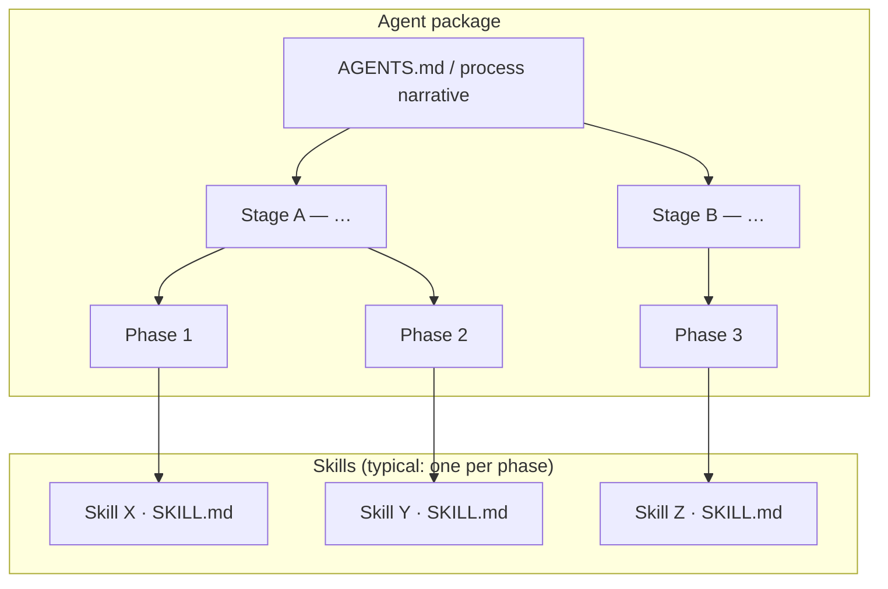

# Agent stages and phases (skills per phase)

This shard is about **designing and documenting agents** that **call skills**. An **agent** owns the end-to-end workflow: **stages** group the journey, **phases** are the units of work you execute in order, and **each phase typically uses a single skill** (one `SKILL.md` / one tool surface the model loads for that slice of work).

**Not in scope here:** how a **single skill** splits its *internal* work into `process.md` rows, `phases/<slug>.md` files, checklists, and numbered **steps** inside those files. That is **skill-local** packaging — normative detail lives in **[Skill structure and concepts — §3](skill-structure-and-concepts.md#skill-structure-sec3)** and the **[rich process table](skill-structure-and-concepts.md#rich-process-table-team-plate)** there.

**Related:** **[agent-skill-model.md](agent-skill-model.md)** (agent vs skill, `AGENTS.md`, orchestration).

---

## Terminology (agent vs skill)

| Layer | Owns | Typical artifact |
| --- | --- | --- |
| **Agent** | Stages, phases, cross-skill routing, corpus/workspace config | **`AGENTS.md`** (merged when the repo ships it), optional small **`SKILL.md`** for discovery |
| **Phase** | One slice of the agent workflow — **usually one skill invocation** | Row in the agent’s process narrative + link to the **skill** (repo path, tool name, or “read `SKILL.md`”) |
| **Skill** | One capability: discovery via **`SKILL.md`**, internal pipeline when run alone | **`content/parts/process.md`**, **`phases/*.md`**, **`generate.py`** / optional **`build.py`** — see **[Skill structure and concepts — §3](skill-structure-and-concepts.md#skill-structure-sec3)** |

**Stages** (agent): narrative grouping — *why* this block of phases exists and what outcome it produces. **Phases** (agent): ordered work units; **do not** conflate them with **steps inside a skill’s phase file** (those are finer-grained and skill-specific).

---

## Diagram

A phase that **coordinates multiple skills** in one go is possible but **non-default** — treat it as explicit orchestration (clear sub-steps or nested calls), not the usual “one phase = one skill” pattern.

---

## Authoring norms (agent)

- **Name phases** as milestones an operator recognizes (“Convert corpus”, “Chunk and index”), not as internal skill slugs.
- **Record which skill** each phase uses: path to repo, tool id, or instruction to open **`SKILL.md`** first.
- **Inputs / outputs** at the **agent** level are cross-skill artifacts (directories, manifests, env keys) — not a duplicate of every bullet inside a skill’s `phases/*.md`.
- **Workspace and config** for the whole engagement live with the **agent** (e.g. `conf/`, topic roots); each **skill** still has **`active_skill_workspace`** (or equivalent) for work that skill does when invoked — see **[workspace-config.md](workspace-config.md)**.

---

## Optional: merged `AGENTS.md` and `build.py`

When an **agent** (or a skill package that **ships** full IDE context) runs a **batch merge**, **`scripts/base/build.py`** assembles **`AGENTS.md`** from configured sections. That is **assembly of the agent document**, not something required on every edit to a leaf skill. Day-to-day **skill** work is **`generate.py`** per internal phase when applicable — see **[agent-skill-model.md](agent-skill-model.md)** and **`scripts/base/build.py`** (module docstring).

---

## Reference

- **[agent-skill-model.md](agent-skill-model.md)** — orchestrators are agents; `SKILL.md` vs `AGENTS.md`.
- **[skill-structure-and-concepts.md §3](skill-structure-and-concepts.md#skill-structure-sec3)** — skill repo layout, **internal** stages / phases / **steps**, process tables, `generate.py` / `build.py` for **skills**.
- **[outline.md](../../../outline.md)** — capability story for a skill (not the agent’s multi-skill spine).
