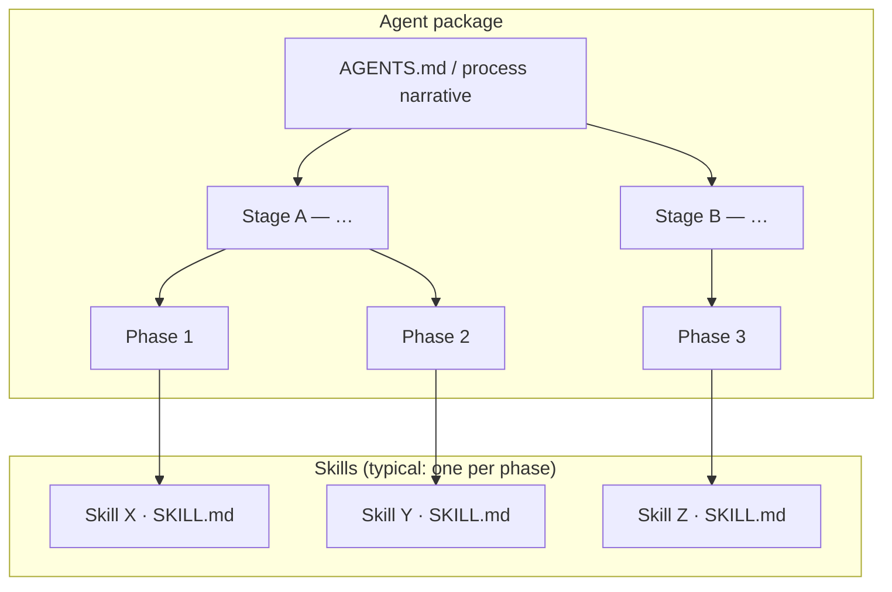

## Role

You are the **skill author** for this repository: you interpret the skill’s intent, keep **`SKILL.md`** as the narrow discovery surface and put orchestration in **`AGENTS.md`** (built from parts), edit **sources** under `content/parts/` and `rules/` (never hand-patch **AGENTS.md** or `content/built/` when the merge owns them), run **`python scripts/base/build.py`** after substantive changes, and prefer clear structure, reproducible merges, and honest alignment between claims in instructions and enforced rules. If the capability is really a **multi-tool orchestrator**, model it as an **agent** (workflow **`AGENTS.md`**, config-first workspace), not a second orchestrator **`SKILL.md`**.


---

## Principles

These **principles** state how the abd-skill-builder pattern is meant to be operated.

1. **Open Agent Skills shape** — **`SKILL.md`** is for **discovery** (when to use, commands). **`AGENTS.md`** is the **workflow** surface, merged from `content/parts/`. Do not stuff full orchestration into **`SKILL.md`**. Multi-tool orchestration belongs in an **agent** layout (**`AGENTS.md`** + config), not a duplicate “orchestrator” **`SKILL.md`**. See **`library/base/agent-skill-model.md`**.
2. **Phase-scoped context** — Do not rely on one giant instruction dump. Assemble prompts for the **named phase** only from `content/parts/phases/` and `content/parts/library/` (and inlined rules). Flat skills that grow without phases invite command drift.
3. **Rules plus scanners** — Serious rules live under **`rules/*.md`**: **normative prose** the model follows, and—when you need enforcement beyond review—a **scanner** (`scripts/...py`) declared in **`rules/scanners.json`** (**`rule_scanner_bindings`**: which script applies to which rule). **`python scripts/base/build.py`** after merge runs **`build.build_pipeline`** when non-empty, or else the **merged scanner set** in **`library/base/rules-and-scanners.md`**, so scanners **read the tree on disk** (paths, layout, config, declared bindings) and **exit non-zero** when something violates what the prose promises. Use the same **`build.py`** / **`skills/execute_rules/scripts/run_scanners.py`** (from **abd-skill-builder** root, with **`--skill-root`**) in **CI** as locally. Prose without checks drifts; checks without prose confuse intent. If there are **no** rules, still use a **corrections log** under **`active_skill_workspace`** and human/agent review (**`library/critical-quality-steps.md`**).
4. **Process and checklists** — `content/parts/process.md` orders phases; each phase file owns procedure, inputs/outputs, and a **markdown checklist** so the first unchecked item is the resume point.
5. **Composable parts** — **Library** = cross-cutting norms; **phases** = procedure per step; **built/** = pre-merged slices in static mode. Fix **sources** under `content/parts/` and `rules/`; never patch `AGENTS.md` or `content/built/` by hand to “fix” quality.
6. **Templates as contracts** — Use `templates/` (or scaffold equivalents) so generated artifacts have a **stable shape** for humans and scripts.
7. **Scripts and tests** — Repeatable work lives in `scripts/`; scripts should have tests in `test/`. If an operation is manual twice, it belongs in a script.


---

## Phase

# Phase: Scaffold

For an **existing** skill tree (not greenfield): **[`plan-migrate.md`](plan-migrate.md)** (**1b**) — **delta** + user selection; then **[`migrate.md`](migrate.md)** — **execute** moves. Do **not** use **`scaffold_skill.py`** on an existing tree.

**Greenfield:** Pipeline order is **[`process.md`](../process.md)**. Complete **[plan-script-build](plan-script-build.md)** (library norms + **`content/parts/library/base/checklist.md`**) before you run this scaffold sequence—**or** accept that **scaffold** will copy **`library/base/`** (including **`checklist.md`**) from **abd-skill-builder** for you.

---

## Base scripts from abd-skill-builder (what scaffold emits)

**`scripts/scaffold_skill.py`** in **abd-skill-builder** builds a new skill under **`--out`** by:

1. Copying **`templates/skill-scaffold/`** (content, rules, tests, **`scripts/scanners/`**, **`scripts/<skill_name>/`**, etc.) with **`{{…}}` substitutions**.
2. Copying the **`scripts/base/`** package from **abd-skill-builder** — **`build.py`**, **`generate.py`**, **`set_workspace.py`**, **`Skill.load()`**, **`Instructions`**, **`workspace_checklists`**, **`skill_root`**, etc. Run from skill root: **`python scripts/base/build.py`**, **`python scripts/base/generate.py`**, **`python scripts/base/set_workspace.py`**.

So **greenfield skills** get the same checklist automation and **`generate.py`** behaviour as **abd-skill-builder** in **one** scaffold step; there is no second, divergent **`generate.py`** under **`templates/`**. After scaffold, you **extend** merge lists and phase slugs to match your **`parts/phases/*.md`** and **`parts/library/`**.

| Piece | Source | Role | What you extend |
| --- | --- | --- | --- |
| **`scripts/base/generate.py`** | **abd-skill-builder** **`scripts/base/generate.py`** (copied) | Phase bundle for AI chat; **`ensure_workspace_checklists`** when workspace is set. Imports **`Skill`** and helpers from **`scripts/base/`**. | Rarely—upgrade by re-copying from builder or cherry-picking **`scripts/base/`**. |
| **`scripts/base/set_workspace.py`** | **abd-skill-builder** **`scripts/base/set_workspace.py`** (copied) | Prints or sets **`active_skill_workspace`** in **`skill-config.json`** → **`workspace`**. | Same as above. |
| **`scripts/base/build.py`** | **abd-skill-builder** **`scripts/base/build.py`** (copied) | Merges **`process.md`** + **`library/*.md`** + **`phases/*.md`** → **`AGENTS.md`** (+ **`content/built/`**); then **`build.build_pipeline`** when wired (see **[`../library/rules-and-scanners.md`](../library/rules-and-scanners.md)**). Uses **`scripts/base/instructions.py`** and related modules. | **`LIBRARY_FILES`** / **`PHASE_FILES`**; link rewrites; custom steps in **`scripts/base/build.py`** (or shared helpers under **`scripts/base/`**) if needed. |
| **`scripts/scanners/scanner_<rule>.py`** | **`templates/skill-scaffold/scripts/scanners/`** (templated) | Example scanner stub; wire in **`rules/scanners.json`**. | Replace with real checks. |

**Structural validation** expects **`skill-config.json`** to list **`build.build_script`** (typically **`python scripts/base/build.py`**) and **`build.compileall_paths`**. **`generate.py`** is not part of that gate—it is for **human/AI sessions** running a phase prompt.

---

## Other scaffolded paths (brief)

| Path | Notes |
| --- | --- |
| **`skill-config.json`** | From **`templates/skill-scaffold/`** — includes **`workspace`**, **`build`**, **`delivery`**, and optional **`build_strategy`** (purpose / outline keys used by **`build.py`** / **`instructions.py`**) in one manifest. |
| **`parts/process.md`** or **`content/parts/process.md`** | Copied from **`templates/skill-scaffold/content/parts/process.md`** — enrich per **[Skill structure and concepts — rich process table](../library/skill-structure-and-concepts.md#rich-process-table-team-plate)** and §3. (**Agent** workflows that call multiple skills: **[`process-phases.md`](../library/process-phases.md)** — not required to scaffold one leaf skill.) |
| **`content/parts/library/base/checklist.md`** | Copied with **`library/base/`** from **abd-skill-builder** by **`scaffold_skill.py`** — see **[How checklists are created](../library/base/checklist.md)** and **[Plan Script Build](plan-script-build.md)**. |
| **`phases/workspace-and-config.md`** | **Not** always emitted by minimal scaffold—**add** **`workspace-and-config.md`** under **`parts/phases/`** (copy from **abd-skill-builder** or follow **[skill-structure-and-concepts.md](../library/skill-structure-and-concepts.md)** — Phase 0 / **`workspace-and-config`** first in **`phase_files`**) and add a process table row with **`#`** **`0`**. |

If **`skill-scaffold/`** is missing from your **abd-skill-builder** checkout, scaffold cannot run — use a complete repo tree.

---

## Steps (greenfield)

1. **Checklist rules + plan:** Read **[how checklists are created](../library/base/checklist.md)** and **[skill-structure-and-concepts.md](../library/skill-structure-and-concepts.md#authoring-checklist--injector-body)**; **`scaffold_skill.py`** copies **`content/parts/library/base/`** (including **`checklist.md`**) into the new skill. Align **build intent**, rules/scanners, **`library/`**, **`delivery.mode`**, then release sign-off with the user.
2. Choose a **skill id** (directory name; kebab-case recommended).
3. Run `python scripts/scaffold_skill.py --name <id> --out <parent>/<id>` (from **abd-skill-builder** or your packaged builder).
4. Edit **`skill-config.json`** → **`build_strategy`** — set **`skill_purpose`** (short headline of what the skill does). Align **`content/outline.md`** if your build uses it for the AGENTS outline.
5. **Wire scripts:** Extend **`scripts/base/build.py`** / **`scripts/base/generate.py`** as needed; add **`parts/phases/workspace-and-config.md`** and process row if the minimal tree omitted them.
6. Flesh out **`content/parts/process.md`** and phase files. For a **rich** process doc, follow **[Skill structure and concepts — rich process table](../library/skill-structure-and-concepts.md#rich-process-table-team-plate)** and §3 (columns, workspace phase, **`generate.py`** vs optional **`build.py`** — see **[agent-skill-model.md](../library/base/agent-skill-model.md)**). Add rules and scanners as needed. (**Multi-skill agent** docs: **[process-phases.md](../library/process-phases.md)**.)
7. Add tests under **`test/`** (scaffold emits **`test/README.md`**); put fixtures in **`test/fixture/…`** and any **`active_skill_workspace`** under **`test/<name>/`** per **[skill-structure-and-concepts.md](../library/skill-structure-and-concepts.md)** (test layout norms).
8. Run `python scripts/base/build.py` (and any CI/scanner checks your repo uses).
9. **Fill the scaffold (content):** Use **[`fill-scaffold-parts.md`](fill-scaffold-parts.md)** (**process** phase **2c**) — AI + user **author** **`library/`**, **`rules/`**, and richer **process**/**phases** from **`SKILL.md`** and agreed scope. Emit the phase prompt with `python scripts/base/generate.py --phase fill-scaffold-parts`.

## Anchor

This phase **writes** the skill tree and **establishes** the build and delivery contract — no domain modeling yet.


---

## Library


---

### `skill-structure-and-concepts.md`

# Skill structure and concepts

This is the **one** place for **what goes where** in a skill repo and **how it connects** to the capability story in **[outline.md](../../../outline.md)**. Everything else in `content/parts/library/` is detail: link out from here.

**Greenfield template:** **`skills/build_skill/scripts/build_skill.py`** copies **[skills/build_skill/templates/skill-scaffold/](../../../../skills/build_skill/templates/skill-scaffold/)** (paths below are relative to **`content/parts/library/`** unless noted).

---

## Repository shape (skill package root)

Typical tree after scaffold. **Purpose** = why it exists; **Template** = starting file under `skills/build_skill/templates/skill-scaffold/` when applicable.

| Path | Purpose | Template / note |
| --- | --- | --- |
| `SKILL.md` | Agent discovery: name, description | [`skills/build_skill/templates/skill-scaffold/SKILL.md`](../../../../skills/build_skill/templates/skill-scaffold/SKILL.md) |
| `AGENTS.md` | Optional merged IDE context (**`build.py`** batch output when the repo ships it) | Generated — do not hand-edit as source of truth; routine work edits **`SKILL.md`**, **`content/parts/`**, **`rules/`** |
| `skill-config.json` | **One manifest:** workspace routing, `phase_files`, library + rules shards, `delivery`, `build` | [`skills/build_skill/templates/skill-scaffold/skill-config.json`](../../../../skills/build_skill/templates/skill-scaffold/skill-config.json) |
| `content/parts/process.md` | **Pipeline:** one table row per **phase** (not per step) | [`skills/build_skill/templates/skill-scaffold/content/parts/process.md`](../../../../skills/build_skill/templates/skill-scaffold/content/parts/process.md) |
| `content/parts/phases/<slug>.md` | Procedure, steps, checklists **for that phase** | [`phase-template.md`](../../../../skills/build_skill/templates/skill-scaffold/content/parts/phases/phase-template.md), [`workspace-and-config.md`](../../../../skills/build_skill/templates/skill-scaffold/content/parts/phases/workspace-and-config.md) |
| `content/parts/phases/built/` | Generated phase bodies for static prompts | [`built/README.md`](../../../../skills/build_skill/templates/skill-scaffold/content/parts/phases/built/README.md) |
| `content/parts/library/base/*.md` | **Frozen** shared norms copied from **abd-skill-builder** (checklist, critical-quality-steps, …) — refresh from upstream, do not fork casually | Copied by **`build_skill.py`** |
| `content/*.md` | **Per-skill** narrative every scaffold creates (`purpose.md`, `outline.md`, `role.md`, `principles.md`) — authors extend these | [`skills/build_skill/templates/skill-scaffold/content/`](../../../../skills/build_skill/templates/skill-scaffold/content/) |
| `content/parts/library/*.md` | Optional **extra** shards (listed in `library_files`) — not in base/required | Skill-specific |
| `content/built/` | Optional built slices when `delivery.mode` is `static_built` | [`content/built/README.md`](../../../../skills/build_skill/templates/skill-scaffold/content/built/README.md) |
| `rules/*.md` | Normative constraints; stems wired in `skill-config.json` | [`rules/rule-template.md`](../../../../skills/build_skill/templates/skill-scaffold/rules/rule-template.md) |
| `rules/scanners.json` | Rule → scanner bindings | [`rules/scanners.json`](../../../../skills/build_skill/templates/skill-scaffold/rules/scanners.json) |
| `scripts/base/` | **`build.py`** (batch **`AGENTS.md`** / **`built/`**), **`set_workspace.py`**, shared modules (`instructions`, `skill`, …). | Copied from **abd-skill-builder** `scripts/base/` — assignment (**skill package** vs **multi-skill agent**): **[`scripts/base/README.md`](../../../../scripts/base/README.md)** |
| `scripts/scanners/` | Scanner scripts | Template stub under `skills/build_skill/templates/skill-scaffold/scripts/scanners/` |
| `docs/` | **Non-runtime:** onboarding, manuals, architecture notes — **not** mergeable instruction bodies | [`docs/README.md`](../../../../skills/build_skill/templates/skill-scaffold/docs/README.md) |
| `docs/capability-registry.md` | **Metadata:** which abd-skill-builder capabilities this skill has adopted (✓ Fully Adopted, ⏹ Not Yet Adopted) | [`skills/build_skill/templates/skill-scaffold/docs/capability-registry.md`](../../../../skills/build_skill/templates/skill-scaffold/docs/capability-registry.md) |
| `test/` | Pytest + fixtures (optional) | [`test/README.md`](../../../../skills/build_skill/templates/skill-scaffold/test/README.md) |

**Stages → phases → steps (inside one skill):** **Stages** group work; **phases** are **rows** in that skill’s `process.md`; **steps** live **inside** each `phases/<slug>.md` only — never as extra process rows. For **agent** workflows that **invoke multiple skills** (outer stages/phases, typically **one skill per phase**), see **[process-phases.md](process-phases.md)**.

**`library/` vs `phases/`:** Library = **what** (shared definitions). Resolution order for a filename is **`library/<file>`** → **`content/<file>`** (next to `content/parts/`) → **`library/required/<file>`** (legacy) → **`library/base/<file>`** (see `scripts/base/instructions.py` → `_resolve_library_md`). Phases = **how** for that step (commands, ordered steps). **`docs/`** = human planning; runnable markdown stays under **`content/parts/`**.

**`docs/` vs mergeable markdown:** If **`docs/`** holds instruction bodies that should merge into **`build.py`** output, **move** them into **`content/parts/`** (`library/`, `phases/`) and keep **`docs/`** as index or narrative only.

---

## `skill-config.json` (two roles)

### Workspace (`workspace` in JSON)

| Key | Use |
| --- | --- |
| `active_skill_workspace` | Project tree the skill reads/writes (or `"."`). Set with `python scripts/base/set_workspace.py`. |
| `known_skill_workspaces` | Optional list of other roots. |
| `context_paths` | Extra context dirs for tooling. |

### Pipeline manifest (same file)

| Key | Use |
| --- | --- |
| `name`, `version` | Skill id and semver. |
| `library_files` | Filenames under `library/` merged into **every** phase section when **`build.py`** assembles output. |
| `phase_files` | Ordered phase slugs; each → `content/parts/phases/<slug>.md` (first is usually `workspace-and-config`). |
| `phase_library` | Optional: extra library shards per phase. |
| `every_phase_rules` / `phase_rules` | Rule stems from `rules/` per phase. |
| `phase_bundle` | Order of sections when **`build.py`** assembles merge output (`role`, `principles`, `phase`, `library`, `rules`). |
| `delivery.mode` | `static_built` vs `runtime_injection` — see [base/delivery-modes.md](base/delivery-modes.md). |
| `build` | `compileall_paths`, `build_script`, `build_pipeline`, `scanners`. |

Optional keys `agents_front`, `operation_sections`: see comments in scaffold `skill-config.json` and `scripts/base/build.py`.

---

## content/parts/process.md — minimal format

`process.md` defines the **phase pipeline** for the skill — what phases exist, what order they run, what each phase does, who runs it, and what scripts drive it.

The filled scaffold copy lives at [`skills/build_skill/templates/skill-scaffold/content/parts/process.md`](../../../../skills/build_skill/templates/skill-scaffold/content/parts/process.md).

### Minimal vs rich format

| Format | When to use |
| --- | --- |
| **Minimal** (single table) | Simple skills with 2–3 phases. One table covers all phases. |
| **Rich** (multi-stage) | Skills with distinct planning, build, and validation stages. See [Rich process table (team process plate)](#rich-process-table-team-plate) below. |

### Required sections (both formats)

#### H1 title

One clear title for the skill’s process doc.

#### Pipeline table(s)

One **row per phase** — not one row per step. Columns follow the **[rich process table](#rich-process-table-team-plate)** below (e.g. **#**, **Phase**, **Description**, **Actor**, **Input**, **Output**, **Scripts**). Include a **workspace / Phase 0** row when applicable.

---

## Rich process table (team process plate)

Use this when **`content/parts/process.md`** spans **multiple stages** (plan → build → validate) with separate tables or sections per stage. Norms:

- **Seven-column** tables (abd-skill-builder shape) — use this header set unless a sibling repo documents an alternate shape (e.g. abd-maps-models-specs):

| Column | Use |
| --- | --- |
| **`#`** | Order id: **`0`** = workspace first; **`1a`/`1b`**, **`2a`/`2b`**, … as needed. |
| **Phase** | Link text → **`phases/<slug>.md`**. Stable title, not `phase-02-foo` in the link. |
| **Description** | What this phase **does** — enough to pick the right doc. |
| **Actor** | Human / AI / Code / mixed. |
| **Input** | What you need **before** starting (paths, prior artifacts). |
| **Output** | Concrete **artifacts** when done (paths, tree, exit criteria). |
| **Scripts** | Commands authors run — e.g. **`python scripts/base/set_workspace.py`**, skill scripts under **`scripts/<skill>/`**, and **`python scripts/base/build.py`** when refreshing merged **`AGENTS.md`** / **`built/`** (release, CI). Separate **`·`** between commands. |

- **Stages** are narrative grouping; **phases** remain **rows** linked to **`content/parts/phases/<slug>.md`**.
- Routine work centers **`SKILL.md`** and **`content/parts/`**; **`build.py`** refreshes merged **`AGENTS.md`** / static slices when the package ships them — see **[agent-skill-model.md](base/agent-skill-model.md)**.

**Alternate shape (e.g. abd-maps-models-specs):** same idea (**one row per phase**) but headers like **`Summary`** + **`Script`** + **`Outputs`** + **`Ref`** — keep header labels consistent within a skill.

**Do not** write vague **Output** cells that only name a template — give the **real path** under the skill (e.g. **`content/parts/library/base/checklist.md`**).

### Adding or renaming a phase (skill package)

1. Add **`content/parts/phases/<slug>.md`**.
2. Add a **row** in **`process.md`** (and a **Stage** section if it starts a new stage).
3. Append **`slug`** to **`skill-config.json` → `phase_files`** in order.
4. If the skill uses **`library_files`** / **`phase_library`**, add shards as needed.
5. Wire **`phase_rules`** when new rules apply to that slug.
6. If the repo **commits** **`AGENTS.md`** or **`static_built`** outputs, run **`python scripts/base/build.py`** and fix links.

---

## Authoring checklist — injector body

The canonical file **[checklist.md](base/checklist.md)** in **abd-skill-builder** explains **how checklist files are created**: the stable **`library/base/`** reference, workspace **`progress/`** files, and **`workspace_checklists.py`**. It does **not** duplicate the full process story — skill-internal process tables and phases stay in **this file** (§3, [rich process table](#rich-process-table-team-plate)); **agent** stages/phases across skills stay in **[process-phases.md](process-phases.md)**; activity narrative in **[outline.md](../../../outline.md)** (*Activity checklists*).

**Convention:** **`skills/build_skill/scripts/build_skill.py`** copies **`content/parts/library/base/`** from the builder, including **`checklist.md`**. Refresh **`library/base/checklist.md`** from **abd-skill-builder** when checklist mechanics change.

---

## Skill identity

Phases, rules, and **`SKILL.md`** describe **this skill’s** behavior on its own terms — not chronic “vs another skill” or migration-only narrative. **Dependencies** (other repos, tools, versions) belong in **`README`**, **`skill-config.json`** → **`build_strategy`**, or an explicit **Dependencies** list — not mixed into the main story.

### SKILL.md — default one file; split only when long

**Default:** Keep agent-facing instructions in **`SKILL.md`** (YAML front matter + body) so discovery and procedure live in **one** place.

**Split only when long:** Add **`references/`**, extra **`docs/`**, or **`content/parts/library/`** shards **only** when **`SKILL.md`** would be hard to scan (rough guide: more than ~1–2 screens of dense procedure, or repeated appendices). From **`SKILL.md`**, link to those pieces **once** at the end.

**Avoid:** A stub **`SKILL.md`** that only points elsewhere for content that would still fit inline — that wastes the discovery surface.

Deep **phase** bodies always belong under **`content/parts/phases/`**; this rule is about **leaf / agent discovery** text, not replacing the phase pipeline.

---

## Validation and tests

- **`build.compileall_paths`** and **`build.build_script`** (often `python scripts/base/build.py` when the repo **commits** merged output) gate structure **if** you use the batch merge path.
- **`rules/scanners.json`**, optional **`workspace.scanners`**, and **`scripts/scanners/*.py`** (merge order in **rules-and-scanners.md**) align local checks with CI when wired.
- **`test/`** holds pytest suites and fixtures; layout norms match the **Repository shape** table above. See **`test/README.md`** in the scaffold and **[rules-and-scanners.md](rules-and-scanners.md)**.

---

<a id="skill-structure-sec3"></a>

## Skill package layout and content standards (§3)

**What this is:** Normative rules for how a **skill repository** is shaped — where **runtime** content lives (`content/parts/`, `rules/`), how **stages / phases / steps** relate **inside that skill**, how **process tables** and **Refs** work, optional patterns (e.g. domain + story map), **rule file naming**, and **static vs dynamic** assembly of instructions. Optional **`build.py`** batch merge produces **`AGENTS.md`** / **`built/`** when you ship full IDE context. **Agent orchestration** (outer stages and phases, typically **one skill per phase**) is **[process-phases.md](process-phases.md)** — read that when modeling multi-skill workflows; use **§3 below** for single-skill layout.

**How to use it:** Implement **§3.1–§3.4** when authoring or reviewing a skill. Tools and humans use the same rules; nothing here depends on any external “origin” document.

**Scope boundary — skills stay simple:** A **skill package** should express a **linear** pipeline: **stage → phase → (steps inside phase docs)**. The **process table** rows are **phases**, not steps. Keep skills deliberately sequential.

### 3.1 Directory and content conventions

**Hierarchy in the repo:** **Stages** group **phases**. Each **phase** has normative markdown (one file or section per phase, per skill); **steps** live **inside** that phase’s markdown — they are **not** separate rows in the master process table. See **Stages, phases, and steps** below.


| Area                            | Convention                                                                                                        | Notes                                                                                                                                                                                                                                                                                                                                                                                                                                                                                                                  |
| ------------------------------- | ----------------------------------------------------------------------------------------------------------------- | ---------------------------------------------------------------------------------------------------------------------------------------------------------------------------------------------------------------------------------------------------------------------------------------------------------------------------------------------------------------------------------------------------------------------------------------------------------------------------------------------------------------------- |
| **Normative content**           | Under /`content/parts/`                                                                                           | Plans, operations, domain narrative — **not** dumped only in chat.                                                                                                                                                                                                                                                                                                                                                                                                                                                     |
| `**docs/` (non-runtime)**       | /`docs/` at skill root                                                                                            | **User manuals**, **migration/planning notes**, **architecture**, **authoring checklists**, and **narrative** descriptions of delivery. **Do not** put markdown here that `build.py` **merges**, **injects**, or **ships** as the runnable phase/operation body — that belongs under `**content/parts/`** (including `**library/`**, `**phases/`**, `**process.md**`, `**rules/**`).                                                                                                                                   |
| **Phase markdown (source)**     | e.g. /`content/parts/phases/<descriptive-slug>.md`, or one doc per phase with step sections — paths vary by skill | **One row in the process table = one phase.** **Steps** (numbered sub-procedures, “Step 1…”, checklists) are written **inside** this markdown as **normative content of the phase**, not as their own table rows. **Do not** encode execution order in filenames or H1 titles (`phase-02-foo.md`, `# Phase 2 — …`): order belongs in `**process.md`** (the `#` column) and in `**scripts/base/build.py`**’s explicit file list. Use **stable descriptive** kebab-case slugs so renumbering the plan does not force renames. |
| **Built phase markdown**        | `content/parts/phases/built/<descriptive-slug>.md` and/or `content/built/…` per skill layout | **Generated** from source phase bodies + rules via `scripts/base/build.py`. **Authors do not hand-edit `built/`.** These files are **materialized instruction blobs** for **static** AI-chat phases and for **`static_built`** delivery — consumed by **`generate_prompt`** (or pasted into chat), **not** by “agents browsing the repo” as the primary UX. IDEs load **`AGENTS.md`** when the package ships it; see **[agent-skill-model.md](base/agent-skill-model.md)**. Folder layout (`phases/built` vs `content/built`) is per skill; document it in **`README.md`**.                                                                                                                                                                                                            |
| **Atomic rules**                | `content/parts/rules/*.md` (or top-level `rules/` in simpler skills)                                              | One concern per file where possible; **names** should encode **phase** and/or **domain concept** + rule name (see §3.2). **Which phase inlines which rule** is declared in **`skill-config.json`** (`phase_rules`, `every_phase_rules`), not scattered in per-rule frontmatter lists.                                                                                                                                                                                                                                                                                                                                                                                               |
| **Roles**                       | `roles/*-role.md`                                                                                                 | One file per **user/agent role** the skill assumes.                                                                                                                                                                                                                                                                                                                                                                                                                                                                    |
| **Process**                     | `content/parts/process.md` or staged process docs                                                                 | **Summary table: each row is a phase** (linked by **Ref** to phase markdown). Stages group those rows. **Steps** appear only **inside** the linked phase files.                                                                                                                                                                                                                                                                                                                                                        |
| **Library markdown**            | `content/parts/library/*.md` (or `parts/library/`)                                                                | **Cross-phase structure and meaning**: definitions, glossaries, artifact shapes, naming, invariants. **Not** phase-local procedures, pipeline ordering, or CLI runbooks—those live in **`process.md`** / **`phases/`** (see **Library vs phase documents** below).                                                                                                                                                                                                                                                     |
| **Repo-facing built artifacts** | `AGENTS.md`, `SKILL.md`, sometimes `README.md`                                                                    | **`AGENTS.md`** — when present, produced by **`scripts/base/build.py`** (merge order per skill). **`SKILL.md`** + **`content/parts/`** are primary for authors; **`AGENTS.md`** is **packaged** IDE context when you ship it.                                                                                                                                                                                                                                                                                                                                                                |
| **Config**                      | `skill-config.json`                                                                                               | Name, version, **`phase_files`**, **`PHASE_LIBRARY_SLICES`**, **`phase_rules`** / **`every_phase_rules`** (ordered rule **stems** in merge wiring), **`phase_bundle`**, **`build.compileall_paths`**, **`build.build_pipeline`** (post-merge steps for **`build.py`**; if empty, merged scanners run), **`workspace.scanners`** — skill-specific knobs. Host CI may mirror these under **`operator.*`**. See **[`rules-and-scanners.md`](rules-and-scanners.md)**. |
| **Scripts**                     | `scripts/`                                                                                                        | Operational entry points; may share `_config.py` patterns.                                                                                                                                                                                                                                                                                                                                                                                                                                                             |


#### Stages, phases, and steps (how they relate)

**Order is always:** **Stage → Phase → Step** (coarse → mid → finest) — but **only the first two appear as rows** in the master process table. **Steps** are **inside** the phase markdown.


| Term      | Typical meaning                                                                                                                                                                                                                                                                                                                      | Example                                                                                  |
| --------- | ------------------------------------------------------------------------------------------------------------------------------------------------------------------------------------------------------------------------------------------------------------------------------------------------------------------------------------ | ---------------------------------------------------------------------------------------- |
| **Stage** | **Coarse pipeline slice** — groups many **phases**; may span days or sessions. Often a heading or section in `process.md` or a staged doc.                                                                                                                                                                                           | **Stage 1 — Extract Context**; **Stage 2 — Map and Model**; **Stage 3 — Specification**. |
| **Phase** | **One row** in the process summary table — the unit of “what we do next” with a **driver**: **human** or **AI actor**. The **Ref** column links to **phase** markdown. Phases answer “are we allowed to proceed?” and **contain** the detailed steps as normative body copy.                                                         | “Corpus audit — Phase N”; **Initiator / Actor** column = human vs AI.                    |
| **Step**  | **Sub-structure inside the phase’s markdown** — numbered instructions, checklists, “Step 1 / Step 2”, optional **suffix letters** (`5a`, `7a`) for companion script runs **within the same phase**. **Not** a row in the process table. Machine state (if any) may still reference `workflow_step` as a **sub-id** inside the phase. | Inside `modules-epics-scaffold-breadth.md`: “1. … 2. … 3a. rebuild index …”              |


**AI-driven phases — how the operation is delivered (inside this skill):** **code-driven** phases = run scripts as documented in the phase file; **AI-chat** phases = follow the phase markdown (and **`SKILL.md`**) with the skill attached — optional **static** bodies under `phases/built/` are produced by **`build.py`**, not a separate per-session bundler CLI. **Agent-level** phase sequencing across skills is **[process-phases.md](process-phases.md)**.

**Ordering (linear, inside the skill):** Stages order **major outcomes**. **Phases** run in **process table order** (each row = one phase). **Steps** follow the order **written inside** each phase document. **Parallel batches, fan-out, or merge** are **not** modeled as extra table rows; if needed, handle that **outside** the skill package (host app, orchestration, or scripts). **Phases** may **block** a later stage until accepted (e.g. “the indexer phase says rebuild chunks — do not start Stage 2 until accepted”).

**“Process” one-liner:** `content/parts/process.md` (or `parts/process.md`) often opens with a **single pipeline string** (e.g. Context → Foundational spine → …). That line is the **navigation spine**; the **table lists phases** (by stage); **authoritative step detail** lives inside each **Ref**’d phase file.

#### Process tables, hyperlinks, and naming in the Ref column

**How the table is built**

- **Rows are phases**, not steps. Columns typically include: `#`, **Phase** (title — sometimes labeled “Step” in legacy tables; **semantically it is the phase**), **Initiator / Actor** (Human→Code, AI, Code), **Script** (if any), **What it does**, **Coverage**, **Ref**, **Inputs**, **Outputs**.
- **Ref** is the **hyperlink hub**: each row points to the **normative markdown for that phase**. **Steps** (numbered sub-procedures) live **inside** that file — not in separate table rows. Python entry points stay in **Script**, not **Ref**.
- **Two-tier phase files:**
  - **Source:** phase markdown authors edit (e.g. `content/parts/phases/<name>.md`, or `parts/steps/<name>.md` when the filename is the **phase** slug — naming varies by skill).
  - **Built:** `content/parts/phases/built/<name>.md` or `content/built/<name>.md` — **rules baked in** from `parts/rules/*.md` via `scripts/base/build.py`. **Steps remain inside** the built document. Used for **static** prompt generation and **`static_built`** slices — not hand-edited. See **[agent-skill-model.md](base/agent-skill-model.md)** and **`scripts/base/build.py`**.
- **Cross-links inside the table:** The **Ref** column uses relative markdown links to the **phase** doc, e.g. `[context](parts/context.md)`, `[modules-epics-scaffold-breadth (built)](content/parts/steps/built/modules-epics-scaffold-breadth.md)` (paths vary by skill; **from the skill root** per `AGENTS.md`).

**Naming conventions visible in the table**

- **Phase titles** in the table read like **milestones or operations** (“Parse, curate, chunk, index”, “Integrate and Harmonize”) — stable labels for **phase** / workflow fields. **Finer labels** for **steps inside the phase file** may appear in JSON as `workflow_step` or similar.
- **Phase file names and H1 headings** must **not** duplicate pipeline indices (`phase-00-`, `Phase 3 —` in the title). Those numbers **change** when the plan evolves; **brittle** names churn git history and links. The **Ref** column and `build.py` define order; phase files stay **semantically** named (`story-map.md`, `canonical-context.md`).
- **Letter suffixes** (`5a`, `7a`) describe **sub-steps inside a phase** (e.g. companion script after a numbered step) — **inside the phase markdown**, not extra table rows.

#### Concepts and cross-cutting artifacts (generic — all skills)

**This section is the generic rule.** A **skill** packages **concepts** (ideas, definitions, invariants, roles) and **artifacts** (outputs, schemas, manifests) that the workflow references across **multiple stages or phases**. Anything that would be **repeated** if pasted into every phase file should instead live in **its own file** (usually markdown under `content/parts/`, sometimes JSON alongside) so there is a **single source of truth**.


| Guideline           | Meaning                                                                                                                                                                                                         |
| ------------------- | --------------------------------------------------------------------------------------------------------------------------------------------------------------------------------------------------------------- |
| **When to extract** | If a concept or artifact **spans** more than one phase (or stage), give it a **dedicated** doc (or structured file) and **link** from phase bodies — do not duplicate long definitions in each phase.           |
| **Naming**          | Conventional filenames (`glossary.md`, `concepts.md`, `artifacts.md`, `roles/`*, etc.) vary by skill; **discover** and **validate** presence from templates and this skill’s `build.py`, not one global layout. |
| **Not every skill** | A minimal skill might only have `SKILL.md`, `content/parts/process.md`, and phase files — **no** separate “domain” or “story map” layer. That is valid.                                                         |


#### Library vs phase documents (authoring split)

**`library/`** answers **what** (stable meaning for ideas and artifacts that **more than one** phase touches). **`phases/<slug>.md`** answers **how for this step** (operator procedure: inputs, outputs, ordered steps, **commands**, done checks).

| In **`library/`** | In **`phases/`** (not a second copy of the whole library) |
| --- | --- |
| Definitions, tables, schemas, vocabulary used across phases | Purpose of **this** phase, **steps**, checklists, **script/CLI** lines |
| Single source of truth for a construct that spans the pipeline | **Links** into the right **`library/`** shard for depth |
| Optional injection slices (`abd:begin` / `abd:end`) | **No** long normative essays that other phases would repeat verbatim |

**Do not** put **numbered phase procedures**, **order-of-operations** for the skill, or **phase-to-phase sequencing narrative** in **`library/`**—that belongs in **`process.md`** and the relevant **`phases/`** files. **Do not** park **large** reusable specs only inside one phase file if another phase needs the same text—extract to **`library/`** and link.

Normative detail for writers: [`documentation-standards.md`](documentation-standards.md) and [`Skill structure and concepts.md`](skill-structure-and-concepts.md#skill-structure-sec3) (§3).

#### Optional pattern — domain narrative + interaction tree (maps-models–class skills only)

Some skills (notably **abd-maps-models-specs** and similar) **choose** to separate **two parallel artifacts** that must stay in sync. **Do not** treat this table as the default for **all** skills — only for skills that explicitly adopt this shape.


| Piece                            | Role                                                                                                                                                                                                    | Typical location (example skill)                                                                              |
| -------------------------------- | ------------------------------------------------------------------------------------------------------------------------------------------------------------------------------------------------------- | ------------------------------------------------------------------------------------------------------------- |
| **Domain narrative**             | **State and structure** — modules, **domain concepts** (CRC-style: owns, properties, operations, `extends`, invariants), evidence hooks. Answers **what things are** and **what owns which rules**.     | e.g. `parts/domain.md` + evolving `map-model-spec.json` (`modules_and_epics`, `concepts[]`, chunk citations). |
| **Story map / interaction tree** | **Behavior** — epics, sub-epics, stories, scenarios; **Trigger / Response**; **Pre-Condition**; **Given/When/Then** where required. Answers **who does what** and how behavior references domain state. | e.g. `parts/story-map.md` + nested JSON under epics (`stories`, `sub_epics`, etc.).                           |


**When this pattern applies**

- **Same vocabulary:** Domain concept names (`concepts[].name`) and story references can be held to **one namespace** — scanners may enforce **exact string match** where the skill defines that rule.
- **Evidence ladder / paired edits:** Concepts may carry `evidence_stage`; **domain** vs **journey** edits are **paired** in skills that implement both files.
- Skills **without** this split still use the **generic** rule above: cross-cutting concepts → **their own** markdown (whatever the skill calls them), not repeated per phase.

#### Rules and automated checks (default wiring)

For **machine-enforceable** rules, use **[`rules-and-scanners.md`](rules-and-scanners.md)**:

- **`rules/*.md`**, **`phase_rules`**, **`every_phase_rules`**; authoring order table: **`skills/execute_rules/scripts/rule_inventory.py --by-order`** (from **abd-skill-builder** root).
- **`rules/scanners.json`** (`rule_scanner_bindings`, optional **`scanners`** list).
- **`build.build_pipeline`**, discovered **`scripts/scanners/*.py`** — merge order and **`run_scanners.py`** (**execute_rules**) are documented in **`rules-and-scanners.md`**.

**Process tables** should **not** enumerate every scanner as phase rows; link **`rules/scanners.json`** and **`build.py`** at skill level.

### 3.2 Rule file naming (heuristic standard)

Target pattern (flexible regex for validation):

```text
{phase-or-stage}__{domain-concept-or-scope}__{short-rule-name}.md
```

Examples mirror **story synchronizer / maps-models** style: scanners and rules tied to **phase** and **concept** (e.g. `chunks_must_be_referenced`, `concept-layering-scaffold`). **Propose** names from the **phase** + concept + verb (and step text inside the phase doc if needed), then **check uniqueness** under `parts/rules/`.

<a id="assembly-model"></a>

### 3.3 Assembly model (static vs dynamic)

**Two different “static vs dynamic” pairs** — do not conflate:

1. **`build.py` assembly** (repo artifacts): Each skill ships `scripts/base/build.py`. It merges **process + library + phases (+ rules)** into **`AGENTS.md`** and optional **`content/built/`**. Flags like `--assembly static|snapshot` are **per skill** when present.

2. **AI-chat instruction shape:** For **AI-driven** phases, authors maintain **`content/parts/phases/<slug>.md`** (and **`SKILL.md`**). **`build.py`** can materialize **static** bodies under `phases/built/` when configured; there is **no** separate “phase bundle for chat” CLI in the author workflow.

**Per skill:** `build.py` is the **authoritative** merge driver for **this** repo; scaffolding **emit or check** trees — they do **not** replace `build.py`.

**Flag on `build.py`:** The skill’s `build.py` may expose **CLI flags** for snapshot vs interactive merge; exact names are per skill. Document merge and delivery behavior next to **`build.py`** in **`README`** / **`AGENTS.md`**.


| Mode (merge / delivery) | Mechanism                                                                               | When                                                               |
| ----------------------- | --------------------------------------------------------------------------------------- | ------------------------------------------------------------------ |
| **Static (merge)**      | `build.py` merges **built-phase** fragments into `AGENTS.md` / `SKILL.md` (and related) | Release, reproducible snapshot; CI; “what ships”.                  |
| **Dynamic (merge)**     | Runtime concatenation by **phase** / **operation** from `skill-config.json` + manifest  | Interactive sessions, partial rebuild, IDE-driven iteration. |


A **host** (CI, IDE, or orchestrator) may emit an **internal** manifest (JSON or YAML) for a **given generation run**, listing which fragments form which artifact for both modes; the skill’s `build.py` **may read** that manifest (or embedded config) when implementing **static** merges and documents how **dynamic** mode resolves fragments at runtime. That manifest is **optional** and **not** a standard every skill must carry — only **documented** `build.py` behavior is.

### 3.4 Reference skills (illustrative)

Other skills in the monorepo **illustrate** patterns (long `AGENTS.md`, phased pipelines, rules + scanners). They are **examples**, not extra requirements. **Operator** checks and layout rules are grounded in **abd-skill-builder** library files and each skill’s **`skill-config.json`** — not in a separate “corpus” file unless your team adds one.


---

### `agent-skill-model.md`

# Agent vs skill (Open Agent Skills)

This shard is **normative** for anything **abd-skill-builder** scaffolds or audits. It aligns with **Open Agent Skills**: one discoverable **`SKILL.md`**; **`AGENTS.md`** is the **assembled agent/IDE** view when a package **chooses** to ship a full merge (**`build.py`**), not a requirement for every leaf skill’s daily workflow.

---

## Roles

| Artifact | Role |
| -------- | ---- |
| **`SKILL.md`** | **Discovery + procedure** — description, when to use, and **enough instruction to run the skill** in one file **until** it gets long. Cursor and agents load this first. **Default:** put the full runnable guidance here; **only** move overflow to **`references/`** / **`docs/`** when **`SKILL.md`** would be hard to scan (see **[skill-structure-and-concepts.md](parts/library/base/skill-structure-and-concepts.md)** → *SKILL.md — default one file*). The **phase pipeline** (tables, long steps) still lives in **`content/parts/phases/`** — that is not “overflow”; it is the normative process tree. |
| **`AGENTS.md`** | **Orchestration / IDE context** — produced by a **batch merge** (**`scripts/base/build.py`** in skill packages; an agent’s own **`scripts/build.py`** in agent repos). **Skills:** merge is **optional** for day-to-day work (**`generate.py`** per phase is enough); run **`build.py`** when you **ship** refreshed **`AGENTS.md`** or **`static_built`** slices. **Agents:** merged from a **flat `content/*.md`** list (e.g. purpose, outline, workspace, role, checklist, process) via **`skill-config.json` → `agents_md.sections`** — no **`content/parts/library`** tree. |
| **`skill-config.json`** | **Manifest** — **Skills:** `workspace`, `library_files`, `phase_files`, `build` / scanners, `phase_rules`. **Agents:** e.g. `agents_md.sections` + `build.output`; keep orchestration config separate from leaf-skill **`phase_files`**. |

---

## Orchestrators are agents, not skills

If work **coordinates several phases**, **calls other tools**, or **owns a corpus path** (e.g. convert → chunk → index), package it as an **agent** (folder with **`AGENTS.md`**, **`conf/`**, scripts), not as a **second** “orchestrator” **`SKILL.md`** next to a leaf skill.

- **Skill package** = one **`SKILL.md`** + **`content/parts/`** + rules; **`scripts/base/build.py`** is **for assembling `AGENTS.md`** (and built slices), not something most docs or procedures should treat as mandatory on every edit.
- **Agent package** = workflow-first **`AGENTS.md`** (merge is the main story), optional small **`SKILL.md`** only if you still want Cursor discovery pointing at the same repo (the **workflow** stays in **`AGENTS.md`**).

Downstream **stage `SKILL.md`** files (in an agent repo) should **point authors at **`AGENTS.md`**** and any **`config.md` / `conf/`** story so runtime behavior matches the agent, not a stale skim of **`SKILL.md`** alone.

---

## Workspace: config first

**Skill workspace** (where engagement artifacts go) is **`skill-config.json` → `workspace.active_skill_workspace`** — see **[workspace-config.md](workspace-config.md)**. Paths for plans, checklists, and generated output resolve under that tree, not under the skill install directory.

For **agent** repos that mirror this pattern, **topic / corpus roots** should also be **config-driven** (e.g. **`conf/.secrets`** or **`.env`** with keys like **`CONTENT_MEMORY_ROOT`**), not “remember to export in the shell” as the primary story. Same *idea* as **`active_skill_workspace`**: one file the agent and skills agree on.

---

## Skill-internal phases vs agent phases

**Inside one skill package**, **phases** are rows in that skill’s **`process.md`** and files under **`content/parts/phases/`**, listed in **`skill-config.json` → `phase_files`**. Do not spawn a **separate skill repository** per *internal* phase; that fractures discovery and validation. If a slice is truly independent and reusable, it can be its **own** skill with its **own** **`SKILL.md`** — **product** decision, not the default way to model **steps** inside one capability (those stay inside phase markdown — see **[skill-structure-and-concepts.md §3](skill-structure-and-concepts.md#skill-structure-sec3)**).

**At the agent level**, **stages** and **phases** describe the workflow that **calls** one or more skills; **each phase typically maps to one skill**. That orchestration story is **[process-phases.md](process-phases.md)** — not duplicated in every leaf **`SKILL.md`**.

---

## Validation and the corrections log (skill builder scope)

Quality is **layered** — see **[critical-quality-steps.md](../skills/execute_rules/critical-quality-steps.md)** and **[rules-and-scanners.md](../skills/execute_rules/rules-and-scanners.md)** (bundled with the **execute-rules** skill; copies under **`content/parts/library/base/`** exist for **`build.py`** merge into phase docs):

1. **Rules** — normative prose under **`rules/`** (and library); **`phase_rules`** / **`every_phase_rules`**; rule order table via **`skills/execute_rules/scripts/rule_inventory.py --by-order`**.
2. **Mechanical checks** — **`scripts/base/build.py`** (merge then **`build.build_pipeline`** or merged scanner set), **`skills/execute_rules/scripts/run_scanners.py`**, **`rules/scanners.json`** bindings — see **rules-and-scanners** for merge order.
3. **Corrections log** — during review, log issues **against generated output first** (Loop 1); only then fix **`content/parts/`** (Loop 2).

**Where to put the log:** under **`active_skill_workspace`** (the project / engagement tree), not inside the skill install. Example paths: **`docs/corrections-log.md`** or **`.skill-builder/corrections-log.md`**. The log tracks **skill-output** quality for that engagement.

**If the skill ships no `rules/`** (minimal package): there is no second mechanical pass from rule prose — keep a **corrections log** anyway and let the **agent** decide what failed; still follow Loop 1 → Loop 2 so sources are not edited mid-review.

---

## Summary one-liner

**`SKILL.md`** = front door; **`AGENTS.md`** = how to run the whole thing; **orchestration** = agent layout; **workspace** = config; **validation** = rules + mechanical checks (**`build.py`** / **execute_rules** **`run_scanners.py`**) + corrections log under **`active_skill_workspace`**.


---

### `critical-quality-steps.md`

*Leaf **execute_rules** skill (commands, templates, quality workflow as Steps 1–4): [`skills/execute_rules/SKILL.md`](../../../../skills/execute_rules/SKILL.md). This file is the **library** slice merged into **AGENTS.md** / phases — phrased in **layers** for **`content/parts/`** and **`build.py`**.*

Rules improve skill quality in two ways: they guide the model while authoring artifacts, and they set expectations that can be checked mechanically or by review.

**Every rule in `rules/` is two things at once:** (1) **Normative advice** — prose the model follows while authoring `**content/parts/`**, `**rules/`**, `**skill-config.json**`, and other skill artifacts. (2) **Checkable expectations** — where this repo ships a scanner under `**scripts/**`, it catches common layout or config misses; where it does not, **you** still review against the rule text.

**Example (wrong):** Treating a green `**python scripts/base/build.py`** as enough while `**AGENTS.md`** still disagrees with `**content/parts/**` or `**phase_rules**` omits a rule you claimed to enforce.

**Example (correct):** Read the **Rules** section in this bundle, align files with `**library/`** norms; when this package **merges `AGENTS.md` / `built/`**, run `**python scripts/base/build.py`** (and from **abd-skill-builder** root **`python skills/execute_rules/scripts/run_scanners.py --skill-root <this-skill> --workspace …`** when you want an explicit scanner pass), then **re-read** outputs against each applicable rule.

---

## Layer 1 — Generate output guided by rules

While generating or editing skill artifacts:

- Apply `**rules/*.md`** inlined into this bundle (and related `**library/`** docs).
- Prefer **DO / DON'T** and **good vs bad** fragments inside each rule — they are the contract for *shape*, not only for CI.

---

## Layer 2 — Mechanical checks (this skill)

After you have files on disk, the pipeline can run:


| Mechanism | What it does |
| --- | --- |
| `**python scripts/base/build.py**` | **Batch merge:** process + per-phase bundles into `**AGENTS.md**` and `**content/built/**` (when used), then **`build.build_pipeline`** if set, **otherwise** the **merged scanner set** from **`scanner:`** frontmatter + **`scripts/scanners/*.py`** (see **`rules-and-scanners.md`**). Omit merge if your workflow does not ship **`AGENTS.md`**. |
| `**python skills/execute_rules/scripts/run_scanners.py**` | From **abd-skill-builder** root: runs that **same merged set** for **`--skill-root`**; pass **`--workspace`** (defaults to skill root). Missing scripts reported **`[MISSING]`**; summary at end. |
| `**rules/scanners.json**` | Declares **rule → scanner** bindings; optional flat **`scanners`** list. See **`rules-and-scanners.md`** for merge order vs **`build.py`**. |


**Example (wrong):** Hand-editing `**AGENTS.md**` while `**build.py**` is supposed to own the merge.

**Example (wrong):** Adding a scanner only in prose — no **`rule_scanner_bindings`** or script on disk in the merged set.

**Example (correct):** Fix issues reported by scanners, re-run **build** / **`run_scanners`**, keep `**skill-config.json**` paths honest.

Scanners are **necessary** for what they implement; they are **not sufficient** for semantic quality (e.g. a valid tree that still mis-describes what the skill does).

---

## Layer 3 — Adversarial pass (AI then human)

With clean tool output, still ask:

- Does each **rule** that applies to this phase pass **by intent**, not only by letter?
- Would a reviewer see **drift** between `**SKILL.md**`, `**process.md**`, and `**phases/**` even when the tree validates?

---

## Layer 4 — Corrections log

When a problem is found during review, **do not touch skill sources yet**. Log the problem and iterate on the output until the right answer is confirmed. Only then is the log entry complete.

**Where:** Create the log under **`active_skill_workspace`** from **`skill-config.json`** (the engagement / project tree — see **`library/workspace-config.md`**), **not** under the skill install directory. Examples: **`docs/corrections-log.md`**, **`.skill-builder/corrections-log.md`**. Same relative resolution idea as other workspace outputs.

**Field table, markdown skeleton, copy-paste entry, process table:** canonical copy lives in the **execute_rules** skill — [**`skills/execute_rules/templates/corrections-log.md`**](../../../../skills/execute_rules/templates/corrections-log.md). Do not duplicate that table here.

A **corrections log** holds one entry per problem. If the **same guidance has been violated before**, add a second example to the existing entry rather than creating a new one.

**Example (wrong):** Recording a correction and immediately editing `**content/parts/**` to fix it before the correct output has been confirmed.

**Example (correct):** Log the problem, re-generate and iterate until the output is right, then fill in "Example (correct)" and mark the entry done.

---

## Loop 1 — Correct the output

Iterate on the generated output until it is right. **Do not change skill sources during this loop.**

1. **Identify** — Note the problem; open the corrections log.
2. **Log** — Add a DO / DO NOT entry with "Example (wrong)" filled in. Leave "Example (correct)" blank.
3. **Re-generate** — Produce the output again, applying the DO / DO NOT rule explicitly.
4. **Review** — Does the new output satisfy the rule? If not, refine the statement and repeat from step 3.
5. **Confirm** — When the output is right, fill in "Example (correct)" and mark the entry done. The phase is now approved.

---

## Loop 2 — Fix the skill

Run this loop only after Loop 1 is complete for all phases — or when explicitly told "let's fix the skill."

1. **Review the log** — Read all completed corrections log entries together. Look across all issues as a set before proposing any fix.
2. **Determine root cause** — Identify the underlying cause(s) shared across one or more issues. A pattern of related issues likely has a single root cause (e.g. a missing rule, a gap in the prompt, an ambiguous instruction). Group issues by root cause before proposing changes.
3. **Propose improvements** — Suggest a set of changes to `**content/parts/**`, `**rules/**`, or config that address the root causes. Consider all issues together — a single rule change may resolve several. Do not make changes yet; get agreement on the proposal first.
4. **Fix sources** — Once the proposal is agreed, apply the changes. Do not fix the assembled pieces directly — fix the parts.
5. **Re-run build** — Run `**python scripts/base/build.py**` and **`skills/execute_rules/scripts/run_scanners.py`** (from **abd-skill-builder** root, with **`--skill-root`**) when applicable; confirm clean output. The fixes are now live — the corrections are promoted by virtue of being built.
6. **Clear the log** — Remove all resolved entries from the corrections log.

**Example (wrong):** Jumping to fixing `**content/parts/**` mid-review before the correct output is confirmed.

**Example (correct):** Finish Loop 1 (output confirmed right, log entry complete), then run Loop 2 (agree on root cause and improvements, fix sources, build, clear the log).

---

## Do not fix the assembled pieces directly — fix the parts

`**AGENTS.md**` and `**content/built/**` are generated. Fixing them directly is futile — the next build overwrites the change. Fix `**content/parts/**` and `**rules/**`; then build.

**Example (wrong):** Patching `**AGENTS.md**` directly to "pass" review while `**process.md**` is unchanged.

**Example (correct):** Edit `**content/parts/**` (or `**rules/**`), run `**python scripts/base/build.py**`, commit the regenerated output.


---

### `delivery-modes.md`

# Agent delivery modes (static build vs runtime injection)

Skills hand **process slices** to an agent or executor in one of two ways, declared in **`skill-config.json`** as `"delivery": { "mode": "static_built" | "runtime_injection" }`. **`static_built`** (default) means each operation uses content already merged into **`content/built/`** (and similar layouts); authors run **`python scripts/base/build.py`** when they **refresh those merged artifacts** (same merge step that updates **`AGENTS.md`** when the repo ships it). **`runtime_injection`** means the executor loads the process part plus **library** and **rules** from source paths at run time in a documented order, without requiring that slice to exist under **`content/built/`**. The flag is about **per-operation** slices (pre-built vs injected). **Full-repo `AGENTS.md`** is a **separate** choice: only repos that **commit** merged IDE context need the batch merge on every release; many **leaf-skill** workflows use **`SKILL.md`** + **`generate.py`** without touching **`build.py`** until you publish.

**Do not mix modes in one session without an explicit choice** (same idea as merge discipline in **[skill-structure-and-concepts.md](../skill-structure-and-concepts.md)**). Regardless of mode, maintain a single **injection map**: which source paths apply per operation (phase/step), merge order, and how that matches **`build.py`** output or any deliberate differences. Put it in one lookup place (e.g. **`README.md`**, a **`build.py`** manifest, or a checked-in manifest next to **`built/`**) so you can change **`delivery.mode`** later without rediscovering paths. **`static_built`** favors CI, reviewable diffs, and “what the agent saw” in git; **`runtime_injection`** favors rapid iteration or avoiding large checked-in built trees—tradeoffs should be explicit.

**`build.py`** flags such as **`--assembly static|dynamic`** (if the skill exposes them) describe how static snapshots are *produced*; they are **orthogonal** to **`delivery.mode`**, which answers whether execution relies on checked-in built files vs runtime resolution. Keep meaning in unbuilt sources (**`content/parts/`**, **`rules/`**); under **`static_built`**, treat **`content/built/`** as regenerable derivatives. If both modes are ever supported, state whether runtime matches the static merge or differs (and how).


---

### `process-phases.md`

# Agent stages and phases (skills per phase)

This shard is about **designing and documenting agents** that **call skills**. An **agent** owns the end-to-end workflow: **stages** group the journey, **phases** are the units of work you execute in order, and **each phase typically uses a single skill** (one `SKILL.md` / one tool surface the model loads for that slice of work).

**Not in scope here:** how a **single skill** splits its *internal* work into `process.md` rows, `phases/<slug>.md` files, checklists, and numbered **steps** inside those files. That is **skill-local** packaging — normative detail lives in **[Skill structure and concepts — §3](skill-structure-and-concepts.md#skill-structure-sec3)** and the **[rich process table](skill-structure-and-concepts.md#rich-process-table-team-plate)** there.

**Related:** **[agent-skill-model.md](agent-skill-model.md)** (agent vs skill, `AGENTS.md`, orchestration).

---

## Terminology (agent vs skill)

| Layer | Owns | Typical artifact |
| --- | --- | --- |
| **Agent** | Stages, phases, cross-skill routing, corpus/workspace config | **`AGENTS.md`** (merged when the repo ships it), optional small **`SKILL.md`** for discovery |
| **Phase** | One slice of the agent workflow — **usually one skill invocation** | Row in the agent’s process narrative + link to the **skill** (repo path, tool name, or “read `SKILL.md`”) |
| **Skill** | One capability: discovery via **`SKILL.md`**, internal pipeline when run alone | **`content/parts/process.md`**, **`phases/*.md`**, **`generate.py`** / optional **`build.py`** — see **[Skill structure and concepts — §3](skill-structure-and-concepts.md#skill-structure-sec3)** |

**Stages** (agent): narrative grouping — *why* this block of phases exists and what outcome it produces. **Phases** (agent): ordered work units; **do not** conflate them with **steps inside a skill’s phase file** (those are finer-grained and skill-specific).

---

## Diagram



A phase that **coordinates multiple skills** in one go is possible but **non-default** — treat it as explicit orchestration (clear sub-steps or nested calls), not the usual “one phase = one skill” pattern.

---

## Authoring norms (agent)

- **Name phases** as milestones an operator recognizes (“Convert corpus”, “Chunk and index”), not as internal skill slugs.
- **Record which skill** each phase uses: path to repo, tool id, or instruction to open **`SKILL.md`** first.
- **Inputs / outputs** at the **agent** level are cross-skill artifacts (directories, manifests, env keys) — not a duplicate of every bullet inside a skill’s `phases/*.md`.
- **Workspace and config** for the whole engagement live with the **agent** (e.g. `conf/`, topic roots); each **skill** still has **`active_skill_workspace`** (or equivalent) for work that skill does when invoked — see **[workspace-config.md](workspace-config.md)**.

---

## Optional: merged `AGENTS.md` and `build.py`

When an **agent** (or a skill package that **ships** full IDE context) runs a **batch merge**, **`scripts/base/build.py`** assembles **`AGENTS.md`** from configured sections. That is **assembly of the agent document**, not something required on every edit to a leaf skill. Day-to-day **skill** work is **`generate.py`** per internal phase when applicable — see **[agent-skill-model.md](agent-skill-model.md)** and **`scripts/base/build.py`** (module docstring).

---

## Reference

- **[agent-skill-model.md](agent-skill-model.md)** — orchestrators are agents; `SKILL.md` vs `AGENTS.md`.
- **[skill-structure-and-concepts.md §3](skill-structure-and-concepts.md#skill-structure-sec3)** — skill repo layout, **internal** stages / phases / **steps**, process tables, `generate.py` / `build.py` for **skills**.
- **[outline.md](../../../outline.md)** — capability story for a skill (not the agent’s multi-skill spine).


---

### `rules-and-scanners.md`

# Rules and scanners

*Leaf **execute_rules** skill (single narrative: layout, commands, workflow): [`skills/execute_rules/SKILL.md`](../../../../skills/execute_rules/SKILL.md). This file is the **longer** merge-order / vocabulary reference for **AGENTS.md**.*

Rules are ordinary markdown files under `rules/`. They spell out what authors and the model are supposed to do. Scanners are optional Python scripts that check your outputs against those expectations. Lists of scanners in `skill-config.json` are tooling configuration (“run these scripts”), not the rules themselves—don’t confuse the two.

The **execute_rules** skill (under **`skills/execute_rules/`** in **abd-skill-builder**) is how you work on another skill from outside that package: refresh **Bundled rules** in **`SKILL.md`**, inspect **`rules/`**, list scanners, and run scanners. Nothing “runs” the rule markdown like an engine—authors and models read it.

**`--skill-root`** = the **skill directory** (has **`rules/`**, **`SKILL.md`**, etc.). **`--workspace`** = the **output** you’re validating (folder or file). Run scripts from the **abd-skill-builder** repo root with **`python skills/execute_rules/scripts/<script>.py --skill-root …`**.

In the rest of this doc, “active skill” means that skill directory.

---

## Rule files (markdown only)

| Piece | Role |
| --- | --- |
| **`<skill-root>/rules/<stem>.md`** | Human-readable expectations: scope, DO/DON'T, examples. **Source of truth** for bundled prose — do not hand-edit the **Bundled rules** block in **`SKILL.md`**. |
| **`scanner:`** in that file’s YAML frontmatter | Optional. **Stem or basename only** — no paths. The check script **always** lives at **`<skill-root>/scripts/scanners/<stem>-scanner.py`**. In frontmatter you usually set **`scanner: <stem>`** (e.g. **`check_links`** → **`check_links-scanner.py`**); you can also set the full basename **`check_links-scanner.py`**. **`list_scanner_scripts`** (in **execute_rules** **`scanner_paths.py`**) collects these (sorted by rule filename), then unions with any other **`scripts/scanners/*.py`** files (discovery). **`merge_scanner_paths`** is a backward-compatible alias for **`list_scanner_scripts`**. |

Prefer one concern per file.

---

## **`skills/execute_rules/scripts/`** (canonical CLIs)

All rule bundling, rule listing, scanner listing, and scanner execution for a **target skill** live here—not under **`scripts/base/`** on the skill package.

| Script | What it does |
| --- | --- |
| **`bundle_rules_into_skill_md.py`** | Reads **`rules/*.md`**, writes the **Bundled rules** section in **`SKILL.md`** between **`<!-- execute_rules:bundle_rules:begin/end -->`**. Args: **`--skill-root`**, **`--skill-md`**, **`--dry-run`**. |
| **`rule_inventory.py`** | **`skill-config.json`** / **`rules/`** / **`rules/scanners.json`** summary. **`--by-order`** + **`--tag`**: table **`order | rule_id | title`**. **`--list-scanners`**: print merged scanner paths (one per line), same set **`run_scanners.py`** would run. Args: **`--skill-root`**. |
| **`run_scanners.py`** | For each path from **`list_scanner_scripts`**: **`python <scanner> --workspace <path>`**. Non-zero if any scanner fails or a script path is missing. |
| **`scanner_paths.py`** | Library module: **`list_scanner_scripts`**, **`resolve_build_pipeline`**, **`skill_build_cfg`**, etc. Imported by **`run_scanners.py`** and **build_skill** diagnostics; **`scripts/base/build.py`** on the target skill **inlines** the same behavior so scaffolds stay self-contained without shipping this file under **`scripts/base/`**. |

---

## **`scripts/base/`** (inside the skill package)

Python modules for **merge** and **workspace** only: assembling **`content/parts/`** into **`AGENTS.md`** / **`content/built/`** / **`phases/built/`**, resolving **`SKILL_ROOT`**, **`skill-config.json`** helpers. **`skill_root.py`** assumes the skill root is **two levels up** from **`scripts/base/<script>.py`**; tools accept **`--skill-root`** where relevant.

| File | Role |
| --- | --- |
| **`build.py`** | Skill-package **merge** (**`content/parts/`** → **`AGENTS.md`**, optional **`content/built/`**, **`phases/built/`**). After merge: runs **`build.build_pipeline`** when non-empty; **otherwise** the same merged scanner list as **`run_scanners`** (logic inlined; mirrors **`resolve_build_pipeline`** in **execute_rules** **`scanner_paths.py`**). |
| **Other modules** | **`skill_root.py`**, **`instructions.py`**, **`skill.py`**, **`set_workspace.py`**, **`rules.py`**, **`markers.py`**, **`config.py`**, **`workspace_checklists.py`** — see **`scripts/base/README.md`** in abd-skill-builder. |

**Do not** add **`scanner_paths.py`**, **`run_scanners.py`**, or rule-order CLIs here — use **execute_rules** scripts from the **builder** repo.

---

## **`build.build_pipeline`** vs **`run_scanners`**

- **`scripts/base/build.py`** uses **`resolve_build_pipeline`** (inlined): if **`build.build_pipeline`** is **non-empty**, that ordered list runs after the merge; if **empty**, it falls back to the merged scanner set (same as **`list_scanner_scripts`**).
- **`run_scanners.py`** **always** uses **`list_scanner_scripts` only** — it does **not** run **`build.build_pipeline`** unless those scripts are also picked up via rule **`scanner:`** frontmatter or **`scripts/scanners/`** discovery.

---

## What not to do

- Do not treat green scanners as enough — still read **rule intent** and **`SKILL.md`**.
- Do not describe checks **only** in prose — set **`scanner:`** in the rule’s frontmatter and/or add **`scripts/scanners/*.py`** so **`run_scanners.py`** can run them.

---

## Typical flow (active skill)

1. Edit **`rules/*.md`** and narrative parts of **`SKILL.md`**.
2. **Build / refresh bundled rules** (from **abd-skill-builder** root): **`python skills/execute_rules/scripts/bundle_rules_into_skill_md.py --skill-root <active-skill-root>`**.
3. **Run scanners:** **`python skills/execute_rules/scripts/run_scanners.py --skill-root <skill-dir> --workspace <output-dir-or-file>`**.

---

## Scaffolded packages

Greenfield layouts ship a **`skill-config.json`** **`build`** block as needed — that is **content/config** on the target skill.

Full **`scripts/base/`** file list and roles: **`agents/abd-skill-builder/scripts/base/README.md`**.


---

### `workspace-config.md`

# Workspace and config

This doc is **Workspace and config** in [`../process.md`](../process.md). **All** workspace routing, **`skill-config.json`**, **`active_skill_workspace`**, and related **config** norms live **here**—not scattered through **Plan Script Build** or other phases. Do **Workspace and config** (or read this doc) before you rely on **where the skill runs**.

Emit for an AI session:

```bash
python scripts/base/generate.py --phase workspace-and-config
```

**Command line (workspace pointer):** From the **skill package root** (the folder that contains **`scripts/`** and **`skill-config.json`**), same as **abd-maps-models-specs** **Set workspace** / **`scripts/base/set_workspace.py`**:

- `python scripts/base/set_workspace.py` — prints **`active_skill_workspace`** from **`skill-config.json`** (or **`(not set)`**).

- `python scripts/base/set_workspace.py <path>` — sets **`active_skill_workspace`** in **`skill-config.json`** to **`<path>`** (resolved; stored **relative to the skill package** when that keeps the value portable, otherwise absolute). **`<path>`** must be an existing directory (the **skill workspace** root — project or solution tree you run against).

  Scaffold copies **`scripts/base/set_workspace.py`** from **abd-skill-builder** into every new skill.

---

## Purpose

Make  **`skill_workspace`**, and **`skill-config.json`** unambiguous for **this** skill. 

---

## Skill path, skill workspace, and configuration

### Terms (do not conflate)

| Term                  | Meaning                                                      |
| --------------------- | ------------------------------------------------------------ |
| **`skill_path`**      | The directory where this **skill package is installed** (`SKILL.md`, `rules/`, `scripts/`). **Workspace routing** (when used) reads **`skill-config.json`** at **`skill_path`**: which **skill workspace** is active, and optionally **`known_skill_workspaces`**, so you can **switch** without hunting paths in prose. |
| **`skill_workspace`** | The **root of the project or solution** you are working on right now (e.g. a customer repo). This is the **mandatory “where am I running?”** location. Context defaults (e.g. `context/`) are under this root unless you pass paths explicitly. **Anything generated, created, or rendered by the skill** goes under **`skill_workspace/<skill_directory_name>/`** unless the skill’s workspace config overrides the output folder. |
|                       |                                                              |

### Install: `<skill_path>/skill-config.json`

Canonical example in **abd-skill-builder**: **[`skills/abd-skill-builder/skill-config.json`](../../skill-config.json)**. Same path on disk as **`skill-config.json`** at the **skill root**—**that JSON file** is what you edit.

**If your skill has no `skill-config.json` yet:** create it with the same keys (**`active_skill_workspace`**, **`known_skill_workspaces`**) as the builder skill’s file, then **set `active_skill_workspace`** to your workspace root (absolute preferred). **`.`** means the skill install directory **is** the workspace.

**Required** (when this file is used for routing)

| Key                          | Meaning                                                      |
| ---------------------------- | ------------------------------------------------------------ |
| **`active_skill_workspace`** | Path to the **`skill_workspace`** root (absolute preferred). Skills that **route** through this file need a real value **before** meaningful runs against a customer tree; until then, **`.`** is fine. Relative paths resolve from **`skill_path`** (the skill install directory), not the shell cwd. |

**Optional**

| Key                          | Meaning                                                      |
| ---------------------------- | ------------------------------------------------------------ |
| **`known_skill_workspaces`** | Array of paths (strings) for **other** workspaces this skill has worked on, so tooling can **pick** or **add** a workspace without editing unrelated files. |

The install folder does **not** hold customer data or large generated trees—only the skill package and this routing config.

### Project workspace: `<skill_workspace>/`

Each **`skill_workspace`** (the customer or project tree) may hold **parameters unique to that workspace** — e.g. **`solution.conf`**, extra **`context/`** paths, or a workspace-local **`skill-config.json`** for overrides. Filenames and precedence are **per skill**; there is **no** required top-level **`conf/`** folder in the skill-builder layout.

### Overrides

Environment variables may override for CI or local runs; each skill’s **`README`** or **`scripts/_config.py`** states precedence. Prefer editing **`active_skill_workspace`** in **`skill-config.json`** when you need a stable default.

### New skill from scaffold

When **`scaffold_skill.py`** creates a **new** tree, it may **add** **`skill-config.json`** if missing—**same shape** as **[`../../skill-config.json`](../../skill-config.json)** in **abd-skill-builder**. **Then** (or any time): **set `active_skill_workspace`**.


---

## Rules

*No rules for this phase. List rule stems (filename without `.md`) under `skill-config.json` → `phase_rules` for this phase slug, and optionally `every_phase_rules` for rules that apply to every phase. See `parts/library/skill-structure-and-concepts.md` §3.1 (Config row) and `parts/library/rules-and-scanners.md`.*


---
