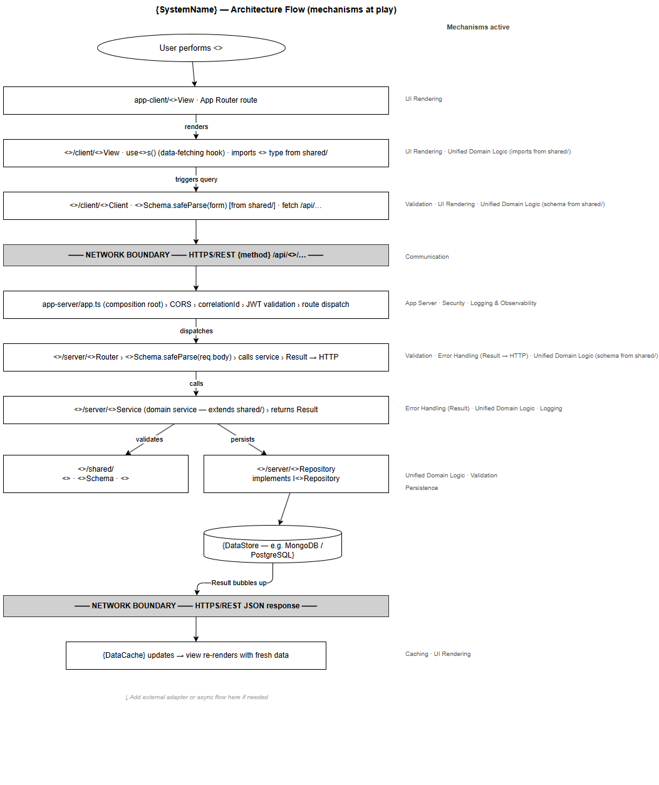
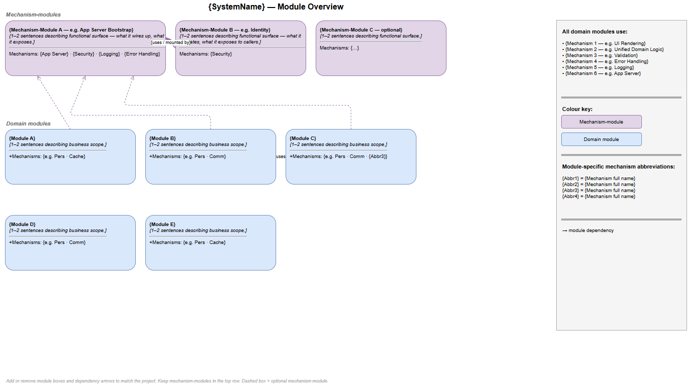
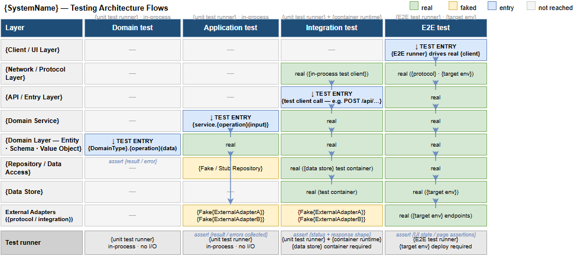

# {SystemName} — Architecture Blueprint

> **Status:** Draft / Approved
> **Owner:** {team-or-person}
> **Last updated:** YYYY-MM-DD
>
> **Purpose.** Second-level architecture document for {SystemName}, building on `architecture-outline.md`. Describes architecture as **mechanisms and modules**: mechanisms define the code shapes every module must adopt; modules are the major domain and infrastructure areas. Mechanism-first descriptions with code shape, an architecture flow diagram, a module catalogue, testing architecture, and ADRs.

---

## 1. Scope

This blueprint extends [`architecture-outline.md`](./architecture-outline.md). Deep mechanism walkthroughs — code, sequence diagrams beyond three participants, per-file structures — defer to architecture specification documents (one or more, one per mechanism or group). Outline-level concerns (system-context diagram, mechanism technology choices, guiding principles, tech stack, major systems, mechanism ADRs) stay in the outline and are not repeated here.

---

## 2. Architecture Mechanisms

Mechanisms go first — they define the code shape that all or some modules must adopt. For each mechanism: the technology choice (brief), then one to two prose paragraphs describing the code shape it imposes. If a mechanism also has a concrete implementation surface (its own routes, API, or bootstrap entry point) it is also a module and is marked *(mechanism + module)*; its functional behaviour is described in Section 4.

### 2.1 Security *(mechanism + module)*

**Technology:** {OAuth 2.0 / OIDC, JWT. Identity provider name. Auth middleware library.}

{Describe how Security shapes the system: where tokens are validated, what every authenticated route must receive (e.g. a Principal passed through method arguments — not ambient state), how role guards are applied. No domain service reads a token directly; the mechanism injects a typed Principal before the domain layer is reached.}

{Note that Security has a concrete module surface — an Identity module with its own middleware, routes, and JWKS client. That functional surface is described in Section 4.}

---

### 2.2 Error Handling & Resilience

**Technology:** {Result<T, E> type or equivalent. Retry / circuit-breaker library if used.}

{Describe how the mechanism shapes domain services: all service operations return a Result type — no thrown exceptions for expected failures. Domain error types are explicit and named. API edge translates Result failures to HTTP status codes using a single error translator — not per-route conditionals.}

{Describe resilience: how external calls are wrapped (retry with back-off, circuit breaker, timeout). Name the wrapper or pattern. State whether circuit-breaker state is in-process per replica or shared.}

---

### 2.3 Logging & Observability

**Technology:** {Structured logging library (e.g. Pino / Winston). Trace propagation — W3C traceparent or equivalent. Aggregation target.}

{Describe how logging shapes every component: a correlation ID is injected at the API edge and propagated on every downstream and outbound call. Loggers are constructor-injected into domain services — no direct console or global logger calls in domain code. Every cross-component call emits a span.}

---

### 2.4 Validation

**Technology:** {Zod / Joi / yup / class-validator or equivalent. Shared schema package or folder.}

{Describe how validation shapes modules: schemas live in a shared package or folder so both client-side pre-submission and server-side authoritative checks use the same definition. The API layer calls `Schema.safeParse(body)` (or equivalent) before passing data to the domain service. Business-rule validation inside domain services returns domain errors via Result, not thrown exceptions.}

---

### 2.5 Configuration & Secrets

**Technology:** {Secrets store — AWS Secrets Manager / HashiCorp Vault / environment variables. Config loading pattern.}

{Describe how config shapes the composition root: all `process.env` reads happen once at startup in the bootstrap; a frozen Config object is constructed and injected into every component through constructor injection. No component reads environment variables directly.}

---

### 2.6 Caching

**Technology:** {Redis / in-process LRU cache / TanStack Query (client-side). Cache pattern — write-through, cache-aside, stale-while-revalidate.}

{Describe the caching pattern(s) in use and how modules interact with it. Which modules depend on a cache interface. TTL, invalidation approach, and which layer owns cache invalidation.}

*(Remove this section if caching is not used.)*

---

### 2.7 Persistence

**Technology:** {PostgreSQL / MongoDB / DynamoDB / etc. ORM or driver. Migration tooling.}

{Describe the repository pattern: each domain module owns its own collection, table, or schema — no cross-module direct reads or writes. Repositories implement a named interface and are injected into domain services. The interface lives in the same shared package as the domain entity it persists so the domain layer stays framework-free.}

---

### 2.8 Communication

**Technology:** {REST / gRPC for synchronous. SQS / Kafka / SFTP / HTTPS for async or file-based. Protocol and contract-versioning approach.}

{Describe the communication pattern(s): synchronous request/response for user-initiated operations; async, file-based, or event-driven for cross-system side effects. Describe how external adapter interfaces are defined, where they live, and how the mechanism requires them to be faked in tests (not integration-tested against real external systems by default).}

---

### 2.9 UI Rendering

**Technology:** {React / Vue / Angular / server-side template engine. Build tooling — Vite / webpack / Next.js.}

{Describe how the UI Rendering mechanism shapes client modules: component naming and file structure conventions, state management pattern for server state (e.g. TanStack Query) vs local UI state (e.g. React state), routing approach. What every module's client surface must provide.}

*(Remove this section if the system has no browser client.)*

---

### 2.10 App Server *(mechanism + module)*

**Technology:** {Express / Fastify / Hapi / Koa / etc. Port, startup/shutdown.}

{Describe how App Server shapes the system: it is the composition root for all HTTP concerns. Every domain module adds one or more routers to the server. Middleware (correlation ID, JWT validation, error translation) is mounted globally — not repeated per router. The server registers all module routers in a single place at startup.}

{The App Server Bootstrap module's functional surface — startup sequence, config loading, dependency wiring, graceful drain — is described in Section 4.}

---

### 2.{N} {Bespoke Mechanism Name} *(bespoke)*

**Technology:** {Technology and package structure.}

{Describe how this bespoke mechanism shapes the codebase. What structural or naming constraint does it impose? Which layers does it touch? How does a change to the mechanism propagate — a rule change in the shared package propagates identically to all consumers without requiring per-module updates.}

*(Repeat for each additional bespoke mechanism from the outline. Remove this placeholder when none is needed.)*

---

## 3. Architecture Flow

The table below is the authoritative text form of the flow diagram. Each row is one layer or boundary in a typical end-to-end request; the right column names every mechanism active at that step. The diagram annotates the same steps visually — both must be kept in sync.

> Source: [`diagrams/architecture-flow.drawio`](./architecture-flow.drawio). Edit in draw.io Desktop and re-export.

| Step | Layer / File | Mechanisms active |
|---|---|---|
| 1 | **User** performs `{operation}` | — |
| 2 | `{client-app}/{Feature}View` · root router entry point | UI Rendering |
| 3 | `{domain}/client/{Entity}View` · `use{Entity}s` (server-state hook) · imports `{Entity}` type from `shared/` | UI Rendering · Unified Domain Logic · Caching |
| 4 | `{domain}/client/{Entity}sClient` · schema `safeParse(form)` [from `shared/`] · `fetch /api/…` | Unified Domain Logic · Validation (client) · Communication |
| — | **NETWORK BOUNDARY** — `{protocol}` `{verb} /api/{domain}/…` | Communication |
| 5 | `{app-server}/app` (composition root) › CORS › correlationId › auth validation › route dispatch | App Server · Security · Logging |
| 6 | `{domain}/server/{Entity}Router` › `RequestSchema.safeParse(req.body)` › calls service › `Result → HTTP` | App Server · Validation (server) · Error Handling |
| 7 | `{domain}/server/{Entity}sServer` (domain service — extends `shared/`) › returns `Result<T, E>` | Unified Domain Logic · Error Handling · Logging |
| 8 | `{domain}/shared/` — `{Entity}` · `{Entity}Schema` · `{Builder / ValueObject}` | Unified Domain Logic |
| 9 | `{domain}/server/{Entity}RepositoryServer` implements `I{Entity}Repository` | Persistence · Unified Domain Logic |
| 10 | `{data store}` | Persistence |
| — | **NETWORK BOUNDARY** — `{protocol}` response | Communication |
| 11 | Server-state cache updates → view re-renders with fresh data | UI Rendering · Caching |

*Note: Unified Domain Logic spans the full stack — `shared/` is imported by `client/` (entity types, client-side schema validation) and extended by `server/` (domain service, repository). Add rows for bespoke mechanisms (e.g. file generation, field masking) where they intersect the flow.*

---

## 4. Modules

All modules — both mechanism-modules and domain modules — are shown in [`diagrams/module-overview.drawio`](./module-overview.drawio). Mechanisms shared by all domain modules are listed in a legend; module-specific mechanisms are listed per module.

### 4.1 Mechanism-Modules

Mechanisms that also have a concrete implementation surface are also modules. Described here by functional behaviour and surface.

#### {MechanismModule — e.g. App Server Bootstrap}

{1–2 sentences: what the module does as a functional unit. Composition root; wires all dependencies; mounts global middleware chain; registers domain routers; starts and drains the HTTP server.}

Uses: {mechanism list}

---

#### {MechanismModule — e.g. Identity}

{1–2 sentences: validates tokens, extracts role claims, attaches a typed Principal to the request context. Exposes a login/logout/refresh route group if applicable.}

Uses: {mechanism list}

---

### 4.2 Domain Modules

One subsection per domain area. Business scope in 1–2 sentences; mechanisms list uses *common set* as shorthand for all mechanisms every domain module shares; additional module-specific mechanisms follow explicitly.

**Common set (all domain modules use):** {e.g. Unified Domain Logic · Security · Validation · Error Handling & Resilience · Logging & Observability · UI Rendering · App Server · Persistence}

---

#### {ModuleName — e.g. Orders}

{1–2 sentences describing what this module does for the business.}

Uses: *common set* + {module-specific mechanisms, e.g. Communication · Caching}

Dependencies: {App Server Bootstrap · Identity · other modules this module calls}

---

#### {ModuleName}

{1–2 sentences.}

Uses: *common set* + {module-specific mechanisms}

Dependencies: {dependencies}

---

*(Repeat for each domain module. Remove the placeholder entries when done.)*

> Source: [`diagrams/module-overview.drawio`](./module-overview.drawio). Edit in draw.io Desktop and re-export.

---

## 5. Testing Architecture

Test tiers common to the whole system:

| Tier | Scope | Test doubles | Where it runs |
|---|---|---|---|
| **Domain** | One `shared/` entity, schema, or builder; pure TypeScript | None | In-process, Vitest / Jest, no DB |
| **Application** | One module's server service; full use case | `Fake*Repository`, fake external adapters | In-process, Vitest / Jest, no DB |
| **Integration** | One module's router + real DB | Real DB (test container); external adapters still faked | CI, Vitest / Jest, requires DB |
| **E2E** | Key user journey; full deployed stack | Real everything, against staging | Pre-release, Playwright / Cypress |

Common doubles: `{FakeClock}`, `{Fake*Repository}`, `{FakeExternalAdapter}`.

See [`diagrams/testing-flow.drawio`](./testing-flow.drawio) for a side-by-side view of which stack layers are real, faked, or not reached in each tier, with annotated entry and assertion points.

---

## 6. Decision Records

Blueprint-level decisions (continuing ADR numbering from the outline):

| ID | Decision | One-line consequence |
|---|---|---|
| [ADR-{NNN}](../decisions/ADR-{NNN}-{slug}.md) | {Decision} | {One-line consequence} |

*(Blueprint ADRs cover: module boundaries, package structure, test-tier vocabulary, data ownership patterns. Mechanism technology choices have their ADRs in the outline.)*

---

## See also

- [`architecture-outline.md`](./architecture-outline.md) — mechanism technology choices, guiding principles, tech stack, major systems, mechanism ADRs.
- [`<mechanism>-architecture-specification.md`](./<mechanism>-architecture-specification.md) — spec (module layout, layer qualifiers, worked examples) for one or more mechanisms mentioned here.
- [`service-level-objectives.md`](./service-level-objectives.md) — non-functional requirements per major system.
