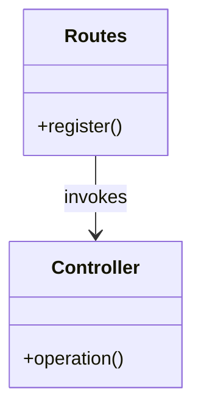
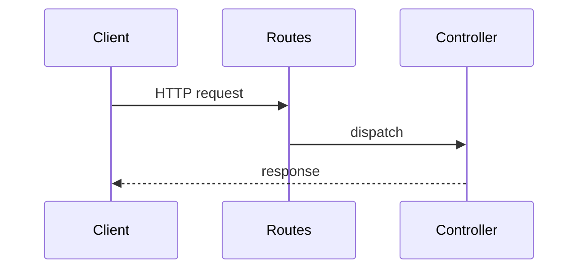

# pml-midtier Express Architecture Specification

## Where to Start -- What Does This Feature Touch?

Answer each question about the feature or story you are working on.

| Question                                                            | Read this                                                       |
| ------------------------------------------------------------------- | --------------------------------------------------------------- |
| Is there a new downstream system to integrate with?                 | [src/entities/](/src/entities/architecture-context.md)          |
| Does it require a new third-party credential or environment value?  | [src/configs/](/src/configs/architecture-context.md)            |

---

## Overview

pml-midtier is a Node.js/Express API gateway.

---

## Mechanisms

### Mechanism: System Entity Controllers

#### Principles & Patterns

- **Principle:** Each downstream system is owned by exactly one folder.
- **Pattern:** Three-file skeleton: index, routes, controller.
  - **Options:** controller per system; controller per area within system.
  - **Benefits:** uniform shape; new systems follow the template.
  - **Trade-offs:** repetition across folders is the price of independence.

#### File Structure

```
src/
+-- entities/
    +-- {System}/
        +-- index.ts
        +-- {system}.routes.ts
        +-- controller.ts
```

#### Participants



#### Flow



#### Walkthrough Example

Scenario: Mavenir customer update.

1. Client posts to `/mavenir/customer/:id`.
2. Routes match and invoke `MavenirCustomerController.update`.
3. Controller validates, calls axios, returns `res.json`.

```typescript
class MavenirCustomerController {
  async update(req: AuthRequest, res: Response) {
    validatePayload(updateSchema, req.body);
    const response = await this.axios.patch(`/customers/${req.params.id}`, req.body);
    return res.json(response.data);
  }
}
```

---

## Testing Architecture

Tests use a Sandbox pattern. See [tests/domain-helpers/](/tests/domain-helpers/architecture-context.md).

---

## References

- ADR-001 through ADR-007.
