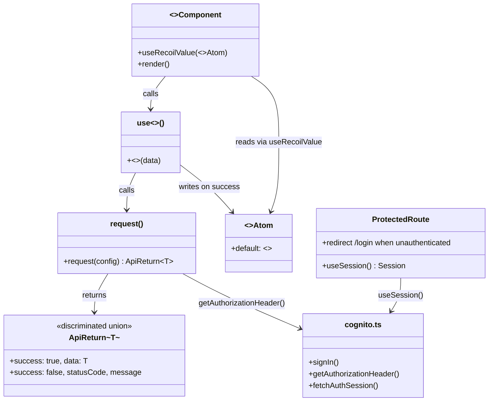
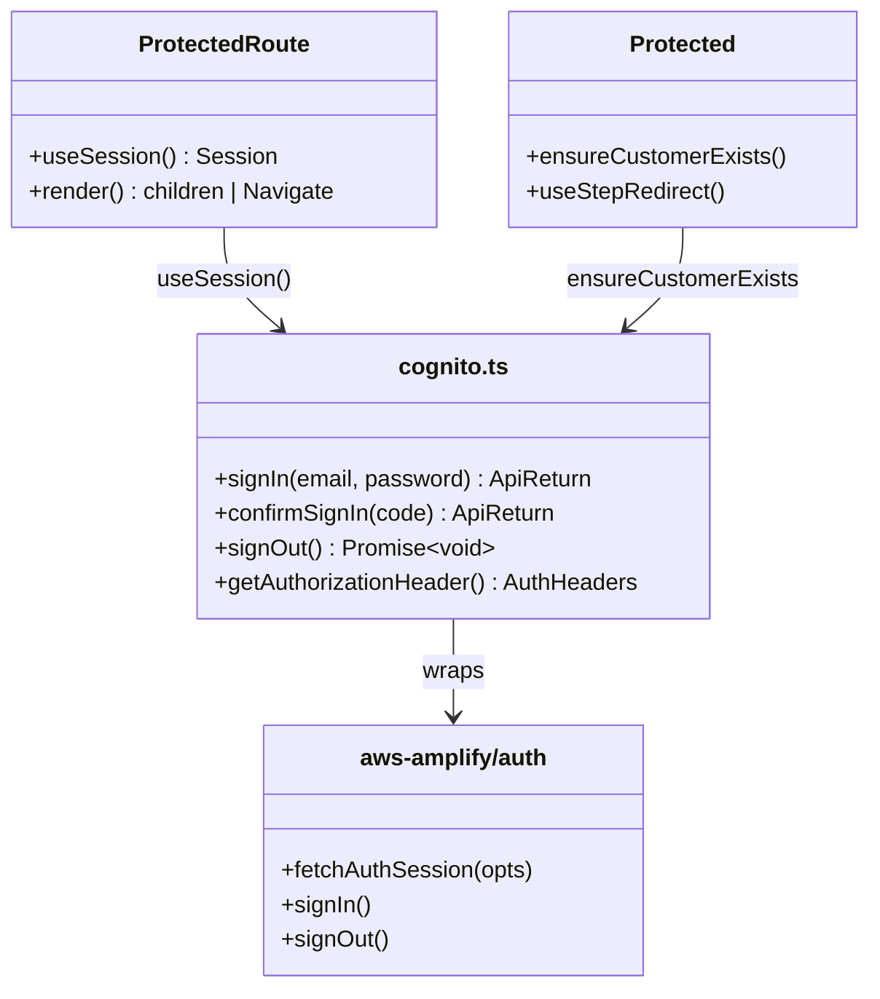
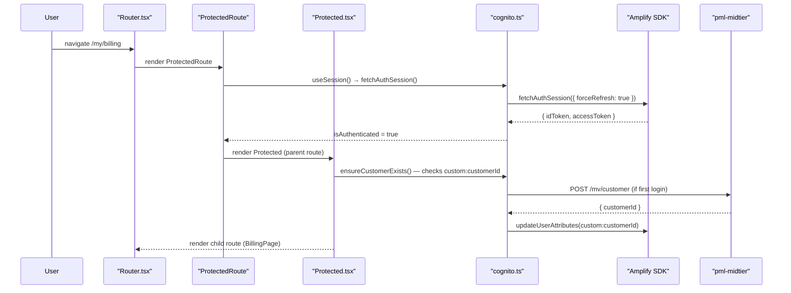
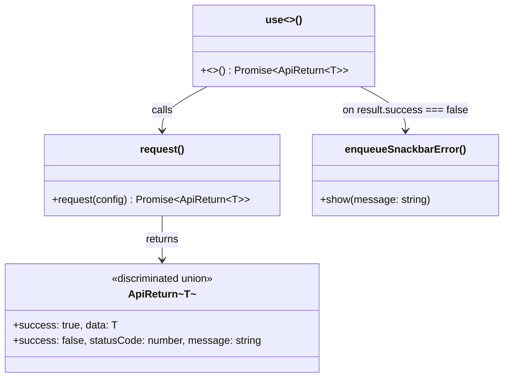
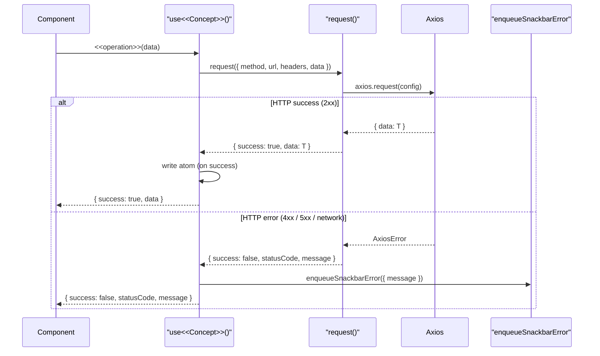
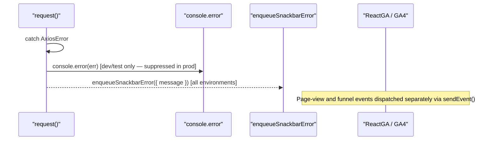
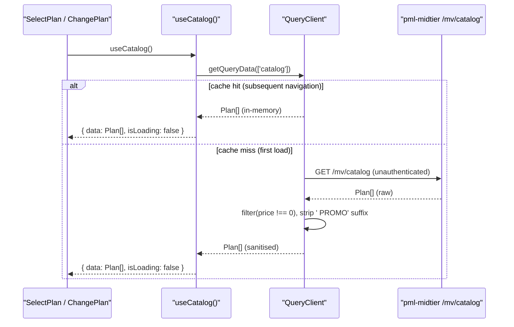
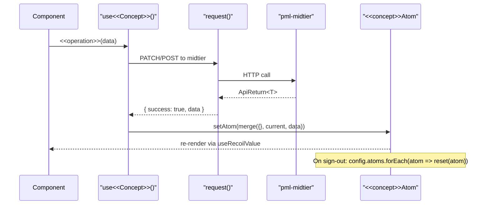
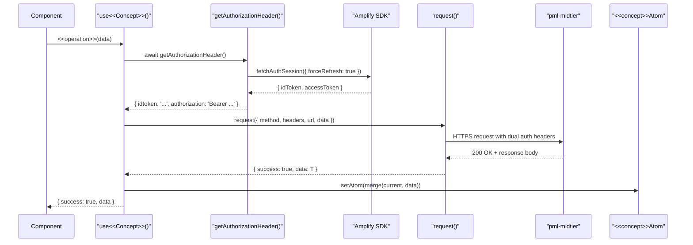
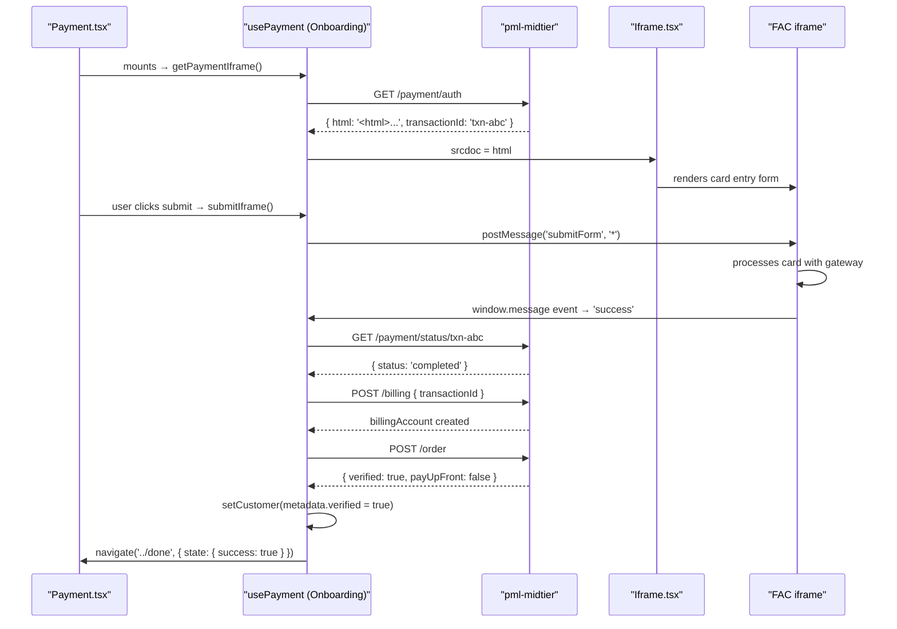

# pml-my React SPA Architecture Specification

> **Mode:** document
> **Sources:** `architecture-outline.md`, `architecture-blueprint.md`, ADR-001–ADR-010, code-research agent-2-deep-dive
> **Mechanisms:** 11 — per-mechanism `## Mechanism:` sections (4+ rule applied)

---

## Table of Contents

- [Overview](#overview)
- [Instantiating the Domain](#instantiating-the-domain)
  - [Principles](#principles)
  - [Architecture Flow](#architecture-flow)
  - [Module Layout](#module-layout)
  - [Participants](#participants)
- [Mechanism: App Bootstrap](#mechanism-app-bootstrap)
- [Mechanism: Security (Identity)](#mechanism-security-identity)
- [Mechanism: Error Handling & Resilience](#mechanism-error-handling--resilience)
- [Mechanism: Logging & Observability](#mechanism-logging--observability)
- [Mechanism: Validation](#mechanism-validation)
- [Mechanism: Configuration & Secrets](#mechanism-configuration--secrets)
- [Mechanism: Caching](#mechanism-caching)
- [Mechanism: Persistence](#mechanism-persistence)
- [Mechanism: Communication (HTTP Client)](#mechanism-communication-http-client)
- [Mechanism: Feature Flag Control](#mechanism-feature-flag-control)
- [Mechanism: Analytics Attribution](#mechanism-analytics-attribution)
- [Mechanism: Hosted-Iframe Payment Integration](#mechanism-hosted-iframe-payment-integration)
- [Testing Architecture](#testing-architecture)
  - [Principles](#principles-1)
  - [Testing Scope](#testing-scope)
  - [Development Workflow](#development-workflow)
  - [Module Layout](#module-layout-1)
  - [Participants](#participants-1)
  - [Domain Test Objects](#domain-test-objects)
- [Example](#example)
- [Grill Me — Map a Story to a Mechanism](#grill-me--map-a-story-to-a-mechanism)
- [Rules and Validation](#rules-and-validation)
  - [Incompleteness Checklist — where the domain layer isn't being used](#incompleteness-checklist--where-the-domain-layer-isnt-being-used)
- [References](#references)

---

## Overview

pml-my is a React 18 / TypeScript 5 single-page application (SPA) hosted on AWS Amplify that provides Paradise Mobile's customer-facing prospect onboarding wizard and authenticated subscriber self-care. It prioritises:

1. **All external system calls cross a named seam** — every interaction with Cognito, pml-midtier, FAC, Persona, or GrowthBook happens through a project-owned service function or hook so it can be stubbed in tests.
2. **`request()` never throws** — the Axios wrapper returns `ApiReturn<T>`; callers check `result.success`; exceptions propagate only to error boundaries or `QueryCache.onError`.
3. **Recoil atoms are the single source of truth for in-session state** — all page components read customer and subscription state from atoms; no component fetches the same data independently.
4. **Feature flag defaults must be safe** — every flag consumer renders correctly before GrowthBook loads.
5. **No raw card data in the application layer** — card capture lives entirely within the FAC iframe.

**Mechanisms:** App Bootstrap, Security (Identity), Error Handling & Resilience, Logging & Observability, Validation, Configuration & Secrets, Caching, Persistence, Communication (HTTP Client), Feature Flag Control, Analytics Attribution, Hosted-Iframe Payment Integration.

> Sources: `docs/architecture/architecture-outline.md` · `docs/architecture/architecture-blueprint.md` · ADR-001 through ADR-010 · code-research agent-2-deep-dive.

---

## Instantiating the Domain

How domain concepts from the domain model become code in pml-my — modules, hooks, atoms, and service functions.

### Principles

- **Domain modules over technical layers.** Source code is organised by business domain (`Onboarding/`, `My/`, `Catalog`) not by technical role (all hooks together, all services together). Mechanism infrastructure lives in `src/utils/`, `src/services/`, and `src/config/`.
- **Domain class names drive file names.** A domain concept (`Customer`, `Plan`, `Cart`, `Subscription`) gives its name to the atom (`customerAtom`, `selectedPlanAtom`), to mutation hooks (`useCustomer`, `useCatalog`), and to API service functions (`fetchCustomer`, `patchCart`). A reader can look at any file name and know which domain concept it came from.
- **Mechanism-modules expose a stable surface API.** App Bootstrap, Identity, and Analytics Attribution each publish a named API surface (hooks, functions, components). Feature modules consume only that surface — never mechanism internals or third-party SDK imports directly.
- **Domain mutations own both the API call and the atom write.** A mutation hook calls the service function and, on success, writes the result into the appropriate Recoil atom in the same function. Components call the mutation hook only; they do not call service functions directly.

### Architecture Flow

One representative authenticated interaction — a Subscriber navigating to `/my/billing` — traced from browser entry to UI re-render.

> See [`architecture-flow.drawio`](./architecture-flow.drawio) for the visual diagram.

```
Browser
  │
  ▼
src/Router.tsx
  │  React Router matches /my/billing
  ▼
<ProtectedRoute>  (src/pages/Protected/)
  │  useSession() → Amplify SDK → cached / refreshed tokens
  │  isAuthenticated = true → render child
  ▼
<BillingPage>  (src/pages/My/pages/Billing/)
  │  useBillingHistory() hook fires
  ▼
useRequestGet  (src/utils/api/hooks/)
  │  getAuthorizationHeader() → fetchAuthSession({ forceRefresh: true })
  │  Axios GET /billing → dual auth headers
  ▼
pml-midtier  [external boundary]
  │  validates idtoken + authorization Bearer
  │  returns BillingHistory JSON
  ▼
ApiReturn<BillingHistory>  (src/types/request.ts)
  │  result.success = true
  ▼
useSetRecoilState(billingAtom)  (src/recoil/)
  │
  ▼
UI re-render — BillingPage reads billingAtom via useRecoilValue
```

| Tech / Layer | File / Module | Domain concept it carries |
|---|---|---|
| **Router** | `src/Router.tsx` | Route tree — maps URL paths to domain modules |
| **Route Guard** | `src/pages/Protected/` + `ProtectedRoute.tsx` | `<<Session>>` — isAuthenticated check; step-resume redirect |
| **Page Component** | `src/pages/My/pages/<<Page>>/` | `<<DomainConcept>>` — renders domain state from Recoil atoms |
| **Mutation Hook** | `src/pages/My/hooks/useCustomer.ts` | `<<Customer>>` — encapsulates API call + atom write |
| **API Wrapper** | `src/utils/api/request.ts` | `<<ApiReturn>>` — discriminated union for every HTTP call |
| **Recoil Atom** | `src/recoil/<<concept>>Atom.ts` | `<<DomainConcept>>` — session-scoped source of truth |
| **Service Function** | `src/services/aws/cognito.ts` | `<<Session>>` — Cognito token operations |
| **Config Module** | `src/config/env.ts` | Build-time configuration; all VITE_* vars |

### Module Layout

```
src/
├── main.tsx                          ← entry point; analytics + React mount
├── App.tsx                           ← provider stack; QueryClient + GrowthBook singletons
├── Router.tsx                        ← route definitions; flag-gated route trees
│
├── config/
│   ├── env.ts                        ← typed env object; requireEnv guard
│   └── flags.ts                      ← GrowthBook flag key constants
│
├── recoil/                           ← global atoms (shared across modules)
│   ├── customerAtom.ts               ← <<Customer>> domain object; session source of truth
│   ├── sessionAtom.ts                ← isLogged + onboarding step redirect
│   ├── accountAtom.ts                ← sign-up credential buffer
│   ├── selectedPlanAtom.ts           ← <<Plan>> | null (onboarding selection)
│   └── utmAtom.ts                    ← UTM campaign attribution parameters
│
├── services/
│   └── aws/
│       └── cognito.ts                ← Identity seam — all Cognito operations
│
├── utils/
│   ├── api/
│   │   ├── request.ts                ← Axios wrapper; ApiReturn discriminated union
│   │   └── hooks/                    ← useRequestGet / useRequestPost / useRequestPatch
│   ├── analytics/
│   │   ├── events.ts                 ← typed event name registries (as const)
│   │   ├── sendEvent.ts              ← named sender functions (GA4, Hotjar)
│   │   └── AnalyticsWrapper.tsx      ← UTM capture; writes utmAtom
│   ├── logger/
│   │   └── disableConsole/           ← console suppression for production
│   └── snackbar/
│       └── snackbar.ts               ← enqueueSnackbarError singleton
│
├── pages/
│   ├── Protected/                    ← session guard + step-resume
│   │   └── utils.ts                  ← ensureCustomerExists
│   ├── Onboarding/                   ← <<Prospect>> conversion wizard
│   │   ├── config.ts                 ← step config + atom reset manifest
│   │   ├── recoil/atoms/             ← onboarding-scoped atoms
│   │   └── pages/
│   │       ├── LineNumber/           ← <<MSISDN>> selection and portability
│   │       ├── SelectPlan/           ← <<Plan>> catalog display
│   │       ├── SelectSim/            ← <<SIM>> type selection
│   │       ├── Profile/              ← <<Customer>> identity + KYC
│   │       ├── Checkout/             ← <<Cart>> review + <<Payment>> iframe
│   │       └── Done/                 ← <<Order>> confirmation
│   └── My/                           ← <<Subscriber>> self-care
│       ├── hooks/
│       │   └── useCustomer.ts        ← self-care <<Customer>> mutation hook
│       ├── recoil/
│       │   └── subscription.ts       ← subscriptionAtom + subscriptionSelector
│       └── pages/
│           ├── Home/                 ← account summary dashboard
│           ├── Billing/              ← billing history + invoice
│           ├── Services/             ← plan and service management
│           ├── Profile/              ← identity + address update
│           ├── Payment/              ← payment method update
│           └── Support/              ← support + feedback
│
└── services/
    └── mavenir/
        └── useCatalog.tsx            ← <<Plan>> catalog (TanStack Query, unauthenticated)
```

| Artefact | Location | Used by |
|----------|----------|---------|
| **`customerAtom`** | `src/recoil/customerAtom.ts` | Onboarding, Self-Care, Analytics Attribution |
| **`selectedPlanAtom`** | `src/recoil/selectedPlanAtom.ts` | Onboarding (SelectPlan → Checkout) |
| **`utmAtom`** | `src/recoil/utmAtom.ts` | Analytics Attribution, Onboarding (purchase events) |
| **`subscriptionSelector`** | `src/pages/My/recoil/subscription.ts` | Self-Care pages (multi-line selector) |
| **`useCustomer` (Onboarding)** | `src/hooks/useCustomer.ts` | Profile, Checkout steps |
| **`useCustomer` (Self-Care)** | `src/pages/My/hooks/useCustomer.ts` | My Profile, My Billing |
| **`useCatalog`** | `src/services/mavenir/useCatalog.tsx` | SelectPlan (Onboarding), ChangePlan (Self-Care) |
| **`request()`** | `src/utils/api/request.ts` | All mutation hooks |
| **`sendEvent()`** | `src/utils/analytics/sendEvent.ts` | All domain modules (analytics events) |
| **`env`** | `src/config/env.ts` | All modules needing configuration |
| **`flags`** | `src/config/flags.ts` | Router, Onboarding, Self-Care |

### Participants



---

## Mechanism: App Bootstrap

### Principles & Patterns

- **Principle:** Third-party SDK initialisation is a single-entry concern executed once before React mounts; no feature module may call initialisation functions.
- **Pattern:** Imperative bootstrap in `main.tsx` followed by a declarative provider stack in `App.tsx`. Singletons (`QueryClient`, `GrowthBook`) are created at module scope — outside the component tree — so they survive full re-renders of `<App />`.
  - **Options:** Per-module lazy init (discarded — race conditions with first render); useEffect on App root (discarded — cannot guarantee pre-mount execution).
  - **Benefits:** Predictable init order; all contexts available to every child component; singletons never recreated.
  - **Trade-offs:** `QueryCache.onError` cannot read Recoil atoms (outer provider) — uses module-scoped `enqueueSnackbarError` instead.

### File Structure

```
src/
├── main.tsx                ← DOM mount; conditional analytics init (non-dev only)
├── App.tsx                 ← provider stack; QueryClient + GrowthBook singletons
│                              Provider nesting order:
│                              LocalizationProvider
│                                QueryClientProvider
│                                  RecoilRoot
│                                    AnalyticsWrapper  ← writes utmAtom at mount
│                                      GrowthBookProvider
│                                        ThemeProvider
│                                          SnackbarProvider
│                                            BrowserRouter → Router
├── config/
│   ├── env.ts              ← required before any SDK init
│   └── flags.ts            ← GrowthBook constants
└── utils/
    ├── analytics/
    │   └── AnalyticsWrapper.tsx  ← UTM capture inside RecoilRoot
    ├── logger/
    │   └── disableConsole/       ← production console suppression
    └── snackbar/
        └── snackbar.ts           ← module-scoped enqueueSnackbarError
```

### Participants

| Class / Module | Layer | Responsibility | Collaborators |
|---|---|---|---|
| **`main.tsx`** | Bootstrap | DOM mount; conditional GA4, GTM, Hotjar, PageSense init | `env`, `App` |
| **`App.tsx`** | Bootstrap | Provider stack assembly; `QueryClient` + `GrowthBook` singletons | `QueryClient`, `GrowthBook`, `RecoilRoot`, `Router` |
| **`QueryClient`** | Infrastructure | TanStack Query in-process cache + global `onError` handler | `enqueueSnackbarError` |
| **`GrowthBook`** | Infrastructure | Feature flag singleton; `loadFeatures()` fire-and-forget | `env.growthbook` |
| **`AnalyticsWrapper`** | Cross-Cutting | UTM capture at mount; writes `utmAtom` | `utmAtom`, `window.location.search` |
| **`enqueueSnackbarError`** | Infrastructure | Module-scoped snackbar utility (used by `QueryCache.onError`) | `notistack` |

### Flow

```mermaid
sequenceDiagram
    participant Browser
    participant main as "main.tsx"
    participant App as "App.tsx"
    participant Analytics as "AnalyticsWrapper"
    participant Router as "Router.tsx"

    Browser->>main: loads index.html; evaluates bundle
    main->>main: if not development — disableConsole(), ReactGA.initialize(), TagManager.initialize(), hotjarInit(), pageSenseInit()
    main->>App: createRoot().render(<App />)
    App->>App: module scope — QueryClient created; GrowthBook created; loadFeatures() (fire-and-forget)
    App->>Analytics: mounts inside RecoilRoot
    Analytics->>Analytics: useEffect — parse window.location.search → write utmAtom
    App->>Router: renders (all providers established)
    Router->>Router: evaluateFlags(MAINTENANCE, DISABLE_SELFCARE) → mount route tree
```

### Walkthrough Example

Scenario: A user visits `https://app.paradise.mobile/?utm_source=google&utm_medium=cpc` in a production environment.

1. **Browser** loads `index.html`; Vite serves the bundle; `main.tsx` evaluates.
2. **`main.tsx`** (`src/main.tsx`) checks `env.environment !== 'development'` — true; calls `disableConsole()`, `ReactGA.initialize(env.google.gaId, ...)`, `TagManager.initialize({ gtmId: env.google.gtmId })`, `hotjarInit()`, `pageSenseInit()`.
3. **`main.tsx`** calls `createRoot(rootElement).render(<App />)` — mounts the React tree.
4. **`App.tsx`** module scope executes: `QueryClient` singleton created with `retry: false` and `QueryCache.onError` snackbar handler; `GrowthBook` singleton created; `growthbook.loadFeatures()` fires async (fire-and-forget).
5. **Provider stack** renders in nesting order — `LocalizationProvider` (enCA) → `QueryClientProvider` → `RecoilRoot` → `AnalyticsWrapper` mounts, reads `utm_source=google utm_medium=cpc` from `window.location.search`, writes `{ utmSource: 'google', utmMedium: 'cpc' }` to `utmAtom` → `GrowthBookProvider` → `ThemeProvider` → `SnackbarProvider` → `BrowserRouter`.
6. **`Router.tsx`** (`src/Router.tsx`) renders; evaluates `useFeatureIsOn(flags.MAINTENANCE)` — `false` (flag not yet loaded, safe default); mounts the full route tree.

```typescript
// src/main.tsx — bootstrap sequence (actual file)
async function bootstrap() {
  if (env.environment !== 'development') {
    disableConsole()
    ReactGA.initialize(env.google.gaId, { gaOptions: { siteSpeedSampleRate: 100 } })
    TagManager.initialize({ gtmId: env.google.gtmId })
    hotjarInit()
    pageSenseInit()
  }
  const rootElement = document.getElementById('root')
  rootElement && createRoot(rootElement).render(<App />)
}
void bootstrap()
```

### Testing the Mechanism

- **T1 (Domain):** Not applicable — bootstrap is imperative side-effects, not domain logic.
- **T2 (Application):** Render `<App />` inside a `TestWrapper` that provides `RecoilRoot` + `QueryClientProvider` with a test `QueryClient` (never the module-level singleton). Use `vi.mock('@/utils/analytics', ...)` to suppress vendor init. Verify that `AnalyticsWrapper` writes `utmAtom` from `window.location.search`.
- **T4 (E2E):** Playwright `beforeAll` — navigate to root; assert page title and that no uncaught console errors are thrown from provider init.

---

## Mechanism: Security (Identity)

### Principles & Patterns

- **Principle:** All authentication operations cross the `src/services/aws/cognito.ts` seam; feature code never imports from `aws-amplify/auth` directly.
- **Pattern:** Thin wrapper module (`cognito.ts`) over Amplify SDK v6, configured once at module load; every authenticated request performs a forced token refresh (`fetchAuthSession({ forceRefresh: true })`); route-level `<ProtectedRoute>` and `Protected` parent enforce session state declaratively.
  - **Options:** Manual JWT storage (discarded — homegrown token lifecycle); session cookies (discarded — SPA model requires client-managed tokens).
  - **Benefits:** Single grep on `cognito.ts` imports audits all auth interactions; forced refresh eliminates stale-token errors; Amplify manages refresh-token rotation internally.
  - **Trade-offs:** Every authenticated API call incurs an Amplify refresh check; accepted as the cost of eliminating stale-token bugs.

### File Structure

```
src/
├── services/
│   └── aws/
│       ├── cognito.ts              ← all Cognito operations; Amplify.configure at module load
│       └── index.ts                ← re-exports
├── pages/
│   ├── Protected/
│   │   ├── Protected.tsx           ← parent route: ensureCustomerExists on first login
│   │   └── utils.ts                ← ensureCustomerExists: Cognito ↔ midtier customer bridge
│   └── ProtectedRoute.tsx          ← render guard: redirects to /sign-in if !isAuthenticated
└── config/
    └── env.ts                      ← awsCognito config (region, userPoolId, webClientId)
```

### Participants

| Class / Module | Layer | Responsibility | Collaborators |
|---|---|---|---|
| **`cognito.ts`** | Service | Wraps Amplify auth primitives; single auth seam | `aws-amplify/auth`, `env.awsCognito` |
| **`getAuthorizationHeader()`** | Service | Force-refreshes session; returns `{ idtoken, authorization: Bearer }` for all midtier calls | `fetchAuthSession` (Amplify) |
| **`ensureCustomerExists()`** | Application | On first login: POSTs to midtier; stamps `custom:customerId` back to Cognito | `cognito.ts`, midtier `/mv/customer` |
| **`ProtectedRoute`** | UI Guard | Renders children when `isAuthenticated === true`; renders `null` during resolution; redirects to `/sign-in` | `useSession()` |
| **`Protected`** | Application | Parent route component; calls `ensureCustomerExists`; drives step-resume redirect | `useSession()`, `sessionAtom` |
| **`useSession()`** | Hook | Returns `{ isAuthenticated, idToken, accessToken }` | `cognito.ts` |



### Flow



### Walkthrough Example

Scenario: A returning Subscriber navigates to `/my/billing`; their Cognito session was established 45 minutes ago.

1. **`Router.tsx`** (`src/Router.tsx`) matches path `/my/billing`; renders `<ProtectedRoute />` as the parent element.
2. **`ProtectedRoute`** (`src/pages/ProtectedRoute.tsx`) calls `useSession()` which internally calls `fetchAuthSession()` via `cognito.ts`.
3. **`cognito.ts`** (`src/services/aws/cognito.ts`) calls `fetchAuthSession({ forceRefresh: true })` — Amplify checks token expiry; the access token is 45 minutes old (< 60-minute window) so no network refresh is needed; returns `{ idToken, accessToken }`.
4. **`ProtectedRoute`** receives `isAuthenticated = true`; renders `<Protected />` (the outlet parent).
5. **`Protected.tsx`** (`src/pages/Protected/Protected.tsx`) calls `ensureCustomerExists()` from `src/pages/Protected/utils.ts`; finds `custom:customerId` already set — no midtier call needed.
6. **`Protected.tsx`** renders the child route; `BillingPage` mounts and fires its data fetch.

```typescript
// src/pages/ProtectedRoute.tsx — actual route guard (illustrative shape)
export const ProtectedRoute = () => {
  const { isAuthenticated } = useSession()          // cognito.ts seam
  if (isAuthenticated === null) return null          // render null during resolution
  if (!isAuthenticated) return <Navigate to="/sign-in" replace />
  return <Outlet />
}
```

### Testing the Mechanism

- **T2 (Application):** Wrap component under test in a mock session provider that returns `{ isAuthenticated: true, idToken: 'mock-id', accessToken: 'mock-access' }`. Test `ProtectedRoute` separately: render with `isAuthenticated = false` → assert redirect to `/sign-in`; with `true` → assert child renders.
- **T3 (Integration):** MSW handler for `POST /mv/customer` — test `ensureCustomerExists` when `custom:customerId` is absent; assert midtier is called exactly once and the attribute is stamped.
- **T4 (E2E):** `acceptance-auth` Playwright project uses `storageState` with pre-established Cognito token state (`tests/e2e/auth.setup.ts`). Navigate to `/my/billing`; assert page loads without redirect.

---

## Mechanism: Error Handling & Resilience

### Principles & Patterns

- **Principle:** `request()` never throws; all callers check `result.success` before acting on data; no unhandled promise rejections.
- **Pattern:** Discriminated union `ApiReturn<T>` wraps every Axios call. On failure, the wrapper returns `{ success: false, statusCode, message }` — callers surface the error via `enqueueSnackbarError`. TanStack Query errors from the catalog flow through `QueryCache.onError` globally.
  - **Options:** Throw on HTTP error (discarded — forces every call site into try/catch); global Axios error interceptor that mutates response (discarded — hides failure type from callers).
  - **Benefits:** Type-safe error handling at every call site; no silent failures; consistent snackbar UX.
  - **Trade-offs:** No circuit-breaker or retry at the HTTP transport layer; payment retry is the only domain-specific retry, gated by `PAYMENT_ATTEMPTS` flag.

### File Structure

```
src/
├── types/
│   └── request.ts              ← ApiReturn<T> type definition
├── utils/
│   ├── api/
│   │   ├── request.ts          ← Axios wrapper; catch → { success: false, ... }
│   │   └── hooks/              ← useRequestGet / useRequestPost / useRequestPatch
│   └── snackbar/
│       └── snackbar.ts         ← enqueueSnackbarError (module-scoped singleton)
└── App.tsx                     ← QueryCache.onError → enqueueSnackbarError
```

### Participants

| Class / Module | Layer | Responsibility | Collaborators |
|---|---|---|---|
| **`ApiReturn<T>`** | Domain Type | Discriminated union: `{ success: true; data: T }` \| `{ success: false; statusCode: number; message: string }` | All service functions |
| **`request()`** | Infrastructure | Axios wrapper; catches all errors; returns `ApiReturn<T>` | Axios, `getAuthorizationHeader()` |
| **`useRequestGet/Post/Patch`** | Infrastructure | React hooks exposing `{ isLoading, response, error }` over `request()` | `request.ts` |
| **`enqueueSnackbarError`** | Infrastructure | Module-scoped snackbar; called by `QueryCache.onError` and mutation hooks on failure | `notistack` |
| **`QueryCache.onError`** | Infrastructure | Global TanStack Query error handler — snackbar on catalog/query failure | `enqueueSnackbarError` |
| **`usePayment` (retry)** | Application | Domain-specific retry capped by `PAYMENT_ATTEMPTS` GrowthBook value | `flags.PAYMENT_ATTEMPTS` |



### Flow



### Walkthrough Example

Scenario: A Subscriber submits a profile update; the midtier returns `422 Unprocessable Entity`.

1. **`Profile.tsx`** (`src/pages/My/pages/Profile/`) calls `useCustomer().patchCustomer({ identity: { preferredName: 'Sam' }, address: currentAddress })`.
2. **`useCustomer`** (`src/pages/My/hooks/useCustomer.ts`) calls `patchCartRequest.request({ headers: await getAuthorizationHeader(), url: env.midtier.mavenir.customer, data })`.
3. **`request()`** (`src/utils/api/request.ts`) sends `axios.request(...)` — midtier responds `422`.
4. **`request()`** catches the `AxiosError`; returns `{ success: false, statusCode: 422, message: 'Unprocessable Entity' }` — does NOT throw.
5. **`useCustomer`** receives `result.success === false`; calls `enqueueSnackbarError({ message: result.message })` — user sees a snackbar toast.
6. **`customerAtom`** is NOT updated — the optimistic merge is skipped.
7. **`Profile.tsx`** receives `{ success: false }` from the hook; can inspect the result to show field-level error UI if desired.

```typescript
// src/utils/api/request.ts — ApiReturn wrapper (illustrative shape)
async function request<T>(config: RequestConfig): Promise<ApiReturn<T>> {
  try {
    const { data } = await axiosInstance.request(config)
    return { success: true, data }
  } catch (err: unknown) {
    const axiosErr = err as AxiosError
    return {
      success: false,
      statusCode: axiosErr.response?.status ?? 0,
      message: axiosErr.message,
    }
  }
}
```

### Testing the Mechanism

- **T1 (Domain):** Unit-test `ApiReturn` type guard utilities if any exist.
- **T2 (Application):** Use MSW handler returning 4xx/5xx; render the component under test; assert snackbar is shown via `notistack` test helpers; assert domain atom is NOT updated on failure.
- **T3 (Integration):** Test `request()` directly with an MSW handler for each error variant (400, 401, 422, 500, network-timeout); assert correct `{ success: false, statusCode }` shapes returned.

---

## Mechanism: Logging & Observability

### Principles & Patterns

- **Principle:** Client-side observability is marketing and conversion analytics only; there is no structured server-side logging or distributed tracing from pml-my.
- **Pattern:** `console.error` for development/test; `disableConsole()` suppresses all console output in production. GA4 + GTM + Hotjar provide production event tracking. This is a documented gap — see below.
  - **Options:** OpenTelemetry browser SDK (deferred — no requirement); structured server-side error log sink (deferred — no requirement).
  - **Benefits:** Zero cost; analytics vendors already in place for marketing use.
  - **Trade-offs:** **Gap:** No production error log, no trace ID, no metrics for API error rates or latency. Debugging production issues requires Hotjar session replay or GA4 event audit.

**Documented Gap:** pml-my has no server-side logging, no OpenTelemetry instrumentation, and no error monitoring service (e.g. Sentry, Datadog). This is accepted for the current scope. Adding an error monitoring service requires: (1) install SDK, (2) init in `main.tsx` alongside analytics, (3) call `ErrorMonitor.captureException()` inside `request()` on `{ success: false }`.

### File Structure

```
src/
├── main.tsx                        ← disableConsole() in non-dev; analytics vendor init
└── utils/
    └── logger/
        └── disableConsole/
            └── index.ts            ← replaces console.error/warn/log with no-ops
```

### Participants

| Class / Module | Layer | Responsibility | Collaborators |
|---|---|---|---|
| **`disableConsole()`** | Infrastructure | Replaces `console.*` with no-ops; called from `main.tsx` in non-dev | `main.tsx` |
| **`console.error`** | Infrastructure | Development/test error output; suppressed in production | — |
| **`sendEvent()`** | Analytics | Production event dispatch (page views, purchases, funnel steps) | GA4, GTM, Hotjar |
| **`QueryCache.onError`** | Infrastructure | Catches unhandled TanStack Query errors; shows snackbar | `enqueueSnackbarError` |

### Flow



### Walkthrough Example

Scenario: A developer runs the app locally; a midtier call fails.

1. **`request()`** (`src/utils/api/request.ts`) catches an `AxiosError`; calls `console.error(err)`.
2. **Browser console** shows the error stack (development — `disableConsole()` not called).
3. **`request()`** returns `{ success: false, statusCode: 503, message: 'Service Unavailable' }`.
4. **Caller** (`useCustomer`) passes the message to `enqueueSnackbarError` — the user sees a snackbar.
5. **In production:** step 2 is suppressed; only the snackbar is user-visible.

```typescript
// src/utils/logger/disableConsole/index.ts — production suppression
export function disableConsole() {
  console.log = () => {}
  console.error = () => {}
  console.warn = () => {}
}
```

### Testing the Mechanism

- **T1 (Domain):** `disableConsole()` unit test — call it, then assert `console.log('test')` produces no output.
- **T2 (Application):** In tests, `console.error` is available (not suppressed); verify that failure paths call `enqueueSnackbarError` (assert via `vi.spyOn(snackbar, 'enqueueSnackbarError')`).

---

## Mechanism: Validation

### Principles & Patterns

- **Principle:** Missing required configuration causes an immediate startup failure (fail-fast); API response data is typed but not runtime-validated at the boundary.
- **Pattern:** `requireEnv()` guard in `src/config/env.ts` throws synchronously at module-load time if any required `VITE_*` variable is absent. MUI form controls provide field-level UX validation. No Zod or runtime schema library is used on API responses.
  - **Options:** Zod for API response validation (deferred — not in current scope; API contract is trusted from pml-midtier); class-validator on DTOs (not applicable — no server-side NestJS in this layer).
  - **Benefits:** Startup failure is fast and visible; misconfigured deploys surface immediately before users are affected.
  - **Trade-offs:** API responses are cast to TypeScript interfaces (`as Customer`) without runtime validation; malformed midtier responses can cause subtle runtime errors downstream.

### File Structure

```
src/
└── config/
    └── env.ts            ← requireEnv guard; typed env object; throws on missing VITE_ vars
```

### Participants

| Class / Module | Layer | Responsibility | Collaborators |
|---|---|---|---|
| **`requireEnv(name, value)`** | Config | Throws `Error` if `value` is falsy; returns `value` | `import.meta.env.*` |
| **`env`** | Config | Typed object — all VITE_* vars accessible via `env.<group>.<key>` | `requireEnv` |
| **MUI form controls** | UI | Field-level validation UX (required, min/max length, pattern) | React form state |

### Flow

```mermaid
sequenceDiagram
    participant Bundle as "Vite bundle eval"
    participant EnvModule as "src/config/env.ts"
    participant RequireEnv as "requireEnv()"
    participant App as "main.tsx"

    Bundle->>EnvModule: module evaluated at startup
    EnvModule->>RequireEnv: requireEnv('VITE_MIDTIER_URL', import.meta.env.VITE_MIDTIER_URL)
    alt value present
        RequireEnv-->>EnvModule: returns value
        EnvModule-->>App: env object ready
    else value absent
        RequireEnv-->>Bundle: throw Error('Missing required environment variable: VITE_MIDTIER_URL')
        Note over Bundle: App fails to start; deploy failure surfaced immediately
    end
```

### Walkthrough Example

Scenario: A new deploy is pushed without setting `VITE_MIDTIER_URL` in the Amplify CI/CD environment variables.

1. **Vite bundle** evaluates `src/config/env.ts` (`src/config/env.ts`) at module load time.
2. **`requireEnv('VITE_MIDTIER_URL', import.meta.env.VITE_MIDTIER_URL)`** receives `undefined`.
3. **`requireEnv()`** throws `Error('Missing required environment variable: VITE_MIDTIER_URL')`.
4. **React app** fails to mount — the white screen with a console error is visible immediately.
5. **Deploy is rolled back** before any real user traffic hits the broken build.

```typescript
// src/config/env.ts — requireEnv guard (actual file)
const requireEnv = (name: string, value: string | undefined) => {
  if (!value) throw new Error(`Missing required environment variable: ${name}`)
  return value
}
export const env = {
  midtier: { url: requireEnv('VITE_MIDTIER_URL', import.meta.env.VITE_MIDTIER_URL) },
  // ... all other VITE_ vars
}
```

### Testing the Mechanism

- **T1 (Domain):** `requireEnv` unit test — call with `undefined`; assert throws. Call with a value; assert returns it.
- **T2 (Application):** Mock `@/config/env` module in component tests that need specific config values (`vi.mock('@/config/env', () => ({ env: { ... } }))`).

---

## Mechanism: Configuration & Secrets

### Principles & Patterns

- **Principle:** No component or service reads `import.meta.env` directly; all configuration access goes through the typed `env` object in `src/config/env.ts`.
- **Pattern:** Build-time injection of `VITE_*` environment variables by AWS Amplify CI/CD; single typed re-export object; no runtime-rotating secrets; secret rotation requires a new Amplify build.
  - **Options:** Runtime config endpoint (discarded — SPA architecture has no server to serve it); `.env` file in repo (rejected for secrets — secrets managed in Amplify console).
  - **Benefits:** Single grep on `import env from '@/config/env'` audits all configuration reads; TypeScript prevents access to undefined keys.
  - **Trade-offs:** Secret rotation requires a build + deploy cycle; no hot-reload of configuration.

### File Structure

```
src/
└── config/
    ├── env.ts              ← single source for all VITE_* vars; requireEnv guard
    ├── flags.ts            ← GrowthBook flag key string constants
    └── index.ts            ← barrel: re-exports env + flags
```

### Participants

| Class / Module | Layer | Responsibility | Collaborators |
|---|---|---|---|
| **`env`** | Config | Typed re-export of all `VITE_*` vars; grouped by concern (`awsCognito`, `midtier`, `google`, `hotjar`, `growthbook`) | `requireEnv`, `import.meta.env` |
| **`flags`** | Config | GrowthBook flag key constants; prevents magic strings in hook calls | `useFeatureIsOn`, `useFeatureValue` |
| **AWS Amplify CI/CD** | Infrastructure | Injects `VITE_*` at build time into the Vite bundle | Build pipeline |

### Flow

```mermaid
sequenceDiagram
    participant CICD as "AWS Amplify CI/CD"
    participant Vite as "Vite build"
    participant EnvModule as "src/config/env.ts"
    participant Consumer as "any service / hook"

    CICD->>Vite: inject VITE_* env vars at build time
    Vite->>EnvModule: bundle evaluates env.ts; requireEnv validates all vars
    EnvModule-->>Consumer: export env (typed object)
    Consumer->>EnvModule: import env from '@/config/env'
    Consumer->>Consumer: const url = env.midtier.url  ✓
    Note over Consumer: import.meta.env.VITE_MIDTIER_URL directly ✗
```

### Walkthrough Example

Scenario: A developer adds a new GrowthBook API host configuration.

1. **Developer** adds `VITE_GROWTHBOOK_API_HOST` to all `.env.*` files and to the Amplify environment variables console.
2. **Developer** adds to **`src/config/env.ts`** (`src/config/env.ts`): `growthbook: { apiHost: requireEnv('VITE_GROWTHBOOK_API_HOST', import.meta.env.VITE_GROWTHBOOK_API_HOST) }`.
3. **Consumer** in `App.tsx` uses `env.growthbook.apiHost` — TypeScript autocomplete confirms the key exists.
4. **Audit:** `rg "import.meta.env"` returns zero results outside `env.ts` — the mechanism is enforced by convention + code review.

```typescript
// src/config/env.ts — actual file shape
export const env = {
  growthbook: {
    apiHost: requireEnv('VITE_GROWTHBOOK_API_HOST', import.meta.env.VITE_GROWTHBOOK_API_HOST),
    clientKey: requireEnv('VITE_GROWTHBOOK_CLIENT_KEY', import.meta.env.VITE_GROWTHBOOK_CLIENT_KEY),
  },
  // ...
}
```

### Testing the Mechanism

- **T1 (Domain):** See Validation mechanism — `requireEnv` tests cover the guard.
- **T2 (Application):** All component tests mock `@/config/env` via `vi.mock`; never read `import.meta.env` in tests.

---

## Mechanism: Caching

### Principles & Patterns

- **Principle:** The plan catalog is fetched once per browser session; all other domain state is in Recoil atoms — no TanStack Query outside the catalog.
- **Pattern:** TanStack Query with `staleTime: Infinity` for the plan catalog (unauthenticated, session-stable reference data); Recoil atoms for all mutable domain state. The `QueryClient` singleton is created once at module scope and lives for the full browser session.
  - **Options:** SWR (not adopted — TanStack Query already in use); Redux RTK Query (discarded — adds Redux boilerplate).
  - **Benefits:** Catalog renders without a loading spinner on subsequent navigations; network round-trips for catalog bounded to one per session.
  - **Trade-offs:** Any new "catalog-like" endpoint must be explicitly justified via ADR before adding a second TanStack Query usage.

### File Structure

```
src/
├── App.tsx                               ← QueryClient singleton; QueryCache.onError handler
└── services/
    └── mavenir/
        └── useCatalog.tsx                ← useQuery — catalog fetch; staleTime: Infinity
```

### Participants

| Class / Module | Layer | Responsibility | Collaborators |
|---|---|---|---|
| **`QueryClient`** | Infrastructure | TanStack Query in-process cache; singleton per browser session | `App.tsx` |
| **`useCatalog`** | Service | `useQuery` hook; fetches `/mv/catalog`; `staleTime: Infinity`; filters `price === 0` plans | `QueryClient`, `request()` or direct Axios |
| **`customerAtom`** | State | Recoil atom; in-memory customer state — refreshed by mutations, not query revalidation | `useCustomer` mutation hooks |
| **`selectedPlanAtom`** | State | Recoil atom; selected plan during onboarding | Onboarding pages |

```mermaid
classDiagram
    class QueryClient {
        +getQueryData(key)
        +setQueryData(key, data)
        +onError: QueryCache.onError
    }
    class UseCatalog ["useCatalog()"] {
        +queryKey: ['catalog']
        +staleTime: Infinity
        +queryFn: fetchPlans()
    }
    class CustomerAtom ["customerAtom"] {
        +default: {} as Customer
    }
    class MutationHook ["use<<Concept>>()"] {
        +<<operation>>() writes CustomerAtom
    }
    UseCatalog --> QueryClient : uses
    MutationHook --> CustomerAtom : writes
```

### Flow



### Walkthrough Example

Scenario: A Prospect visits SelectPlan, browses, navigates away to sign-up, then returns to SelectPlan within the same browser session.

1. **First visit:** **`SelectPlan.tsx`** (`src/pages/Onboarding/pages/SelectPlan/SelectPlan.tsx`) calls `useCatalog()`.
2. **`useCatalog`** (`src/services/mavenir/useCatalog.tsx`) queries `QueryClient` for key `['catalog']` — cache miss; fires `GET /mv/catalog`.
3. **Midtier** returns the plan list; `useCatalog` filters out `price === 0` plans and strips `' PROMO'` suffixes; result is stored in `QueryClient` with `staleTime: Infinity`.
4. **SelectPlan** renders plan cards.
5. **Second visit (same session):** `useCatalog()` is called again; `QueryClient` returns the cached `Plan[]` immediately — no network call; page renders without a loading spinner.

```typescript
// src/services/mavenir/useCatalog.tsx — cache hook (actual file shape)
export function useCatalog() {
  return useQuery({
    queryKey: ['catalog'],
    queryFn: fetchPlans,        // GET /mv/catalog (unauthenticated)
    staleTime: Infinity,        // never re-fetch within a session
  })
}
```

### Testing the Mechanism

- **T2 (Application):** Wrap test in `QueryClientProvider` with a fresh `new QueryClient()` per test (never the module singleton). Use MSW handler for `GET /mv/catalog`. Render `SelectPlan`; assert plans are displayed. Navigate away and back; assert MSW handler was called exactly once.
- **T3 (Integration):** Test `useCatalog` in isolation with MSW; assert `staleTime: Infinity` means a second `renderHook` call does not trigger another fetch.

---

## Mechanism: Persistence

### Principles & Patterns

- **Principle:** pml-my is stateless across browser sessions; pml-midtier is the system of record for all domain data; Recoil atoms are the in-session working copy only.
- **Pattern:** No client-side database. Recoil atoms hold in-memory session state. Amplify SDK manages Cognito token storage in `localStorage` (SDK-internal). On sign-out, every atom in the reset manifest (`config.ts`) is cleared.
  - **Options:** `recoil-persist` (dependency present but no `persistAtom` effects visible on root atoms — not adopted); IndexedDB (discarded — no offline requirement).
  - **Benefits:** Full page refresh recovers application state from Cognito tokens + midtier fetches; no stale cached PII persists across sessions.
  - **Trade-offs:** Any navigation away from an in-progress onboarding step that hasn't called `patchCart` loses uncommitted form state.

### File Structure

```
src/
├── recoil/
│   ├── customerAtom.ts         ← default: {} as Customer (non-null-safe cast — use optional chaining)
│   ├── sessionAtom.ts
│   ├── accountAtom.ts
│   ├── selectedPlanAtom.ts
│   └── utmAtom.ts
└── pages/
    └── Onboarding/
        ├── config.ts            ← atom reset manifest (atoms[] array)
        └── recoil/
            └── atoms/           ← onboarding-scoped atoms (numberOptionsAtom, personaDataAtom, etc.)
```

### Participants

| Class / Module | Layer | Responsibility | Collaborators |
|---|---|---|---|
| **`customerAtom`** | State | Full `Customer` object; default `{} as Customer` — all reads use optional chaining | All domain modules |
| **`config.ts` (atoms array)** | Config | Exhaustive list of atoms to reset on sign-out | `signOut()` in `cognito.ts` |
| **`signOut()`** | Service | Iterates `atoms` array; calls `useResetRecoilState(atom)()` for each | `config.ts`, `cognito.ts` |
| **Amplify token store** | Infrastructure | SDK-managed `localStorage` for Cognito tokens — survives page refresh | Amplify SDK |
| **pml-midtier** | External | Authoritative persistence layer for all domain data | `request()` |

### Flow



### Walkthrough Example

Scenario: A Subscriber signs out. All session data must be cleared to prevent PII leakage to the next user on the same device.

1. **`signOut()`** (`src/services/aws/cognito.ts`) is called.
2. **`config.ts`** (`src/pages/Onboarding/config.ts`) exports `atoms` — the reset manifest: `[customerAtom, sessionAtom, accountAtom, selectedPlanAtom, utmAtom, numberOptionsAtom, personaDataAtom, simTypeHelperAtom, backToCheckoutAtom, ...]`.
3. **`signOut()`** iterates the array; calls `useResetRecoilState(atom)()` for each — all in-memory session state is cleared.
4. **Amplify SDK** clears Cognito tokens from `localStorage`.
5. **User** is redirected to `/sign-in`; `customerAtom` is back to `{} as Customer` — no PII remains in-process.

```typescript
// src/pages/Onboarding/config.ts — atom reset manifest (illustrative shape)
export const atoms = [
  customerAtom,
  sessionAtom,
  accountAtom,
  selectedPlanAtom,
  utmAtom,
  numberOptionsAtom,
  personaDataAtom,
  simTypeHelperAtom,
  backToCheckoutAtom,
]
```

### Testing the Mechanism

- **T1 (Domain):** Assert `customerAtom` default value is `{}` (empty object, not null).
- **T2 (Application):** Render sign-out button; mock `signOut()` in `cognito.ts`; assert `customerAtom` is reset post-sign-out using `useRecoilValue(customerAtom)` in the test tree.
- **T4 (E2E):** Sign in as authenticated subscriber; sign out; assert browser localStorage no longer contains Cognito token keys; assert navigating to `/my` redirects to `/sign-in`.

---

## Mechanism: Communication (HTTP Client)

### Principles & Patterns

- **Principle:** All pml-midtier calls use the shared Axios wrapper (`request()`); every service function returns `Promise<ApiReturn<T>>`; no call site uses try/catch.
- **Pattern:** Dual-header auth pattern — `idtoken` + `Authorization: Bearer` — attached by calling `getAuthorizationHeader()` before every authenticated call. There are no Axios interceptors; auth headers are added manually in each service call. The catalog is the sole unauthenticated endpoint.
  - **Options:** Axios interceptor for auth headers (deferred — would require interceptor returning a Promise for async token refresh); fetch API (discarded — no `ApiReturn` wrapper integration).
  - **Benefits:** Explicit auth on every call; no hidden interceptor magic; `ApiReturn` type safety enforced at service layer.
  - **Trade-offs:** Caller must remember `await getAuthorizationHeader()` on every authenticated call — convention-enforced, not infrastructure-enforced.

### File Structure

```
src/
├── utils/
│   └── api/
│       ├── request.ts           ← Axios instance + request() wrapper
│       ├── index.ts             ← re-exports
│       └── hooks/
│           ├── useRequestGet.ts
│           ├── useRequestPost.ts
│           └── useRequestPatch.ts
├── services/
│   └── aws/
│       └── cognito.ts           ← getAuthorizationHeader()
└── types/
    └── request.ts               ← ApiReturn<T> type
```

### Participants

| Class / Module | Layer | Responsibility | Collaborators |
|---|---|---|---|
| **`request()`** | Infrastructure | Axios wrapper; returns `ApiReturn<T>`; never throws | Axios, `getAuthorizationHeader()` |
| **`useRequestGet/Post/Patch`** | Infrastructure | React hooks; expose `{ isLoading, response, error }` over `request()` | `request.ts` |
| **`getAuthorizationHeader()`** | Service | Force-refreshes Cognito session; returns `{ idtoken, authorization: Bearer }` | `cognito.ts` → Amplify |
| **`useCatalog`** | Service | Unauthenticated catalog fetch via TanStack Query (not `request()`) | `QueryClient`, Axios |
| **`useCustomer` (Onboarding)** | Application | `patchCustomer`, `patchCart`, `patchCartPlan` — all via `request()` | `request.ts`, `customerAtom` |
| **`useCustomer` (Self-Care)** | Application | `patchCustomer` (identity / address update) via `request()` | `request.ts`, `customerAtom` |

### Flow



### Walkthrough Example

Scenario: A Prospect at the SelectSim step selects eSIM and submits.

1. **`SelectSim.tsx`** (`src/pages/Onboarding/pages/SelectSim/SelectSim.tsx`) calls `useCustomer().patchCart({ simType: 'eSIM', iccid: null })`.
2. **`useCustomer`** (`src/hooks/useCustomer.ts`) calls `await getAuthorizationHeader()` — force-refreshes session; receives `{ idtoken, authorization }`.
3. **`useCustomer`** calls `patchCartRequest.request({ method: 'patch', headers, url: env.midtier.mavenir.customer + '/cart', data: mergedCart })`.
4. **`request()`** (`src/utils/api/request.ts`) sends the HTTPS PATCH to pml-midtier with dual auth headers.
5. **Midtier** validates both tokens; updates the cart; returns `{ success: true, cart: { simType: 'eSIM', ... } }`.
6. **`request()`** returns `{ success: true, data: cart }`.
7. **`useCustomer`** calls `setCustomer(merge({}, customer, { cart: { simType: 'eSIM' } }))` — `customerAtom` is updated.
8. **`SelectSim.tsx`** navigates to `../profile`.

```typescript
// src/hooks/useCustomer.ts — mutation hook pattern (illustrative shape)
export function useCustomer() {
  const { customer, setCustomer } = useRecoilState(customerAtom)

  const patchCart = async (cartData: Partial<Cart>): Promise<ApiReturn<Customer>> => {
    const headers = await getAuthorizationHeader()
    const result = await request<Customer>({
      method: 'patch',
      url: `${env.midtier.mavenir.customer}/cart`,
      headers,
      data: merge({}, customer.cart, cartData),
    })
    if (result.success) setCustomer(merge({}, customer, { cart: result.data.cart }))
    else enqueueSnackbarError({ message: result.message })
    return result
  }

  return { patchCart /* ... */ }
}
```

### Testing the Mechanism

- **T2 (Application):** MSW handler for each midtier endpoint (`PATCH /mv/customer/cart`); mock `getAuthorizationHeader()` to return stub headers; render the step component; assert `customerAtom` updated on success; assert snackbar on failure.
- **T3 (Integration):** Test `request()` with real Axios + MSW; verify dual header is present on the network request; verify `ApiReturn` shape for success and failure cases.
- **T4 (E2E):** `acceptance-auth` Playwright — full onboarding step with real Cognito test pool; assert midtier receives the dual auth headers (via Playwright network intercept or test-mode logging).

---

## Mechanism: Feature Flag Control

### Principles & Patterns

- **Principle:** All feature flag keys are named constants in `src/config/flags.ts`; no magic strings in hook calls; the app renders safely before GrowthBook loads.
- **Pattern:** GrowthBook JS SDK singleton; `loadFeatures()` fire-and-forget at app startup; consumers use `useFeatureIsOn(flags.KEY)` (boolean) or `useFeatureValue(flags.KEY, safeDefault)` (typed value); route-level gates in `Router.tsx` for coarse feature control.
  - **Options:** LaunchDarkly (discarded — vendor choice was GrowthBook, ADR-006); environment variable feature flags (discarded — requires build per flag change; GrowthBook allows runtime toggle).
  - **Benefits:** Maintenance mode and product gating without code deployment; single audit point for all flag keys; safe defaults prevent blank screens before flags load.
  - **Trade-offs:** Flag state is asynchronous at first load — all consumers must handle `false` (or their default) gracefully.

### File Structure

```
src/
├── config/
│   └── flags.ts                    ← all flag keys as string constants (flags object)
├── App.tsx                         ← GrowthBook singleton; GrowthBookProvider; loadFeatures()
└── Router.tsx                      ← MAINTENANCE + DISABLE_SELFCARE → coarse route gates
```

### Participants

| Class / Module | Layer | Responsibility | Collaborators |
|---|---|---|---|
| **`flags`** | Config | String-constant registry; single source of flag key names | All flag consumers |
| **`GrowthBook`** | Infrastructure | Feature flag singleton; fetches definitions from CDN | `env.growthbook` |
| **`GrowthBookProvider`** | Bootstrap | Makes flag state available to all child components | `GrowthBook` instance |
| **`useFeatureIsOn(key)`** | Hook | Returns boolean; `false` before features load | `flags.*` |
| **`useFeatureValue(key, default)`** | Hook | Returns typed value; `default` before features load | `flags.*` |
| **`Router.tsx`** | Routing | Evaluates `MAINTENANCE` + `DISABLE_SELFCARE`; collapses route tree | `useFeatureIsOn` |
| **`usePayment`** | Application | Evaluates `PAYMENT_ATTEMPTS` (numeric) + `PAY_UP_FRONT` | `useFeatureValue` |
| **`SelectSim`** | UI | Evaluates `DISABLE_PSIM` + `DISABLE_ESIM` | `useFeatureIsOn` |

### Flow

```mermaid
sequenceDiagram
    participant App as "App.tsx"
    participant GB as "GrowthBook SDK"
    participant CDN as "GrowthBook CDN"
    participant Router as "Router.tsx"
    participant Component as "<<Consumer>>"

    App->>GB: new GrowthBook({ apiHost, clientKey })
    App->>GB: loadFeatures() [fire-and-forget — void]
    GB->>CDN: fetch feature definitions
    App->>Router: render (features may not be loaded yet)
    Router->>Router: useFeatureIsOn(flags.MAINTENANCE) → false (safe default)
    CDN-->>GB: feature JSON
    GB->>GB: update in-process flag state
    Note over Router,Component: React re-renders; flags now reflect remote values
    Component->>GB: useFeatureIsOn(flags.DISABLE_PSIM)
    GB-->>Component: true (flag enabled remotely)
```

### Walkthrough Example

Scenario: Paradise Mobile enables the `maintenance` flag in GrowthBook during a weekend deployment window.

1. **GrowthBook dashboard** sets `maintenance` flag to `true`.
2. **Next user** loads the app; `App.tsx` fires `loadFeatures()` — CDN returns `{ "maintenance": { "defaultValue": true } }`.
3. **`Router.tsx`** (`src/Router.tsx`) calls `useFeatureIsOn(flags.MAINTENANCE)` — receives `true`.
4. **Route tree** collapses: all routes render `<Maintenance />` component.
5. **Any user already on the page** sees the maintenance content on their next navigation (React re-render triggered by GrowthBook state update).
6. **Maintenance ends** — flag toggled to `false` in dashboard; no code deploy needed; users see the normal app on their next page load.

```typescript
// src/config/flags.ts — actual file
export const flags = {
  MAINTENANCE: 'maintenance',
  MAINTENANCE_TEXT: 'maintenance-text',
  DISABLE_SELFCARE: 'disable-selfcare',
  DISABLE_PSIM: 'disable-psim',
  DISABLE_ESIM: 'disable-esim',
  PORTING_2FA: 'porting-2fa',
  PAYMENT_ATTEMPTS: 'payment-attempts',
  PAY_UP_FRONT: 'pay-up-front',
  CHANGE_PLAN_ROAMING_TICKET: 'change-plan-roaming-ticket',
} as const
```

### Testing the Mechanism

- **T2 (Application):** Wrap test in `GrowthBookProvider` with a test `GrowthBook` instance pre-loaded with test feature JSON. Test `Router.tsx` with `MAINTENANCE = true` → assert `<Maintenance />` renders; with `false` → assert normal route tree.
- **T4 (E2E):** Playwright — set GrowthBook CDN response via network intercept; assert maintenance page renders when flag is `true`.

---

## Mechanism: Analytics Attribution

### Principles & Patterns

- **Principle:** All analytics event dispatch goes through typed sender functions in `src/utils/analytics/sendEvent.ts`; no component calls `window.gtag`, `window.dataLayer.push`, or `hj()` directly.
- **Pattern:** UTM capture at app root via `AnalyticsWrapper` → `utmAtom`; typed event names from `events.ts`; email classification gate prevents test signups from polluting production metrics; multi-vendor dispatch behind a stable API.
  - **Options:** Analytics in each component directly (discarded — vendor coupling and untestability); single wrapper object (current pattern — stable surface, swappable vendors).
  - **Benefits:** Vendor SDKs swappable without touching feature code; test emails excluded from purchase metrics; campaign attribution available throughout session via `utmAtom`.
  - **Trade-offs:** Hotjar identity calls include PII — must be reviewed for privacy-regulation compliance before production enablement.

### File Structure

```
src/
├── main.tsx                          ← vendor init (GA4, GTM, Hotjar, PageSense) — non-dev only
├── recoil/
│   └── utmAtom.ts                    ← UTM campaign parameters; session-scoped
└── utils/
    └── analytics/
        ├── events.ts                 ← typed event name registries (as const arrays)
        ├── sendEvent.ts              ← sendPageViewEvent, sendGAPurchaseEvent, sendUserAttributesEvent
        ├── AnalyticsWrapper.tsx      ← UTM capture; mounts inside RecoilRoot; writes utmAtom
        ├── types.ts                  ← analytics type re-exports
        └── index.ts                  ← barrel export
```

### Participants

| Class / Module | Layer | Responsibility | Collaborators |
|---|---|---|---|
| **`events.ts`** | Config | Type-safe event name constants (`as const` arrays); compile-time typo prevention | All event senders |
| **`sendEvent.ts`** | Service | `sendPageViewEvent`, `sendGAPurchaseEvent`, `sendUserAttributesEvent`; wraps ReactGA, Hotjar | `ReactGA`, `hotjar`, `events.ts` |
| **`AnalyticsWrapper`** | Cross-Cutting | Mounts inside `RecoilRoot`; parses `window.location.search`; writes `utmAtom` | `utmAtom`, `query-string` |
| **`utmAtom`** | State | `{ utmSource, utmMedium, utmCampaign, utmTerm, utmContent }` | All conversion events |
| **`checkEmailType()`** | Service | Classifies email as `'TEST'` / `'CUSTOMER'` / `'GUEST'`; gates purchase event send | `env.google.testDomains` |
| **`hotjar.identify()`** | Infrastructure | PII identity call to Hotjar; includes name, address, cart, UTM | `sendUserAttributesEvent` |

### Flow

```mermaid
sequenceDiagram
    participant User
    participant AW as "AnalyticsWrapper"
    participant UTM as "utmAtom"
    participant Hook as "useCustomer()"
    participant Send as "sendEvent.ts"
    participant GA4 as "ReactGA / GA4"
    participant HJ as "Hotjar"

    User->>AW: app loads with ?utm_source=google
    AW->>AW: useEffect — parse window.location.search
    AW->>UTM: setUtm({ utmSource: 'google', ... })
    User->>Hook: completes onboarding; createOrder() succeeds
    Hook->>Send: sendGAPurchaseEvent('purchase', cart, identity)
    Send->>Send: checkEmailType(identity.email) → 'CUSTOMER'
    Send->>GA4: ReactGA.event('purchase', { transaction_id, items, ... })
    Hook->>Send: sendUserAttributesEvent(utmParams, customer)
    Send->>HJ: hotjar.identify(customerId, { utmSource, name, address, ... })
```

### Walkthrough Example

Scenario: A Subscriber acquired via Google CPC completes onboarding.

1. **`AnalyticsWrapper`** (`src/utils/analytics/AnalyticsWrapper.tsx`) mounts inside `RecoilRoot`; `useEffect` runs — parses `?utm_source=google&utm_medium=cpc` from `window.location.search`; writes `{ utmSource: 'google', utmMedium: 'cpc' }` to `utmAtom`.
2. **Onboarding wizard** proceeds; at Profile step, `sendUserAttributesEvent(utmParams, customer)` fires with partial customer data (name + UTM) — Hotjar session is tagged.
3. **Checkout: `createOrder()`** (`src/pages/Onboarding/pages/Checkout/steps/Payment/hooks/usePayment.tsx`) succeeds; calls `sendGAPurchaseEvent('purchase', customer.cart, customer.identity)`.
4. **`checkEmailType(identity.email)`** (`src/utils/analytics/sendEvent.ts`) — email `sam@company.com` is not in `testDomains`; returns `'CUSTOMER'`.
5. **`ReactGA.event('purchase', { transaction_id: 'txn-abc', currency: 'USD', value: 50, items: [...] })`** fires — GA4 receives an ecommerce purchase event attributed to the Google CPC campaign.
6. **`hotjar.identify(customer.metadata.id, { utmSource: 'google', utmMedium: 'cpc', name: 'Sam', msisdn: '613-555-0001', ... })`** fires — Hotjar session recording is correlated to this customer identity.

```typescript
// src/utils/analytics/sendEvent.ts — typed sender pattern
export function sendGAPurchaseEvent(
  eventName: EventPurchaseList[number],
  cart: Cart,
  identity: Identity,
) {
  const emailType = checkEmailType(identity.email)
  sendGAEvent(eventName, 'Onboarding Type', emailType)
  if (emailType === 'CUSTOMER') {
    ReactGA.event('purchase', {
      transaction_id: cart.transactionId,
      currency: 'USD',
      value: cart.plan?.price ?? 0,
      items: [{ item_id: cart.plan?.id, item_name: cart.plan?.name }],
    })
  }
}
```

### Testing the Mechanism

- **T1 (Domain):** `checkEmailType` — unit test each classification branch (test domain → `'TEST'`; regular email → `'CUSTOMER'`; guest domain → `'GUEST'`).
- **T2 (Application):** Mock `sendEvent` module; render Checkout component; trigger `createOrder` success via MSW; assert `sendGAPurchaseEvent` was called with correct cart and identity. Separately test `AnalyticsWrapper` — assert `utmAtom` is written from `?utm_source=x` in the test URL.
- **T4 (E2E):** Playwright — intercept GA4 network calls; assert purchase event fires after successful onboarding completion.

---

## Mechanism: Hosted-Iframe Payment Integration

### Principles & Patterns

- **Principle:** pml-my never handles raw card data; card capture is delegated entirely to the FAC-hosted iframe; all cross-boundary communication is `window.postMessage`.
- **Pattern:** Midtier provides the iframe HTML as a string (`srcdoc`); pml-my renders `<iframe srcdoc={html}>` and communicates via `postMessage`. After FAC confirms `'success'`, two sequential midtier calls complete the order: `POST /billing` then `POST /order`.
  - **Options:** Client-side card tokenisation library (discarded — increases PCI DSS scope); redirect to FAC payment page (discarded — breaks the in-app UX flow).
  - **Benefits:** pml-my is out of PCI DSS card-data scope; FAC manages all card validation and tokenisation.
  - **Trade-offs:** `postMessage` origin is `'*'` (known security gap — see §2.1 Outline); payment retry is limited to `PAYMENT_ATTEMPTS` flag value.

### File Structure

```
src/
└── pages/
    └── Onboarding/
        └── pages/
            └── Checkout/
                ├── Checkout.tsx                    ← tab container (Review + Payment)
                └── steps/
                    └── Payment/
                        ├── Payment.tsx             ← renders iframe + submit button
                        ├── hooks/
                        │   └── usePayment.tsx      ← full payment orchestration
                        └── components/
                            └── Iframe/
                                ├── Iframe.tsx      ← <iframe srcdoc={html}>
                                └── IframeSkeleton.tsx
```

*(Self-Care payment method update: `src/pages/My/pages/Payment/hooks/usePayment.tsx` — same mechanism, different endpoint.)*

### Participants

| Class / Module | Layer | Responsibility | Collaborators |
|---|---|---|---|
| **`usePayment` (Onboarding)** | Application | Orchestrates full payment: iframe load → postMessage submit → status poll → order create | `getPaymentIframe`, `getPaymentStatus`, `createOrder`, `handleMaxAttempts`, `PAYMENT_ATTEMPTS` flag |
| **`Iframe.tsx`** | UI | Renders `<iframe srcdoc={iframeData.html}>` | `usePayment` |
| **`getPaymentIframe()`** | Service | GET midtier `/payment/auth[/raw]` → returns HTML string + transactionId | `request()`, `getAuthorizationHeader()` |
| **`getPaymentStatus()`** | Service | GET midtier `/payment/status/:transactionId` → `{ status: 'completed' \| 'failed' \| 'created' }` | `request()` |
| **`createOrder()`** | Service | Sequential: `POST /billing` → `POST /order` → updates `customerAtom` | `request()`, `customerAtom` |
| **`handleMaxAttempts()`** | Service | `POST /payment/failed` → navigate to Done with failure state | `request()` |
| **FAC iframe** | External | Hosted card entry form; posts `'success'` / `'error'` to parent window | `window.postMessage` |
| **`PAYMENT_ATTEMPTS` flag** | Config | `useFeatureValue(flags.PAYMENT_ATTEMPTS, 1)` — max retry count | GrowthBook |

### Flow



### Walkthrough Example

Scenario: A Prospect completes card entry in the FAC iframe and the payment succeeds on first attempt.

1. **`Payment.tsx`** (`src/pages/Onboarding/pages/Checkout/steps/Payment/Payment.tsx`) mounts; calls `usePayment().getPaymentIframe()`.
2. **`usePayment`** (`src/pages/Onboarding/pages/Checkout/steps/Payment/hooks/usePayment.tsx`) calls `GET /payment/auth` via `request()` + `getAuthorizationHeader()`; midtier returns `{ html: '<html>...FAC form...</html>', transactionId: 'txn-abc123' }`.
3. **`iframeData.html`** is set as `srcdoc` on **`Iframe.tsx`** (`src/pages/Onboarding/pages/Checkout/steps/Payment/components/Iframe/Iframe.tsx`) — user sees the FAC card-entry UI embedded in the Paradise Mobile checkout page.
4. **User** fills Visa card details; clicks "Pay Now". **`Payment.tsx`** calls `submitIframe()` which calls `postMessage('submitForm', '*')` to the iframe `contentWindow`.
5. **FAC iframe** validates card with FAC gateway; posts `'success'` back to the parent window.
6. **`usePayment`** receives the `message` event; increments `paymentAttempts` to 1; calls `GET /payment/status/txn-abc123`.
7. **Midtier** returns `{ status: 'completed' }`.
8. **`createOrder()`** runs: `POST /billing` with `{ transactionId: 'txn-abc123' }` → billing account created; `POST /order` → `{ verified: true, payUpFront: false }`.
9. **`customerAtom`** is updated: `metadata.verified = true`.
10. **`usePayment`** calls `navigate('../done', { state: { success: true, payUpFront: false } })` — user sees the activation confirmation screen.

```typescript
// src/pages/Onboarding/pages/Checkout/steps/Payment/hooks/usePayment.tsx — postMessage protocol
const submitIframe = () => {
  iframeRef.current?.contentWindow?.postMessage('submitForm', '*')  // known gap: origin = '*'
}

// window message listener (simplified)
useEffect(() => {
  const onMessage = (event: MessageEvent) => {
    if (event.data === 'success') handlePaymentSuccess()
    if (event.data === 'error') handlePaymentError()
    // NOTE: event.origin is not checked — known security gap (architecture-outline §2.1)
  }
  window.addEventListener('message', onMessage)
  return () => window.removeEventListener('message', onMessage)
}, [])
```

### Testing the Mechanism

- **T2 (Application):** Mock `getPaymentIframe` to return test HTML; render `Payment.tsx`; assert iframe renders with `srcdoc`. Simulate `window.postMessage('success', '*')` in test; assert `createOrder()` is called (MSW handler asserts sequence: `/billing` then `/order`).
- **T3 (Integration):** Test the full postMessage + status-poll + order-create sequence with MSW; assert retry logic increments counter and calls `handleMaxAttempts` at limit.
- **T4 (E2E):** `acceptance-auth` Playwright — payment step with test card in Playwright iframe intercept; assert Done page renders with success state.

---

## Testing Architecture

Tests are generated using **`abd-story-acceptance-test`** — story-driven names, Given/When/Then helpers, one scenario definition executed across tiers. The sections below define the layer structure; the skill defines the code shape within each layer.

> Source: ADR-010 — Test-tier vocabulary (revised).

### Principles

- **One scenario definition, multiple execution modes.** A single scenario file defines given/when/then for an acceptance criterion. Tier-specific adapters execute it in each mode (render, domain object, browser). Assertions are mode-appropriate but flow logic is written once.
- **Build and verify vertically, one AC at a time.** For each acceptance criterion: write T1 → green, write T2 → green, write T3 → green, then move to the next AC. Never write an entire tier across all ACs before starting the next tier.
- **T1 first, T2 second, T3 last.** Creation order matches feedback speed — fastest tests are written and passing first, slowest last.
- **Stub at the tier boundary only.** T1 stubs HTTP via MSW and Cognito session. T2 stubs HTTP via MSW (domain test object wraps hooks internally). T3 stubs pml-midtier via MSW Playwright handlers or test-account fixtures.
- **`vi.mock` on HTTP modules is an anti-pattern.** MSW handlers must be used; they are reused across all three tiers.
- **Domain test objects wrap existing hooks.** They expose domain operations (from `domain-model.md`) and internally call the real hooks via `renderHook`. No new production code — the test domain layer exists only in `tests/`.
- **Helpers own mechanics; test files own scenarios.** Test files contain only `it` declarations.

### Testing Scope

```
  T1 — Presentation tests  (tests/<epic>/presentation/**)
  Entry: render(<Component />) via React Testing Library
  Real: React, hooks, Recoil atoms, MUI components
  Stub: HTTP via MSW; Cognito session via mock provider; GrowthBook via test instance
  Asserts: DOM state (screen renders correct content), atom values, navigation calls
  Proves: UI wiring — click button → right thing shows on screen
  Speed: fastest (no browser, no real API, Vitest + jsdom)

  T2 — Application tests  (tests/<epic>/application/**)
  Entry: domain test object method call (e.g. customer.selectPlan(plan))
  Real: hooks (via renderHook inside domain object), Recoil atoms, Axios, ApiReturn
  Stub: HTTP via MSW; Cognito session; no renderer
  Asserts: object state (atom values), API calls made (MSW spy), correct sequencing
  Proves: front-end event → API call → state change — same scope as E2E but inspecting objects not HTML
  Speed: medium (no browser, no DOM rendering)

  T3 — E2E tests  (tests/<epic>/e2e/**)
  Entry: full Chromium browser via Playwright
  Real: full SPA stack — routing, Recoil, GrowthBook, Amplify token flow (test pool)
  Stub: pml-midtier via MSW Playwright handlers or test-account fixtures
  Asserts: page content, navigation, DOM state, network calls (Playwright intercept)
  Proves: the whole thing works in a real browser
  Speed: slowest (browser startup, network, rendering)

  Shared artefacts:
  ├── tests/<epic>/scenarios/<story>.scenario.ts   ← one scenario definition (given/when/then)
  ├── tests/<epic>/domain/<entity>-test-domain.ts  ← domain test objects wrapping hooks
  ├── tests/mocks/handlers/                        ← MSW handlers shared across all tiers
  └── tests/mocks/server.ts                        ← setupServer (Vitest)
```

| Layer | Entry point | Real | Stubbed | Asserts | Proves |
|-------|-------------|------|---------|---------|--------|
| **T1 Presentation** | `render(<Component />)` | React, hooks, Recoil, MUI | HTTP (MSW), Cognito, GrowthBook | DOM, atoms, navigation | UI wiring correct |
| **T2 Application** | domain test object method | hooks, Recoil, Axios, ApiReturn | HTTP (MSW), Cognito | object state, API calls, sequencing | event → API → state correct |
| **T3 E2E** | Playwright `page.goto` | full SPA | pml-midtier (MSW / fixtures) | page content, network | everything works together |

### Development Workflow

```
For each Acceptance Criterion in a Story:
  1. Write T1 (Presentation) test  → make it pass → commit
  2. Write T2 (Application) test   → make it pass → commit
  3. Write T3 (E2E) test           → make it pass → commit
  4. Next AC

Never: write all T1 tests first across every AC, then all T2, then all T3.
Always: vertical slice per AC through all three tiers.
```

### Module Layout

| Story artefact | Test artefact |
|----------------|---------------|
| Epic | folder |
| Sub-epic | subfolder inside the epic folder |
| Story | `describe` block inside the file |
| Scenario (AC) | `it` / `test` method inside the describe |

```
tests/
├── mocks/
│   ├── handlers/                          ← MSW handlers — shared T1 / T2 / T3
│   └── server.ts                          ← setupServer (Vitest)
├── helpers/
│   └── with-providers.tsx                 ← shared test wrappers (QueryClient + Recoil + Router)
├── complete-onboarding/                   ← EPIC folder
│   ├── select-checkout-plan/                       ← SUB-EPIC folder
│   │   ├── select-checkout-plan-scenarios.ts           ← scenario constants (GWT + fixtures)
│   │   ├── select-checkout-plan-domain-objects.ts      ← domain test object
│   │   ├── select-checkout-plan-presentation.spec.tsx  ← T1: render, click, assert DOM
│   │   ├── select-checkout-plan-application.spec.ts    ← T2: domain object method, assert state + API
│   │   └── select-checkout-plan-e2e.spec.ts            ← T3: Playwright, assert page
│   ├── select-number/                              ← next SUB-EPIC folder
│   │   ├── select-number-scenarios.ts
│   │   ├── select-number-domain-objects.ts
│   │   ├── select-number-presentation.spec.tsx
│   │   ├── select-number-application.spec.ts
│   │   └── select-number-e2e.spec.ts
│   └── helpers.ts                                  ← epic-level shared GWT helpers (Playwright)
└── manage-services/                       ← another EPIC folder
    ├── change-plan/
    │   ├── change-plan-scenarios.ts
    │   ├── change-plan-domain-objects.ts
    │   └── ...
    └── helpers.ts
```

**File naming convention:** `<sub-epic-kebab>-<role>.ext`

| Role | Suffix | Extension |
|------|--------|-----------|
| Scenario constants | `-scenarios` | `.ts` |
| Domain test object | `-domain-objects` | `.ts` |
| T1 Presentation | `-presentation.spec` | `.tsx` |
| T2 Application | `-application.spec` | `.ts` |
| T3 E2E | `-e2e.spec` | `.ts` |

### Participants

| | T1 Presentation | T2 Application | T3 E2E |
|-|-----------------|----------------|--------|
| **Given** | MSW handlers + mock session provider + seed data | MSW handlers + domain test object + seed data | Playwright storageState + MSW handlers + seed data |
| **When** | `userEvent.click / type`; React Testing Library | domain test object method call | `page.goto`, `page.click` |
| **Then** | `expect(screen.getBy...)` | `expect(atom.state)`, `expect(msw.calls)` | `expect(page.locator(...))` |

### Domain Test Objects

Domain test objects live in `tests/<epic>/<sub-epic>/<sub-epic>-domain-objects.ts` and wrap existing production hooks behind the domain model interface. They do not create new production code — they are test infrastructure only.

Each domain test object:
- Maps 1:1 to a class in `docs/domain/model/domain-specification.md`
- Exposes the operations from that domain class that are relevant to the sub-epic under test
- Internally calls the real hook (via `renderHook`) which hits MSW stubs
- Returns inspectable state (atom values, API call history)

```
// tests/complete-onboarding/select-checkout-plan/select-checkout-plan-domain-objects.ts
// Domain class: OnboardingCustomer (domain-specification.md)
// Operation under test: selectPlan(plan: Plan): Cart
// Wraps: useCustomer.patchCartPlan via renderHookWithProviders
```

---

## Example

In **document** mode, no runnable template slice is produced. The worked examples are embedded inline in each mechanism's Walkthrough Example section above — every step references a real file from `src/`.

| Artefact | Source |
|----------|--------|
| Auth walkthrough | `src/services/aws/cognito.ts`, `src/pages/ProtectedRoute.tsx` |
| HTTP + ApiReturn walkthrough | `src/utils/api/request.ts`, `src/hooks/useCustomer.ts` |
| Configuration walkthrough | `src/config/env.ts` (actual file, shown above) |
| Feature flag walkthrough | `src/config/flags.ts` (actual file, shown above), `src/Router.tsx` |
| Payment walkthrough | `src/pages/Onboarding/pages/Checkout/steps/Payment/hooks/usePayment.tsx` |
| Analytics walkthrough | `src/utils/analytics/sendEvent.ts`, `src/utils/analytics/AnalyticsWrapper.tsx` |
| Bootstrap walkthrough | `src/main.tsx` (actual file, shown above) |

---

## Grill Me — Map a Story to a Mechanism

Use these questions to identify the right mechanism(s) for any new story before writing code.

**1. What surface triggers the story?**

| Trigger surface | Start here |
|---|---|
| User navigates to a URL → `src/Router.tsx` route matches | → [Security (Identity)](#mechanism-security-identity) (if auth-required) + the domain module page |
| User clicks a button or submits a form | → [Communication (HTTP Client)](#mechanism-communication-http-client) + [Error Handling & Resilience](#mechanism-error-handling--resilience) |
| App first loads (UTM in URL) | → [Analytics Attribution](#mechanism-analytics-attribution) + [App Bootstrap](#mechanism-app-bootstrap) |
| A remote configuration change without deploy | → [Feature Flag Control](#mechanism-feature-flag-control) |
| Card entry in checkout | → [Hosted-Iframe Payment Integration](#mechanism-hosted-iframe-payment-integration) |

**2. Which domain concept is involved?**

| Domain concept | Primary atom / hook |
|---|---|
| `Customer` (profile, identity, address) | `customerAtom` → `useCustomer` |
| `Plan` (catalog, selection) | `selectedPlanAtom` → `useCatalog` |
| `Cart` (onboarding working memory) | `customerAtom.cart` → `useCustomer.patchCart` |
| `Subscription` (self-care line selection) | `subscriptionSelector` → My module |
| `Session` (authentication state) | `sessionAtom` → `useSession()` |
| `UTM` (campaign attribution) | `utmAtom` → `sendEvent.ts` |

**3. Which module owns it?**

| Business scope | Module | Key files |
|---|---|---|
| Plan browsing, signup entry point | **Catalog** | `src/services/mavenir/useCatalog.tsx` |
| Number select, SIM, profile, KYC, payment, order | **Onboarding** | `src/pages/Onboarding/` |
| Dashboard, billing, plan change, profile, portability | **Self-Care** | `src/pages/My/` |

**4. Which mechanisms does it use?**

Ask these sub-questions:

- Does the story mutate data on pml-midtier? → [Communication (HTTP Client)](#mechanism-communication-http-client) + [Error Handling & Resilience](#mechanism-error-handling--resilience)
- Does the story require an authenticated session? → [Security (Identity)](#mechanism-security-identity) — wrap the route in `<ProtectedRoute>`
- Does the story read or write in-session state (customer, plan, cart)? → [Persistence](#mechanism-persistence) (Recoil atom)
- Does the story need reference data (plan catalog)? → [Caching](#mechanism-caching) — use `useCatalog()`
- Does the story need a build-time setting (API URL, Cognito pool ID)? → [Configuration & Secrets](#mechanism-configuration--secrets) — add to `env.ts`
- Does the story need to track conversion or user behaviour? → [Analytics Attribution](#mechanism-analytics-attribution) — call `sendEvent()`
- Does the story involve card capture? → [Hosted-Iframe Payment Integration](#mechanism-hosted-iframe-payment-integration) — use `usePayment` hook only; do NOT handle card data

**5. Is a GrowthBook flag gate required?**

| Gate type | Flag | Consumer |
|---|---|---|
| Full app in maintenance | `flags.MAINTENANCE` | `Router.tsx` — route tree collapses |
| Self-care disabled | `flags.DISABLE_SELFCARE` | `Router.tsx` — `/sign-in/*` → Maintenance |
| SIM type availability | `flags.DISABLE_PSIM` / `flags.DISABLE_ESIM` | `SelectSim` step |
| Payment retry limit | `flags.PAYMENT_ATTEMPTS` | `usePayment` hook |
| New feature (any) | Add key to `flags.ts` first | Then consume via `useFeatureIsOn(flags.NEW_KEY)` |

**Rule:** If you add a new flag string anywhere in the codebase, add it to `src/config/flags.ts` first. Never use a magic string in a `useFeatureIsOn` / `useFeatureValue` call.

---

## Rules and Validation

Rules are in `c:\dev\paradise-mobile\pml-vouchera\.cursor\skills\abd-architecture-specification\rules\`.

| Rule file | What it checks | Verdict |
|-----------|----------------|---------|
| `mechanism-section-has-all-five-parts.md` | Every mechanism has Principles & Patterns, File Structure, Participants, Flow, Walkthrough Example, Testing the Mechanism in that order | **PASS** — all 12 mechanisms have all 6 sub-sections in correct order |
| `walkthrough-is-numbered-and-names-participants.md` | Walkthrough is ordered-list steps naming participants | **PASS** — all walkthroughs use numbered steps; each step names the participant (bold or as subject) |
| `include-class-and-sequence-diagrams.md` | Every mechanism has Participants table or Mermaid classDiagram AND Mermaid sequenceDiagram | **PASS** — all mechanisms have a Mermaid `sequenceDiagram` in Flow and either a Mermaid `classDiagram` or a structured Participants table |
| `grounded-in-architecture-source-of-truth.md` | Mechanism names and layer names match `architecture-outline.md` and `architecture-blueprint.md` | **PASS** — all mechanism names drawn verbatim from outline §2 and blueprint §3; layers named consistently (Bootstrap, Service, Infrastructure, Application, Config, State, UI Guard) |
| `section-organization-matches-mechanism-count.md` | 4+ mechanisms → one `## Mechanism:` section per concern | **PASS** — 12 mechanisms → 12 per-mechanism `## Mechanism:` H2 sections |
| `include-table-of-contents.md` | Document has a TOC with links to all top-level sections | **PASS** — TOC present at top; links to Overview, Instantiating the Domain, all 12 mechanisms, Testing Architecture, Example, Grill Me, Rules, References |
| `include-instantiating-the-domain-section.md` | `## Instantiating the Domain` before `## Mechanisms` with four sub-sections | **PASS** — section present with Principles, Architecture Flow, Module Layout, Participants sub-sections |
| `code-examples-follow-project-coding-and-testing-standards.md` | Code examples use TypeScript; follow project style (`async/await`, `ApiReturn`, no bare throws) | **PASS** — all examples are TypeScript; `request()` returns `ApiReturn<T>`; no try/catch at call sites; no `import.meta.env` outside `env.ts` |

---

## References

- **Architecture source of truth:** `docs/architecture/architecture-outline.md` (mechanisms, principles) · `docs/architecture/architecture-blueprint.md` (code shapes, module boundaries) · ADR-001–ADR-010
- **Code research:** `docs/external/code-research/agent-2-deep-dive/` — eight deep-dive reports on auth, API layer, Recoil state, payment flow, GrowthBook, onboarding, analytics, and customer domain
- **Coding standard:** `abd-clean-code` (workspace default)
- **Testing standard:** `abd-story-acceptance-test` — generates T1–T3 test files from story scenarios
- **Domain model:** `docs/domain/model/domain-model.md`
- **Domain code map:** `docs/domain/model/domain-code-map.md` — 1:1 mapping of domain operations to code locations (used by domain test objects)
- **Story map:** `docs/stories/story-map/story-map.md`
- **Flow diagram:** `docs/architecture/specification/architecture-flow.drawio`
