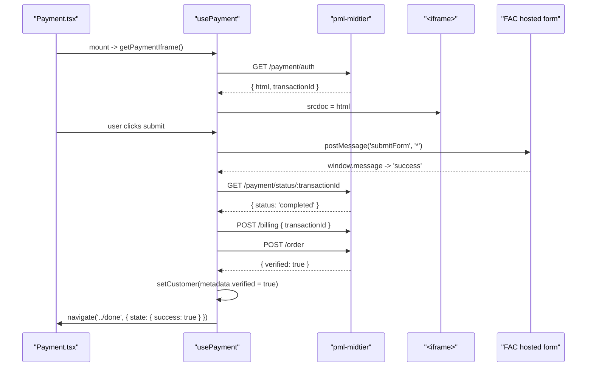

# Mechanism: Hosted-Iframe Payment Integration

### Overview

Hosted-Iframe Payment Integration is the mechanism by which pml-my keeps card data entirely outside its own runtime while still rendering an in-app checkout. pml-midtier returns the FAC-hosted iframe HTML as an opaque string; pml-my renders it via `<iframe srcdoc={html}>` and communicates with the embedded FAC form using `window.postMessage`. After FAC confirms `'success'`, the `usePayment` hook drives two sequential midtier calls to finalise the order: `POST /billing` then `POST /order`. Payment retry is capped by the `PAYMENT_ATTEMPTS` GrowthBook value.

### File Structure

```
src/
+-- pages/
|   +-- Onboarding/
|       +-- pages/
|           +-- Checkout/
|               +-- Checkout.tsx                    <- Review + Payment tab container
|               +-- steps/
|                   +-- Payment/
|                       +-- Payment.tsx             <- renders iframe + submit button
|                       +-- hooks/
|                       |   +-- usePayment.tsx      <- full payment orchestration state machine
|                       +-- components/
|                           +-- Iframe/
|                               +-- Iframe.tsx      <- <iframe srcdoc={html} />
|                               +-- IframeSkeleton.tsx
```

> Note: Self-Care payment-method update at `src/pages/My/pages/Payment/hooks/usePayment.tsx` follows the same mechanism against a different endpoint set.

### Participants

| Class / Module              | Responsibility                                                                                          | Collaborators                                            |
| --------------------------- | ------------------------------------------------------------------------------------------------------- | -------------------------------------------------------- |
| `usePayment` (Onboarding)   | Orchestrates iframe load -> postMessage submit -> status poll -> billing -> order; retries up to flag value | `getPaymentIframe`, `getPaymentStatus`, `createOrder`, `handleMaxAttempts`, `PAYMENT_ATTEMPTS` |
| `Iframe.tsx`                | Renders `<iframe srcdoc={iframeData.html}>`; exposes `contentWindow` ref for postMessage                | `usePayment`                                             |
| `getPaymentIframe()`        | `GET /payment/auth[/raw]` -> `{ html, transactionId }`                                                  | `request()`, `getAuthorizationHeader()`                  |
| `getPaymentStatus()`        | `GET /payment/status/:transactionId` -> `{ status: 'completed' \| 'failed' \| 'created' }`               | `request()`                                              |
| `createOrder()`             | Sequential `POST /billing` then `POST /order`; writes `customerAtom.metadata.verified = true`           | `request()`, `customerAtom`                              |
| `handleMaxAttempts()`       | `POST /payment/failed`; navigates to Done with failure state                                            | `request()`                                              |
| FAC iframe (external)       | Hosted card-entry form; posts `'success'` / `'error'` to parent window                                  | `window.postMessage`                                     |
| `PAYMENT_ATTEMPTS` flag     | `useFeatureValue(flags.PAYMENT_ATTEMPTS, 1)` retry cap                                                  | GrowthBook                                               |

### Flow



### Rules

- **pml-my never handles raw card data.** Card capture lives entirely inside the FAC iframe; the SPA never reads card fields.
- **Iframe HTML is opaque.** pml-my treats `iframeData.html` as a string -- no parsing, no rewriting, no DOM mutation.
- **Retry is gated by the `PAYMENT_ATTEMPTS` flag.** Hard-coded retry limits are forbidden; production tuning happens in GrowthBook.
- **Order finalisation is sequential.** `POST /billing` must precede `POST /order`; the order endpoint depends on the billing-account ID created by the first call.
- **The `postMessage` origin gap is documented, not closed silently.** `event.origin` is not currently validated (architecture-outline section 2.1); any closure of that gap requires coordination with the FAC integration team.

### Canonical Patterns

```typescript
// src/pages/Onboarding/pages/Checkout/steps/Payment/hooks/usePayment.tsx
const submitIframe = () => {
  iframeRef.current?.contentWindow?.postMessage('submitForm', '*')
  // origin '*' is a known gap; tracked in architecture-outline section 2.1
}

useEffect(() => {
  const onMessage = (event: MessageEvent) => {
    if (event.data === 'success') handlePaymentSuccess()
    if (event.data === 'error') handlePaymentError()
  }
  window.addEventListener('message', onMessage)
  return () => window.removeEventListener('message', onMessage)
}, [])
```
