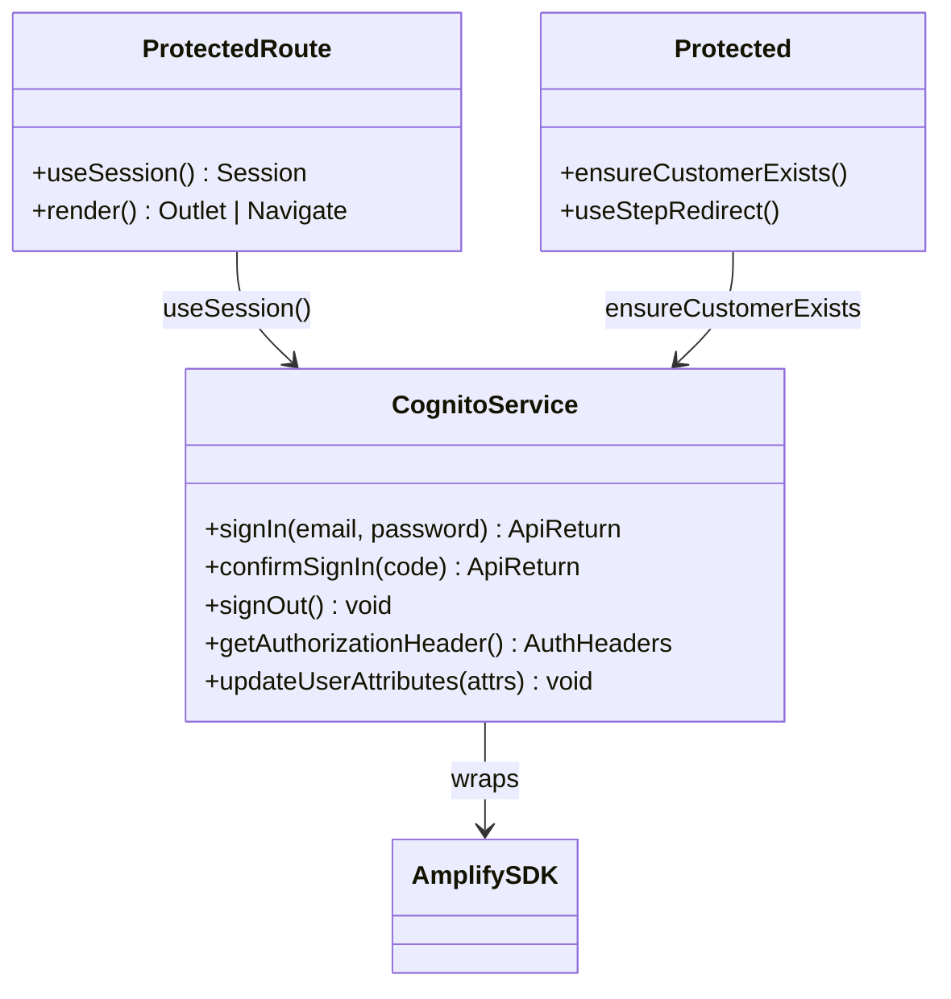

# Mechanism: Security (Identity)

### Overview

Security (Identity) is the mechanism by which the SPA proves the caller's identity to pml-midtier and gates rendering on authentication state. It is implemented as a thin wrapper module (`cognito.ts`) over Amplify SDK v6, paired with a render-time `<ProtectedRoute>` guard and an outlet-parent `Protected` component that drives session bootstrap. Every authenticated outbound call to pml-midtier first calls `getAuthorizationHeader()`, which force-refreshes the session through Amplify and returns the dual-header (`idtoken` + `Authorization: Bearer`) shape that pml-midtier requires.

### File Structure

```
src/
+-- services/
|   +-- aws/
|       +-- cognito.ts              <- all Amplify auth calls; Amplify.configure at module load
|       +-- index.ts                <- re-exports
+-- pages/
|   +-- Protected/
|   |   +-- Protected.tsx           <- outlet parent; ensureCustomerExists on first login
|   |   +-- utils.ts                <- ensureCustomerExists -- Cognito <-> midtier customer bridge
|   +-- ProtectedRoute.tsx          <- render-time guard; redirects unauthenticated users to /sign-in
+-- config/
|   +-- env.ts                      <- awsCognito (region, userPoolId, webClientId)
```

### Participants

| Class / Module               | Responsibility                                                                                            | Collaborators                                |
| ---------------------------- | --------------------------------------------------------------------------------------------------------- | -------------------------------------------- |
| `cognito.ts`                 | The single Cognito seam; wraps `signIn`, `confirmSignIn`, `signOut`, `fetchAuthSession`, `updateUserAttributes` | `aws-amplify/auth`, `env.awsCognito`         |
| `getAuthorizationHeader()`   | Force-refreshes the session; returns `{ idtoken, authorization: 'Bearer ...' }`                           | `fetchAuthSession({ forceRefresh: true })`   |
| `useSession()`               | Hook returning `{ isAuthenticated, idToken, accessToken }`                                                | `cognito.ts`                                 |
| `<ProtectedRoute>`           | Render-time gate: renders `<Outlet />` when authenticated, `null` during resolution, `<Navigate />` otherwise | `useSession()`                               |
| `<Protected>` (outlet parent)| Runs `ensureCustomerExists` on first login; drives onboarding step-resume redirect                        | `useSession()`, `sessionAtom`, midtier `/mv/customer` |

### Class Specification



### Rules

- **No feature code imports `aws-amplify/auth` directly.** All authentication operations go through `src/services/aws/cognito.ts`. A `grep` on `aws-amplify/auth` outside `cognito.ts` is the audit.
- **Every authenticated outbound request calls `getAuthorizationHeader()` first.** It force-refreshes the session; the dual-header shape (`idtoken` + `Authorization`) is non-negotiable for pml-midtier.
- **`<ProtectedRoute>` renders `null` during resolution, not a spinner.** Spinners cause layout shift on fast token refresh; `null` is the correct mid-state.
- **`ensureCustomerExists` runs once per first login per Cognito user.** It writes `custom:customerId` back onto the Cognito attribute set so subsequent sessions skip the midtier call.
- **Tests stub Cognito at the session-provider layer, not by mocking `aws-amplify/auth`.** A mock session provider wraps the component under test and returns a deterministic `Session`.

### Canonical Patterns

```typescript
export const ProtectedRoute = () => {
  const { isAuthenticated } = useSession()
  if (isAuthenticated === null) return null
  if (!isAuthenticated) return <Navigate to="/sign-in" replace />
  return <Outlet />
}

async function getAuthorizationHeader(): Promise<AuthHeaders> {
  const session = await fetchAuthSession({ forceRefresh: true })
  return {
    idtoken: session.tokens?.idToken?.toString() ?? '',
    authorization: `Bearer ${session.tokens?.accessToken?.toString() ?? ''}`,
  }
}
```
