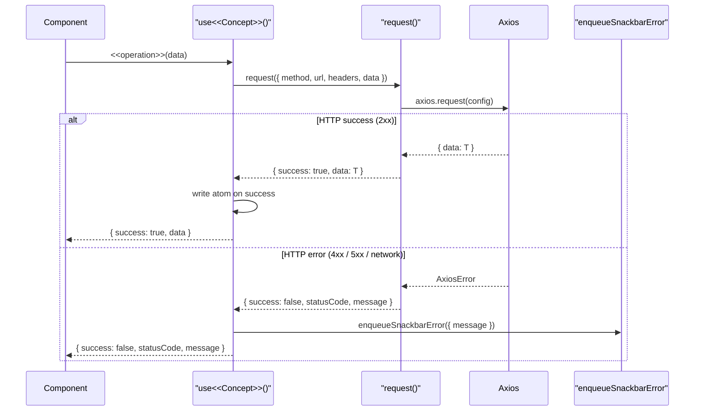

# Mechanism: Communication (HTTP Client) & Error Handling

### Overview

This folder owns two tightly-coupled mechanisms. **Communication** is the shared Axios wrapper (`request()`) every mutation hook calls, paired with the React-hook family (`useRequestGet` / `useRequestPost` / `useRequestPatch`) that exposes loading and response state for components that prefer the hook interface. **Error Handling & Resilience** is the `ApiReturn<T>` discriminated union returned by every `request()` call -- `request()` never throws; callers check `result.success` instead -- combined with the snackbar sink (`enqueueSnackbarError`) and the global `QueryCache.onError` handler.

The two mechanisms share a single file (`request.ts`) because they describe two angles on the same behaviour: how to talk to pml-midtier, and what to do when the conversation fails.

### File Structure

```
src/
+-- utils/
|   +-- api/
|       +-- request.ts                  <- Axios instance + request() wrapper; never throws
|       +-- index.ts                    <- barrel re-export
|       +-- hooks/
|           +-- useRequestGet.ts        <- GET-shaped hook returning { isLoading, response, error }
|           +-- useRequestPost.ts       <- POST-shaped hook
|           +-- useRequestPatch.ts      <- PATCH-shaped hook
|   +-- snackbar/
|       +-- snackbar.ts                 <- enqueueSnackbarError module singleton
+-- types/
|   +-- request.ts                      <- ApiReturn<T> type definition
+-- App.tsx                             <- QueryClient.QueryCache.onError -> enqueueSnackbarError
```

### Participants

| Class / Module                | Responsibility                                                                                  | Collaborators                                     |
| ----------------------------- | ----------------------------------------------------------------------------------------------- | ------------------------------------------------- |
| `ApiReturn<T>`                | Discriminated union `\| { success: true; data: T } \| { success: false; statusCode; message }`   | Every service function and mutation hook          |
| `request()`                   | Axios wrapper; catches every error; returns `ApiReturn<T>`                                      | Axios, `getAuthorizationHeader()` (Identity)      |
| `useRequestGet/Post/Patch`    | React hooks exposing `{ isLoading, response, error }` over `request()`                          | `request.ts`                                      |
| `enqueueSnackbarError`        | Module-scoped snackbar emitter; called by `QueryCache.onError` and by mutation hooks on `success: false` | `notistack`                                  |
| `QueryCache.onError`          | Global TanStack Query error handler; routes catalog/query failures to the snackbar             | `enqueueSnackbarError`                            |

### Flow



### Rules

- **`request()` never throws.** Callers always receive an `ApiReturn<T>`; `try/catch` at call sites is an anti-pattern.
- **Every authenticated call attaches `await getAuthorizationHeader()`.** Convention-enforced; auditable via `grep` on `request(` without `headers:`.
- **Domain atoms are only written on `result.success === true`.** Optimistic merges happen inside the mutation hook, not in components.
- **`enqueueSnackbarError` is the only user-visible error surface.** Components do not surface API errors themselves; they let the mutation hook do it.
- **No Axios response interceptors.** Auth headers are attached explicitly at each call site so the dependency is visible.

### Canonical Patterns

```typescript
// src/utils/api/request.ts
async function request<T>(config: RequestConfig): Promise<ApiReturn<T>> {
  try {
    const { data } = await axiosInstance.request(config)
    return { success: true, data }
  } catch (err: unknown) {
    const axiosErr = err as AxiosError
    return {
      success: false,
      statusCode: axiosErr.response?.status ?? 0,
      message: axiosErr.message,
    }
  }
}

// Mutation-hook shape (canonical)
const patchCart = async (cartData: Partial<Cart>): Promise<ApiReturn<Customer>> => {
  const headers = await getAuthorizationHeader()
  const result = await request<Customer>({
    method: 'patch',
    url: `${env.midtier.mavenir.customer}/cart`,
    headers,
    data: merge({}, customer.cart, cartData),
  })
  if (result.success) setCustomer(merge({}, customer, { cart: result.data.cart }))
  else enqueueSnackbarError({ message: result.message })
  return result
}
```
