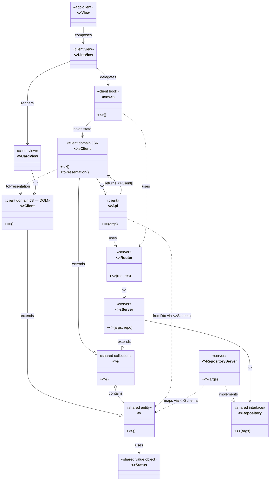
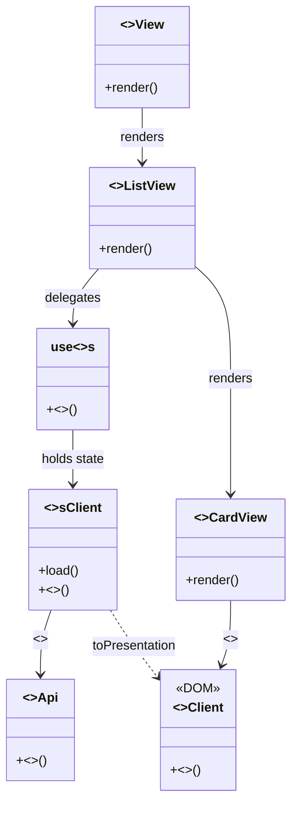
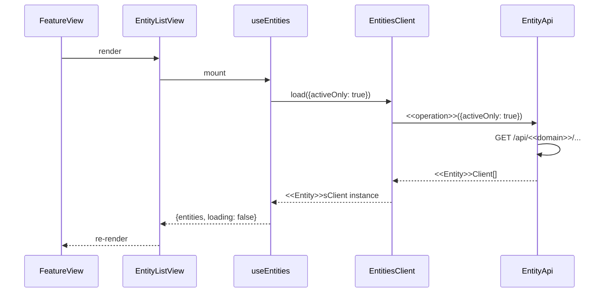
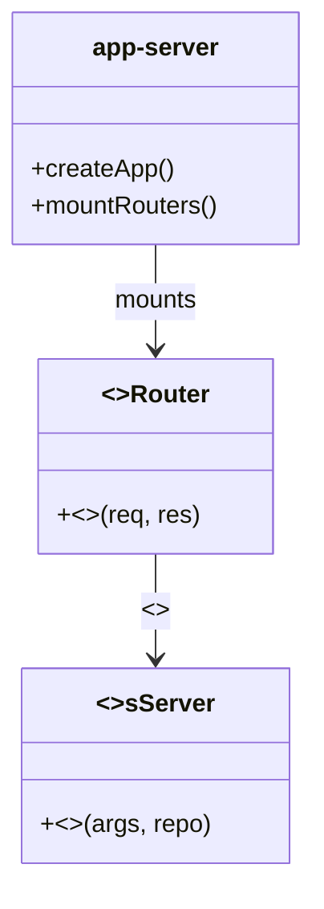
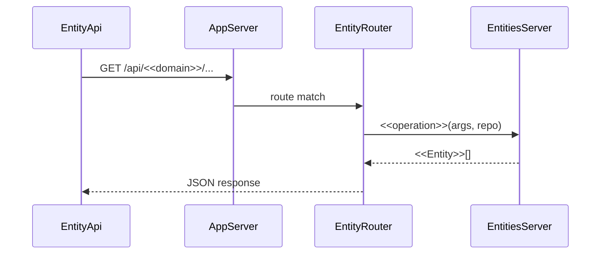
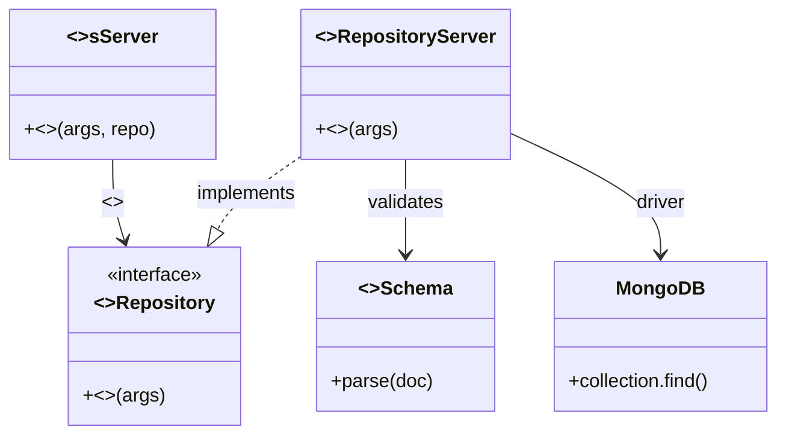
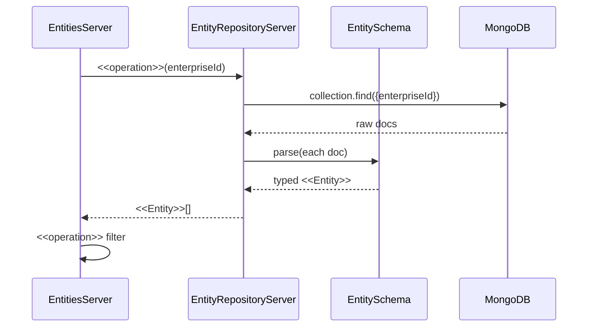

### Architecture Flow

One user interaction from view through network to persistence and back:

```
User performs <<operation>>
        │
        ▼
┌───────────────────────────────────────────────────┐
│  app-client/<<Feature>>View.tsx                   │  Top-level view — composes <<Entity>> views
│  app-client/App.tsx  (React Router)               │  for <<Feature>> scope; Router maps paths.
└──────────────────────┬────────────────────────────┘
                       │ renders
                       ▼
┌───────────────────────────────────────────────────┐
│  <<domain>>/client/<<Entity>>ListView.tsx         │  React view — renders <<Entity>> state
│  <<domain>>/client/use<<Entity>>s.ts  (hook)      │  Hook — delegates to <<Entity>>sClient
└──────────────────────┬────────────────────────────┘
                       │ calls
                       ▼
┌───────────────────────────────────────────────────┐
│  <<domain>>/client/<<Entity>>sClient.ts           │  Client domain — extends shared <<Entity>>s
│  <<domain>>/client/<<Entity>>Api                  │  Type-safe HTTP — one method per <<operation>>
└──────────────────────┬────────────────────────────┘
                       │ GET | POST /api/<<domain>>/...
                       ▼  ─────────── NETWORK BOUNDARY ───────────
┌───────────────────────────────────────────────────┐
│  app-server/app.ts                                │  Composition root — mounts <<Entity>>Router
└──────────────────────┬────────────────────────────┘
                       │ routes to
                       ▼
┌───────────────────────────────────────────────────┐
│  <<domain>>/server/<<Entity>>Router               │  Route handler — delegates to <<Entity>>sServer
└──────────────────────┬────────────────────────────┘
                       │ calls
                       ▼
┌───────────────────────────────────────────────────┐
│  <<domain>>/server/<<Entity>>sServer.ts           │  Server domain — extends shared <<Entity>>s
└──────────┬────────────────────────────────────────┘
           │ extends                     │ uses
           ▼                             ▼
┌──────────────────────┐   ┌──────────────────────────────────┐
│  <<domain>>/shared/  │   │  <<domain>>/server/              │
│  <<Entity>>,          │   │  <<Entity>>RepositoryServer      │
│  <<Entity>>s,         │   │  implements <<Entity>>Repository │
│  <<Entity>>Schema     │   └──────────────┬───────────────────┘
└──────────────────────┘                  ▼
                           ┌──────────────────────────────────┐
                           │  MongoDB / file system             │
                           └──────────────────────────────────┘
                       │ JSON response
                       ▼  ─────────── NETWORK BOUNDARY ───────────
   hook updates state → view re-renders
```


| Tech                      | File                                         | Instantiates from domain                                                            |
| ------------------------- | -------------------------------------------- | ----------------------------------------------------------------------------------- |
| **Top-level view**        | `app-client/<<Feature>>View.tsx`             | Composes `<<Entity>>` views for `<<Feature>>` scope                                 |
| **React view**            | `<<domain>>/client/<<Entity>>ListView.tsx`   | Renders `<<Entity>>` state and interactions                                         |
| **Hook**                  | `<<domain>>/client/use<<Entity>>s.ts`        | Thin bridge to `<<Entity>>sClient`                                                  |
| **Client domain**         | `<<domain>>/client/<<Entity>>sClient.ts`     | Extends shared `<<Entity>>s`; selection, load, orchestration                        |
| **Client entity**         | `<<domain>>/client/<<Entity>>Client.ts`      | Extends shared `<<Entity>>`; wraps DOM                                              |
| **Type-safe HTTP client** | `<<domain>>/client/<<Entity>>.api.ts`        | `<<Entity>>Api` — one method per server route                                       |
| **Composition root**      | `app-server/app.ts`                          | Mounts `<<Entity>>Router`; injects `<<Entity>>RepositoryServer`                     |
| **Route handler**         | `<<domain>>/server/<<domain>>.routes.ts`     | `<<Entity>>Router` — delegates to `<<Entity>>sServer`                               |
| **Server domain**         | `<<domain>>/server/<<Entity>>sServer.ts`     | Extends shared `<<Entity>>s`; persistence-backed operations                         |
| **Repository impl**       | `<<domain>>/server/<<domain>>.repository.ts` | `<<Entity>>RepositoryServer implements <<Entity>>Repository`                        |
| **Shared domain**         | `<<domain>>/shared/`                         | `<<Entity>>`, `<<Entity>>s`, `<<Entity>>Schema`, `<<Entity>>Repository` (interface) |
| **Persistence**           | MongoDB / file system                        | Stores `<<Entity>>` documents                                                       |


### Module Layout

```
packages/
│
├── app-server/                      # Composition root — Express app
│   ├── app.ts                       # Mounts domain routers; injects repos
│   └── package.json                 # depends on all <domain>-server packages
│
├── app-client/                      # Composition root — React app
│   ├── App.tsx                      # React Router: maps paths to top-level views
│   ├── HomeView.tsx                 # Entry — links to feature routes
│   ├── WirePaymentView.tsx          # worked example: <<Feature>>View composes domain views
│   ├── main.tsx
│   ├── index.html
│   └── package.json                 # depends on all <domain>-client packages
│
└── <domain>/                        # One folder per business capability
    ├── shared/                      # @app/<domain>-shared — domain core (plain names)
    │   ├── <Entity>.ts              # <<Entity>> — entity class
    │   ├── <Entity>Status.ts        # value object / status enum
    │   ├── <Entity>s.ts             # <<Entity>>s — collection class
    │   ├── <Entity>Repository.ts    # <<Entity>>Repository — persistence interface
    │   ├── <entity>.schema.ts       # Zod schema
    │   └── package.json
    ├── server/                      # @app/<domain>-server (layer qualifiers)
    │   ├── <Entity>sServer.ts       # extends shared <<Entity>>s
    │   ├── <Entity>Router.ts        # or <domain>.routes.ts — HTTP adapter
    │   ├── <domain>.repository.ts   # <<Entity>>RepositoryServer implements interface
    │   └── package.json
    └── client/                      # @app/<domain>-client (layer qualifiers)
        ├── <Entity>Client.ts        # extends shared <<Entity>>
        ├── <Entity>sClient.ts       # extends shared <<Entity>>s
        ├── <Entity>ListView.tsx
        ├── <Entity>CardView.tsx
        ├── use<Entity>s.ts          # thin React hook
        ├── <Entity>.api.ts          # <<Entity>>Api — type-safe HTTP client
        └── package.json
```


| Artefact                 | Location                       | Used by                                                    |
| ------------------------ | ------------------------------ | ---------------------------------------------------------- |
| **Zod schema**           | `shared/<entity>.schema.ts`    | Repository (parse docs), client forms (`safeParse`)        |
| **Entity class**         | `shared/<Entity>.ts`           | All tiers — business methods like `isEligible()`           |
| **Collection class**     | `shared/<Entity>s.ts`          | Filter/search in shared; extended by client and server     |
| **Repository interface** | `shared/<Entity>Repository.ts` | Implemented by `<<Entity>>RepositoryServer` in server tier |
| **Value object**         | `shared/<Entity>Status.ts`     | Entity lifecycle rules shared across tiers                 |


### Participants

Class relationships for one domain module — inheritance (`--|>`), interface implementation (`..|>`), composition and delegation (`-->`), cross-boundary dependency (`..>`). The same `<<operation>>` name flows from shared domain through client and server tiers.

**Views and client-side domain.** React views (`<<Entity>>ListView`, `<<Entity>>CardView`) contain no business logic — they delegate to `use<<Entity>>s`, which holds `<<Entity>>sClient` state. The hook exposes `<<Entity>>Client[]` (via `toPresentation()`). `<<Entity>>CardView` receives each `<<Entity>>Client` and calls its presentation `<<operation>>` — that is where client-side domain JS wraps DOM behaviour.

`<<Entity>>Api` is not view hydration. It only fetches JSON over HTTP, validates with `<<Entity>>Schema`, builds `<<Entity>>` via `fromDto`, wraps in `<<Entity>>Client`, and returns to `<<Entity>>sClient`. That is wire-format → typed objects at the network boundary — not React DOM hydration.




| Class                        | Package       | Relationship to shared                     | `<<operation>>` role                                                                                                                       |
| ---------------------------- | ------------- | ------------------------------------------ | ------------------------------------------------------------------------------------------------------------------------------------------ |
| `<<Entity>>`                 | `shared/`     | Domain entity — plain name, no qualifier   | Defines business `<<operation>>` (e.g. eligibility, lifecycle)                                                                             |
| `<<Entity>>s`                | `shared/`     | Domain collection — plain name             | Defines collection `<<operation>>` (e.g. filter, search)                                                                                   |
| `<<Entity>>Repository`       | `shared/`     | Persistence contract (interface)           | Declares persistence `<<operation>>` (e.g. find, save)                                                                                     |
| `<<Entity>>Client`           | `client/`     | `extends <<Entity>>` — client domain JS    | Presentation `<<operation>>` — wraps DOM; called by `<<Entity>>CardView`                                                                   |
| `<<Entity>>sClient`          | `client/`     | `extends <<Entity>>s` — client domain JS   | Client `<<operation>>` (load, toggleSelection); `toPresentation()` → `<<Entity>>Client[]`                                                  |
| `<<Entity>>Api`              | `client/`     | HTTP client — one method per server route  | fetch JSON → `<<Entity>>Schema` → `<<Entity>>.fromDto` → `<<Entity>>Client`; returns to `<<Entity>>sClient`; `..>` uses `<<Entity>>Router` |
| `<<Entity>>ListView`         | `client/`     | React view — no domain logic               | Delegates to `use<<Entity>>s`; renders `<<Entity>>CardView` per item                                                                       |
| `<<Feature>>View`            | `app-client/` | Top-level feature view — no domain logic   | Composes `<<Entity>>ListView` and other domain views — e.g. `WirePaymentView`                                                              |
| `<<Entity>>CardView`         | `client/`     | React view — one item                      | Receives `<<Entity>>Client`; calls `<<operation>>` on client domain JS for render                                                          |
| `use<<Entity>>s`             | `client/`     | Thin React bridge                          | Holds `<<Entity>>sClient`; exposes `<<operation>>` and `<<Entity>>Client[]` to views; `..>` uses `<<Entity>>Router`                        |
| `<<Entity>>sServer`          | `server/`     | `extends <<Entity>>s` — persistence-backed | Adds server `<<operation>>`; uses `<<Entity>>Repository`                                                                                   |
| `<<Entity>>Router`           | `server/`     | HTTP adapter                               | Maps HTTP request to `<<operation>>` on `<<Entity>>sServer`; `..>` used by `<<Entity>>Api` and `use<<Entity>>s`                            |
| `<<Entity>>RepositoryServer` | `server/`     | `implements <<Entity>>Repository`          | Implements persistence `<<operation>>` — validates with `<<Entity>>Schema`                                                                 |


Worked example: `specs/mern/template/packages/recipients/` — top-level view `app-client/WirePaymentView.tsx` composes `RecipientListView`.

> **Note:** Other engagements (e.g. kanban) may use same-name extends with a `Domain`* import alias. This MERN specification uses **layer qualifiers on extensions** — shared stays unqualified; client and server carry `Client`, `Server`, `Api`, `Router`, etc.

---

## Mechanisms

### Mechanism: Web Client

#### Principles & Patterns

- **Principle:** The web client renders domain state and captures user intent. Views delegate to client-side domain classes (`<<domain>>-client`); those classes own presentation behaviour and call the type-safe HTTP client. No persistence or server-side domain logic in the client tier.
- **Pattern:** Two-level view hierarchy plus client domain extension, thin hook, and API client:
  1. **Top-level view** (`app-client/<<Feature>>View.tsx`) — composes domain views for a feature scope; owns navigation between steps; no domain logic.
  2. **Domain view** (`<<domain>>/client/<<Entity>>ListView.tsx`) — renders one domain's data; delegates to hook/client domain.
  3. **Client-side domain** (`<<Entity>>sClient.ts`, `<<Entity>>Client.ts`) — extends `shared/`; `<<Entity>>Client` wraps DOM; `<<Entity>>sClient` owns selection, search, and API orchestration.
  4. **Hook** (`use<<Entity>>s.ts`) — thin React state bridge; delegates to client domain classes.
  5. **Type-safe HTTP client** (`<<Entity>>.api.ts`) — `<<Entity>>Api` class with one typed method per server route; called by client domain, not by views directly.
  - **Benefits:** Presentation logic testable without React; shared tier keeps plain domain names; tier suffix makes imports unambiguous.
  - **Trade-offs:** More classes than a hook-only approach; justified when selection, DOM, or animation behaviour belongs in the domain language.

#### File Structure

```
packages/
├── app-client/
│   ├── App.tsx                      # React Router — maps paths to top-level views
│   ├── HomeView.tsx                 # Home — links to feature routes
│   ├── WirePaymentView.tsx          # worked example — <<Feature>>View composes domain views
│   ├── main.tsx
│   └── index.html
└── <domain>/client/
    ├── <<Entity>>Client.ts           # extends shared — wraps DOM
    ├── <<Entity>>sClient.ts          # extends shared — selection, load, orchestration
    ├── <<Entity>>ListView.tsx        # Domain view — renders <<Entity>> data
    ├── <<Entity>>CardView.tsx        # Domain view — one item; calls <<Entity>>Client
    ├── use<<Entity>>s.ts             # Thin hook — bridge to <<Entity>>sClient
    ├── <<Entity>>.api.ts             # <<Entity>>Api — type-safe HTTP client
    └── index.ts
```

#### Participants




| Class              | Package              | Instantiates from                                      |
| ------------------ | -------------------- | ------------------------------------------------------ |
| **FeatureView**    | `app-client/`        | `<<Feature>>` scope — composes `<<Entity>>` views      |
| **EntityListView** | `<<domain>>/client/` | `<<Entity>>` — renders state; delegates to hook        |
| **EntityCardView** | `<<domain>>/client/` | One item; calls `<<Entity>>Client` DOM `<<operation>>` |
| **EntitiesClient** | `<<domain>>/client/` | `<<Entity>>sClient` — extends shared; selection + load |
| **EntityClient**   | `<<domain>>/client/` | `<<Entity>>Client` — extends shared; wraps DOM         |
| **useEntities**    | `<<domain>>/client/` | Thin React bridge to `<<Entity>>sClient`               |
| **EntityApi**      | `<<domain>>/client/` | `<<Entity>>Api` — one method per route                 |


#### Flow




#### Walkthrough Example

Scenario: User initiates wire payment and views active recipients. **Views delegate; domain JS owns behaviour.**

1. **WirePaymentView** — top-level feature view; composes domain views only.
2. **RecipientListView** — domain view; calls `useRecipients`, renders **RecipientCardView** per item.
3. **useRecipients** — sets `loading`, calls `RecipientsClient.load`, exposes state to the list view.
4. **RecipientsClient** / **RecipientApi** — load over HTTP.
5. **RecipientCardView** — calls `RecipientClient.cardCssClass()` (DOM on client domain JS).

```typescript
// template/packages/app-client/WirePaymentView.tsx
export function WirePaymentView() {
  return (
    <main className="wire-payment-page">
      <RecipientListView />
    </main>
  );
}
```

```typescript
// template/packages/recipients/client/RecipientListView.tsx
export function RecipientListView() {
  const {
    recipients,
    selectedCount,
    loading,
    toggleRecipient,
    isSelected,
    filterBySearch,
    confirmSelection,
  } = useRecipients();
  const [searchQuery, setSearchQuery] = useState('');
  const [error, setError] = useState<string | null>(null);

  const displayed = searchQuery ? filterBySearch(searchQuery) : recipients;

  const handleConfirmSelection = async () => {
    try {
      await confirmSelection?.();
    } catch (err) {
      setError(err instanceof Error ? err.message : 'Failed to confirm selection');
    }
  };

  return (
    <div className="recipient-list-view">
      <header>
        <h1>Select Recipient for Wire Payment</h1>
        <input
          type="search"
          placeholder="Search by name or bank..."
          value={searchQuery}
          onChange={e => setSearchQuery(e.target.value)}
        />
      </header>

      {loading && <p>Loading recipients...</p>}
      {!loading && displayed.length === 0 && <p>No active recipients available</p>}
      {error && <p className="error">{error}</p>}

      <div className="recipient-cards" data-testid="recipient-list">
        {displayed.map(r => (
          <RecipientCardView
            key={r.id}
            recipient={r}
            isSelected={isSelected(r.id)}
            onToggle={() => toggleRecipient(r.id)}
          />
        ))}
      </div>

      <footer>
        <p>{selectedCount} recipient(s) selected</p>
        <button onClick={handleConfirmSelection} disabled={selectedCount === 0}>
          Confirm Selection
        </button>
      </footer>
    </div>
  );
}
```

```typescript
// template/packages/recipients/client/useRecipients.ts
export function useRecipients() {
  const [collection, setCollection] = useState<RecipientsClient | null>(null);
  const [loading, setLoading] = useState(false);

  useEffect(() => {
    setLoading(true);
    RecipientsClient.load({ activeOnly: true })
      .then(setCollection)
      .finally(() => setLoading(false));
  }, []);

  return {
    recipients: collection?.toPresentation() ?? [],
    loading,
    toggleRecipient: (id: string) =>
      setCollection(prev => (prev ? prev.toggleSelection(id) : null)),
    isSelected: (id: string) => collection?.isSelected(id) ?? false,
    filterBySearch: (query: string) => collection?.displayed(query) ?? [],
    confirmSelection: () => collection?.confirmSelection(),
    selectedCount: collection?.selectedCount() ?? 0,
  };
}
```

```typescript
// template/packages/recipients/client/RecipientsClient.ts
export class RecipientsClient extends Recipients {
  static async load(opts?: { activeOnly?: boolean }): Promise<RecipientsClient> {
    const items = await RecipientApi.loadByEnterprise(opts);
    return new RecipientsClient(items);
  }
}
```

```typescript
// template/packages/recipients/client/Recipient.api.ts
export class RecipientApi {
  static async loadByEnterprise(opts?: { activeOnly?: boolean }): Promise<RecipientClient[]> {
    const params = new URLSearchParams();
    if (opts?.activeOnly) params.set('activeOnly', 'true');
    const response = await fetch(`/api/recipients?${params}`);
    const data = await response.json();
    return hydrateRecipients(data.recipients);
  }
}
```

```typescript
// template/packages/recipients/client/RecipientClient.ts — DOM behaviour
export class RecipientClient extends Recipient {
  cardCssClass(isSelected: boolean): string {
    return `recipient-card${isSelected ? ' selected' : ''}`;
  }
}
```

```typescript
// template/packages/recipients/client/RecipientCardView.tsx
export function RecipientCardView({ recipient, isSelected, onToggle }: RecipientCardViewProps) {
  return (
    <div className={recipient.cardCssClass(isSelected)} onClick={onToggle}>
      <h3>{recipient.name}</h3>
      <p className="bank">{recipient.bankName}</p>
    </div>
  );
}
```

---

### Mechanism: App Server

#### Principles & Patterns

- **Principle:** The app server adapts HTTP to domain operations. Route handlers are thin — they parse the request and delegate to `<<domain>>-server` domain classes. No business logic in routes.
- **Pattern:** Composition root + HTTP adapter + server-side domain:
  1. **Composition root** (`app-server/app.ts`) — creates Express, instantiates repositories, mounts domain routers.
  2. **HTTP adapter** (`<<Entity>>Router` in `<<domain>>.routes.ts`) — one handler per `<<operation>>`; maps HTTP verb + path; delegates to server-side domain.
  3. **Server-side domain** (`<<Entity>>sServer.ts` in `<<domain>>-server`) — extends shared; owns `<<operation>>()` methods that use the repository.
  - **Options:** Routes in `app-server/` (kanban pattern) vs in `<<domain>>/server/` (recipients pattern) — both valid; domain package owns routes by default.
  - **Benefits:** HTTP concerns isolated; domain logic testable without Express; tier suffix keeps shared names clean.
  - **Trade-offs:** Two files per operation (route + server domain method); acceptable for traceability.

#### File Structure

```
packages/
├── app-server/
│   ├── app.ts                       # Composition root — mounts routers, injects repos
│   └── index.ts
└── <domain>/server/
    ├── <<Entity>>sServer.ts          # Server-side domain — extends shared
    ├── <<domain>>.routes.ts          # <<Entity>>Router — HTTP adapter
    ├── <<domain>>.repository.ts      # <<Entity>>RepositoryServer implements <<Entity>>Repository
    └── index.ts
```

#### Participants




| Class              | Package              | Instantiates from                                                     |
| ------------------ | -------------------- | --------------------------------------------------------------------- |
| **AppServer**      | `app-server/`        | Wires all `<<domain>>` routers and repos                              |
| **EntityRouter**   | `<<domain>>/server/` | `<<Entity>>Router` — one handler per `<<operation>>`                  |
| **EntitiesServer** | `<<domain>>/server/` | `<<Entity>>sServer` — extends shared; owns `<<operation>>()` with I/O |


#### Flow




#### Walkthrough Example

Scenario: HTTP request for active recipients reaches server-side domain.

1. **app.ts** mounted `RecipientRouter.create(repo)` at startup — composition root injected the repository.
2. **recipients.routes.ts** — `RecipientRouter` receives `GET /api/recipients?activeOnly=true`; extracts `activeOnly` from query.
3. Route handler delegates to `RecipientsServer.loadByEnterprise()` — never calls repo or `shared/` directly.
4. **RecipientsServer** extends shared `Recipients`; loads via repository, applies `filterByStatus('Active')`.

```typescript
// template/packages/app-server/app.ts
export function createApp(): express.Application {
  const app = express();
  app.use(cors());
  app.use(express.json());
  const repo = new RecipientRepositoryServer(db);
  app.use('/api/recipients', RecipientRouter.create(repo));
  return app;
}
```

```typescript
// template/packages/recipients/server/recipients.routes.ts
router.get('/', async (req, res) => {
  const enterpriseId = (req as any).user.enterpriseId;
  const activeOnly = req.query.activeOnly === 'true';
  const recipients = await RecipientsServer.loadByEnterprise(enterpriseId, repo, { activeOnly });
  res.json({ recipients, total: recipients.length });
});
```

```typescript
// template/packages/recipients/server/RecipientsServer.ts
export class RecipientsServer extends Recipients {
  static async loadByEnterprise(
    enterpriseId: string,
    repo: RecipientRepository,
    opts?: { activeOnly?: boolean },
  ): Promise<Recipient[]> {
    const all = await repo.findByEnterprise(enterpriseId);
    let collection: Recipients = new Recipients(all);
    if (opts?.activeOnly) {
      collection = collection.filterByStatus('Active');
    }
    return collection.toArray();
  }
}
```

---

### Mechanism: Persistence

#### Principles & Patterns

- **Principle:** Persistence is infrastructure at the edge. Only `<<domain>>-server` domain classes call the repository; routes and client never touch MongoDB directly.
- **Pattern:** Repository per domain module — maps domain operations to MongoDB collections; validates every document with the shared Zod schema before returning typed domain objects.
  - **Options:** MongoDB (default); file system (kanban `PlanningFolderRepository`); direct JSON for prototypes.
  - **Benefits:** Schema validation at the boundary catches corrupt data early; repository is swappable for tests.
  - **Trade-offs:** One repository class per domain; acceptable because persistence logic stays out of domain classes.

#### File Structure

```
packages/<domain>/server/
├── <<domain>>.repository.ts         # RecipientRepositoryServer — MongoDB I/O
└── <<Entity>>sServer.ts              # Server-side domain — calls repository
```

#### Participants




| Class                      | Layer                | Instantiates from                                      |
| -------------------------- | -------------------- | ------------------------------------------------------ |
| **EntityRepository**       | `shared/`            | Persistence interface — declares `<<operation>>`       |
| **EntityRepositoryServer** | `<<domain>>/server/` | `implements <<Entity>>Repository` — MongoDB I/O        |
| **EntitySchema**           | `shared/`            | Validates raw docs at repository boundary              |
| **EntitiesServer**         | `<<domain>>/server/` | `<<Entity>>sServer` — orchestrates repo + shared logic |


#### Flow




#### Walkthrough Example

Scenario: Server-side domain loads recipients from MongoDB with schema validation.

1. **RecipientsServer.loadByEnterprise()** calls `repo.findByEnterprise(enterpriseId)`.
2. **RecipientRepositoryServer** (`template/packages/recipients/server/recipients.repository.ts`) queries MongoDB; each doc validated via `RecipientSchema.parse(doc)`.
3. Invalid docs throw at parse time — corrupt data never reaches domain logic.
4. Typed `Recipient[]` returns to server-side domain; `filterByStatus('Active')` applied from shared collection class.

```typescript
// template/packages/recipients/server/recipients.repository.ts
export class RecipientRepositoryServer implements RecipientRepository {
  async findByEnterprise(enterpriseId: string): Promise<Recipient[]> {
    const docs = await this.collection.find({ enterpriseId }).toArray();
    return docs.map(doc => Recipient.fromDto(RecipientSchema.parse(doc)));
  }
}
```

```typescript
// template/packages/recipients/shared/recipient.schema.ts
export const RecipientSchema = z.object({
  id: z.string().uuid(),
  name: z.string().min(1, 'Beneficiary name is required').max(140),
  status: z.enum(['Active', 'Pending', 'Inactive']),
  beneficiaryBank: BeneficiaryBankSchema,
  createdAt: z.coerce.date(),
});
```

---

## Testing Architecture

When generating tests from this specification, use the `**abd-story-acceptance-test**` skill. That skill owns the test file shape, helper naming, orchestrator pattern, and RED-GREEN-REFACTOR cycle. This section defines the MERN-specific layer structure; `abd-story-acceptance-test` defines how to write the code within each layer.

Testing is the counterpart to **Instantiating the Domain** — where domain maps every artifact to a class or operation, testing maps every story artifact to a test artifact. The same three questions apply: *What is the principle? What is the pattern? How does it actually run?* — but the answers describe layers of test coverage rather than layers of runtime code.

### Principles

- **Stories instantiate tests.** Every story produces three test files — one per tier — at the same folder path as the story in the story hierarchy. The test name is the story name.
- **Same scenario vocabulary across tiers.** The base helper defines Given/When/Then method names from the story's acceptance criteria. Every tier helper implements the same names — only the mechanism (HTTP, React render, browser) differs.
- **Stub at the tier boundary only.** Server tests run real domain logic and real repository calls (or a test database); no domain stubs. Client tests mock the API boundary only; no server calls. E2E tests stub nothing — real browser, real server, real database.
- **Helpers own test mechanics; test files own scenarios.** Test files are scenario declarations (it/test blocks). Helpers handle setup, teardown, and assertion plumbing. Test files never call fetch, render, or Playwright directly.

### Testing Scope

Four independent layers — none call each other. The base helper is shared scenario vocabulary, not a runnable test. Domain unit tests are a separate, always-present layer that runs against shared domain classes directly.

```
  ┌─────────────────────────────────────────────────────────────────┐
  │  Domain unit tests  (packages/<domain>/shared/*.test.ts)        │
  │  Entry point : class constructor / method call                  │
  │  Real        : shared domain classes only (Recipient, etc.)     │
  │  Stub        : nothing                                          │
  │  Asserts     : return values, thrown errors, state              │
  └─────────────────────────────────────────────────────────────────┘

  ┌─────────────────────────────────────────────────────────────────┐
  │  HTTP adapter tests  (tests/<epic>/<sub-epic>_server.test.ts)   │
  │  Entry point : Express route via Supertest                      │
  │  Real        : domain classes, repository, test DB              │
  │  Stub        : nothing                                          │
  │  Asserts     : HTTP status + JSON response body                 │
  └─────────────────────────────────────────────────────────────────┘

  ┌─────────────────────────────────────────────────────────────────┐
  │  React adapter tests  (tests/<epic>/<sub-epic>_client.test.tsx) │
  │  Entry point : render(<View />) via Testing Library             │
  │  Real        : React tree, hooks, client domain JS              │
  │  Stub        : <<Entity>>Api via vi.mock                        │
  │  Asserts     : DOM elements via screen                          │
  └─────────────────────────────────────────────────────────────────┘

  ┌─────────────────────────────────────────────────────────────────┐
  │  Browser tests  (tests/<epic>/<sub-epic>_e2e.spec.ts)           │
  │  Entry point : page.goto(url) via Playwright                    │
  │  Real        : full stack — browser, server, DB                 │
  │  Stub        : nothing                                          │
  │  Asserts     : page elements via page.getByRole / waitForSelector│
  └─────────────────────────────────────────────────────────────────┘

  Base helper  (tests/<epic>/helpers/<sub-epic>.base.ts)
  └─ scenario vocabulary + test data constants shared by the three adapter tiers
```


| Layer             | Entry point                 | Real                               | Stubbed                       | Asserts                      |
| ----------------- | --------------------------- | ---------------------------------- | ----------------------------- | ---------------------------- |
| **Domain unit**   | class method call           | shared domain classes only         | nothing                       | return values, errors, state |
| **HTTP adapter**  | Express route via Supertest | domain + repository + test DB      | nothing                       | HTTP status + JSON body      |
| **React adapter** | `render(<View />)`          | React tree + hooks + client domain | `<<Entity>>Api` via `vi.mock` | DOM via `screen`             |
| **Browser**       | `page.goto(url)`            | full stack                         | nothing                       | page elements via Playwright |


### Module Layout

Domain unit tests live **alongside the domain classes** they test — not in `tests/`. Story-driven acceptance tests live in `tests/` and map the story hierarchy to files.

```
packages/<domain>/shared/
    <Entity>.ts
    <Entity>s.ts
    <entity>.schema.ts
    <entity>s.test.ts          ← domain unit tests — live here, next to the classes
```

Story hierarchy maps the acceptance test folder and file structure:


| Story artifact            | Test artifact                                   |
| ------------------------- | ----------------------------------------------- |
| Epic                      | folder                                          |
| Mid-level sub-epic        | intermediate folder (only when it has children) |
| **Lowest-level sub-epic** | **file** (`<sub-epic>_<tier>.test.ts`)          |
| **Story**                 | `**describe` block** inside the file            |
| **Scenario**              | `**it` / `test` block** inside the describe     |


```
tests/
└── <epic>/                                        # Epic → folder
    ├── <lowest-sub-epic>_server.test.ts           # Sub-epic → file
    │     describe('<Story name>')                 # Story  → describe block
    │       it('<scenario outcome>')               # Scenario → it block
    ├── <lowest-sub-epic>_client.test.tsx          # same sub-epic, client tier
    ├── <lowest-sub-epic>_e2e.spec.ts              # same sub-epic, E2E tier
    └── helpers/
        ├── <lowest-sub-epic>.base.ts              # abstract helper — vocab from story AC
        ├── <lowest-sub-epic>.server.ts            # seeds DB; fires HTTP via Supertest
        ├── <lowest-sub-epic>.client.ts            # mocks API; renders via Testing Library
        └── <lowest-sub-epic>.e2e.ts               # navigates browser via Playwright
```

When the story hierarchy has mid-level sub-epics, they become intermediate folders:

```
tests/
└── <epic>/
    └── <mid-sub-epic>/                            # Mid sub-epic → folder
        ├── <lowest-sub-epic>_server.test.ts       # Lowest sub-epic → file
        ├── <lowest-sub-epic>_client.test.tsx
        ├── <lowest-sub-epic>_e2e.spec.ts
        └── helpers/
            └── ...
```

### Participants

The base helper is the **domain test** — it expresses scenarios entirely in business terms with no knowledge of HTTP, DOM, or browsers. Each tier helper extends it to wire those same domain scenarios to a specific test infrastructure. The Given/When/Then names are the same; only the mechanism beneath them differs.


|                         | Domain test (base)                   | Server tier                       | Client tier                        | E2E tier                           |
| ----------------------- | ------------------------------------ | --------------------------------- | ---------------------------------- | ---------------------------------- |
| **Layer**               | Pure domain — business language only | HTTP adapter                      | React/DOM adapter                  | Full browser                       |
| **Given**               | business scenario language           | seeds MongoDB                     | configures `vi.mock`               | seeds via test API/fixture         |
| **When**                | (abstract — no transport)            | `request(app).get(...)` Supertest | `render(<View />)` Testing Library | `page.goto(...)` Playwright        |
| **Then**                | (abstract — no assertion target)     | HTTP status + JSON response body  | DOM elements via `screen`          | Page elements via `page.getByRole` |
| **Test data constants** | ✓ here                               | —                                 | —                                  | —                                  |


```mermaid
classDiagram
    class BaseHelper ["<sub-epic>BaseHelper"] {
        <<domain test>>
        +givenUserLoggedIn()
        +givenEnterpriseHas<<Entity>>(data)
        #seedRecipients(data)
        #seedUser(opts)
        +cleanup()
    }
    class ServerHelper ["<sub-epic>ServerHelper"] {
        <<HTTP adapter test>>
        #seedRecipients() MongoDB insert
        +whenUserInitiates<<Operation>>() Supertest HTTP
        +then<<Assertion>>() status + JSON body
    }
    class ClientHelper ["<sub-epic>ClientHelper"] {
        <<React adapter test>>
        #seedRecipients() vi.mock RecipientApi
        +when<<View>>Renders() render component
        +then<<Assertion>>Visible() screen.getByText
    }
    class E2eHelper ["<sub-epic>E2eHelper"] {
        <<browser test>>
        #seedRecipients() test API fixture
        +whenUserOpens<<Feature>>Page() page.goto
        +then<<View>>Visible() page.getByRole
    }
    ServerHelper --|> BaseHelper : extends
    ClientHelper --|> BaseHelper : extends
    E2eHelper --|> BaseHelper : extends
```


| Participant                  | Tier            | Tool                     | Role                                                                   |
| ---------------------------- | --------------- | ------------------------ | ---------------------------------------------------------------------- |
| `<sub-epic>.base.ts`         | **Domain test** | —                        | Business scenario language; test data constants; abstract seed/cleanup |
| `<sub-epic>.server.ts`       | HTTP adapter    | Supertest                | Seeds MongoDB; fires HTTP; asserts status + JSON body                  |
| `<sub-epic>.client.ts`       | React adapter   | Vitest + Testing Library | `vi.mock` at API boundary; renders view; asserts DOM                   |
| `<sub-epic>.e2e.ts`          | Browser         | Playwright               | Seeds via fixture; navigates browser; asserts page elements            |
| `<sub-epic>_server.test.ts`  | HTTP adapter    | Vitest                   | Scenario declarations; delegates to server helper                      |
| `<sub-epic>_client.test.tsx` | React adapter   | Vitest                   | Scenario declarations; delegates to client helper                      |
| `<sub-epic>_e2e.spec.ts`     | Browser         | Playwright               | Scenario declarations; delegates to E2E helper                         |


### Example

Worked example: `template/tests/create-wire-payment/` and `template/packages/recipients/shared/recipients.test.ts`.

#### Domain unit tests — shared domain classes, no infrastructure

```typescript
// packages/recipients/shared/recipients.test.ts
describe('Recipient', () => {
  it('is eligible for payment when status is Active', () => {
    const r = makeRecipient({ status: 'Active' });
    expect(r.isEligibleForPayment()).toBe(true);          // ← business rule on domain class
  });
  it('is not eligible for payment when status is Pending', () => {
    const r = makeRecipient({ status: 'Pending' });
    expect(r.isEligibleForPayment()).toBe(false);
  });
});

describe('Recipients', () => {
  it('filterByStatus returns only recipients with matching status', () => {
    const collection = new Recipients([
      makeRecipient({ name: 'Active Vendor', status: 'Active' }),
      makeRecipient({ name: 'Pending Vendor', status: 'Pending' }),
    ]);
    expect(collection.filterByStatus('Active').toArray().map(r => r.name))
      .toEqual(['Active Vendor']);                         // ← collection filtering rule
  });
  it('search matches on bank name', () => {
    const collection = new Recipients([
      makeRecipient({ name: 'Vendor A', bankName: 'Chase Bank' }),
      makeRecipient({ name: 'Vendor B', bankName: 'Bank of America' }),
    ]);
    expect(collection.search('chase').toArray().map(r => r.name))
      .toEqual(['Vendor A']);                              // ← search rule
  });
});
```

#### Base helper — shared Given/When/Then vocabulary

```typescript
// helpers/select-recipient.base.ts
export abstract class SelectRecipientBaseHelper {
  protected enterprise = { id: 'test-enterprise-id' };
  protected user = { token: '' };

  protected abstract seedRecipients(data: RecipientData[]): Promise<void>;
  protected abstract seedUser(options: { hasWireEntitlement: boolean }): Promise<void>;
  abstract cleanup(): Promise<void>;

  async givenUserLoggedIntoChannelOne(opts = { hasWireEntitlement: true }) {
    await this.seedUser(opts);
  }
  async givenEnterpriseHasRecipientsWithActiveStatus(data = ACTIVE_RECIPIENTS) {
    await this.seedRecipients(data);
  }
  async givenEnterpriseHasNoActiveRecipients() {
    await this.cleanup();
  }
}
```

#### Server tier — real HTTP, real DB, no stubs

```typescript
// select-recipient_server.test.ts
// Sub-epic → file | Story → describe | Scenario → it
describe('View Active Recipients for Wire Payment', () => {
  it('user views list of active recipients when initiating wire payment', async () => {
    await helper.givenUserLoggedIntoChannelOne();
    await helper.givenEnterpriseHasRecipientsWithActiveStatus([
      { name: 'Acme Corporation', status: 'Active', bankName: 'Chase Bank', accountMasked: '****1234' },
    ]);
    await helper.whenUserInitiatesCreateWirePayment();
    helper.thenRecipientSelectionIncludesActiveRecipientsOnly(['Acme Corporation']);
  });

  it('user without wire entitlement receives access denied', async () => {
    await helper.givenUserLoggedIntoChannelOne({ hasWireEntitlement: false });
    await helper.whenUserAttemptsToAccessWirePayment();
    helper.thenAccessDeniedWithMessage('You do not have permission to create wire payments');
  });
});
```

```typescript
// helpers/select-recipient.server.ts — when/then implementation
async whenUserInitiatesCreateWirePayment() {
  this.response = await request(app)
    .get('/api/recipients')
    .query({ activeOnly: 'true' })
    .set('Authorization', `Bearer ${this.user.token}`);
}
thenRecipientSelectionIncludesActiveRecipientsOnly(expectedNames: string[]) {
  assert.strictEqual(this.response.status, 200);                              // ← HTTP 200
  const names = this.response.body.recipients.map((r: any) => r.name);
  assert.deepStrictEqual(names.sort(), expectedNames.sort());                 // ← correct names
  for (const r of this.response.body.recipients)
    assert.strictEqual(r.status, 'Active');                                   // ← all Active
}
thenAccessDeniedWithMessage(msg: string) {
  assert.strictEqual(this.response.status, 403);                              // ← HTTP 403
  assert.strictEqual(this.response.body.message, msg);                        // ← error message
}
```

#### Client tier — RecipientApi stubbed with vi.mock, DOM asserted

```typescript
// helpers/select-recipient.client.ts — stub at the API boundary
vi.mock('../../../../packages/recipients/client/Recipient.api', () => ({
  RecipientApi: { loadByEnterprise: vi.fn(), selectByIds: vi.fn() },
}));

givenActiveRecipients(data: RecipientData[]) {
  vi.mocked(RecipientApi.loadByEnterprise).mockResolvedValue(
    data.map(r => ({ id: crypto.randomUUID(), name: r.name, status: r.status, ... })) as never
  );
}
whenRecipientListViewRenders() { render(<RecipientListView />); }

async thenRecipientNamesVisible(names: string[]) {
  await waitFor(() => {
    for (const name of names)
      expect(screen.getByText(name)).toBeInTheDocument();    // ← DOM contains recipient names
  });
}
```

```typescript
// select-recipient_client.test.tsx
describe('View Active Recipients for Wire Payment', () => {
  it('user views list of active recipients when initiating wire payment', async () => {
    helper.givenActiveRecipients([
      { name: 'Acme Corporation', status: 'Active', bankName: 'Chase Bank', accountMasked: '****1234' },
    ]);
    helper.whenRecipientListViewRenders();
    await helper.thenRecipientNamesVisible(['Acme Corporation']);
  });

  it('system displays empty state when no active recipients exist', async () => {
    helper.givenActiveRecipients([]);
    helper.whenRecipientListViewRenders();
    await waitFor(() =>
      expect(screen.getByText('No active recipients available')).toBeInTheDocument()  // ← empty-state text
    );
  });
});
```

#### E2E tier — real browser via Playwright, no stubs

```typescript
// helpers/select-recipient.e2e.ts
export class SelectRecipientE2eHelper extends SelectRecipientBaseHelper {
  constructor(private readonly page: Page) { super(); }

  async whenUserOpensWirePaymentPage() {
    await this.page.goto('/wire-payment/create');
  }
  async thenRecipientSelectionPageVisible() {
    await this.page.waitForSelector('.recipient-list-view');   // ← component mounted in browser
  }
}
```

```typescript
// select-recipient_e2e.spec.ts
test.describe('View Active Recipients for Wire Payment', () => {
  test('user navigates to wire payment recipient selection', async ({ page }) => {
    const helper = new SelectRecipientE2eHelper(page);
    await helper.givenActiveRecipientsSeeded();
    await helper.whenUserOpensWirePaymentPage();
    await helper.thenRecipientSelectionPageVisible();
    await expect(
      page.getByRole('heading', { name: 'Select Recipient for Wire Payment' })
    ).toBeVisible();                                           // ← heading visible in real browser
  });
});
```

---

## Example Files

The worked example lives in `template/`. It implements the **Create Wire Payment → Select Recipient** story using all three mechanisms (web client, app server, persistence) and the Recipients domain module.


| Artifact                 | Path                                   | What it is                                                             |
| ------------------------ | -------------------------------------- | ---------------------------------------------------------------------- |
| Runnable code            | `template/packages/`                   | `app-client/`, `app-server/`, `recipients/{shared,client,server}`      |
| Specification by example | `template/specification-by-example.md` | Given/When/Then scenarios for the story                                |
| Domain spec              | `template/domain-spec.md`              | `Recipient`, `Recipients`, `RecipientStatus`, client/server extensions |
| Tests                    | `template/tests/`                      | Server, client, and E2E helpers + test files                           |


---

## Rules and Validation

Rules live in `rules/`. Scanners live in `scanners/typescript/`. When generating code from this specification, read every rule first, then run the scanners against the generated workspace before declaring done.


| Rule | What it checks |
| ---- | -------------- |


| File                                           | What it checks                                                                  |
| ---------------------------------------------- | ------------------------------------------------------------------------------- |
| `rules/organize-by-domain-module.md`           | `packages/<domain>/{shared,client,server}` structure; composition roots present |
| `rules/delegate-routes-to-domain-server.md`    | Route handlers are thin — no repo calls, no shared logic inline                 |
| `rules/maintain-layer-purity.md`               | `shared/` is framework-free; `client/` and `server/` don't cross-import         |
| `rules/share-domain-logic.md`                  | Entities, schemas, and business rules defined once in `shared/`                 |
| `rules/implement-domain-entities-correctly.md` | Business rules on domain classes; schema validates at boundaries                |
| `rules/implement-full-interfaces.md`           | Every `implements` covers all interface members; no stub no-ops                 |
| `rules/ensure-type-safe-routes.md`             | Route handlers compile without implicit `any`; `req.user` typed                 |
| `rules/cross-layer-method-naming.md`           | Same `{verbNoun}` stem across shared, client, server, route, and API            |
| `rules/preserve-arg-names-across-layers.md`    | Arg names unchanged across layer boundaries; only types may narrow              |
| `rules/property-casing-transform.md`           | `camelCase` in TypeScript; `snake_case` in JSON and MongoDB docs                |
| `rules/standard-mutation-response.md`          | All mutations on the same aggregate return the same response shape              |
| `rules/consistent-view-naming.md`              | React components end in `View` or `CardView`; no `Page` suffix                  |
| `rules/use-ubiquitous-language.md`             | Names come from the domain model; no `Manager`, `Handler`, `Helper`             |
| `rules/use-valid-package-names.md`             | `package.json` names are valid npm scoped names derived from the domain         |
| `rules/include-all-external-dependencies.md`   | Every import has a declared dependency; project compiles after install          |
| `rules/test-story-driven.md`                   | Tests mirror story hierarchy; Given/When/Then helpers at all three tiers        |
| `rules/scaffold-test-scripts.md`               | `scripts/test.sh`, `test.ps1`, `test-e2e.sh`, `test-e2e.ps1` present            |
| `rules/use-thorough-e2e-tests.md`              | E2E tests are independent; no blanket deletes; `app-client` required            |


Each rule file has a paired scanner in `scanners/typescript/` named in its `scanner:` frontmatter. Run them all:

```bash
python foundational/skill-helpers/skills/common/scripts/run_scanners.py \
  --skill-root practices/architecture-centric-engineering/specs/mern \
  --workspace <path-to-generated-code> \
  --language typescript
```

---

