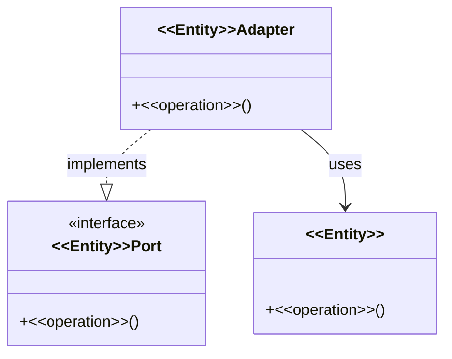
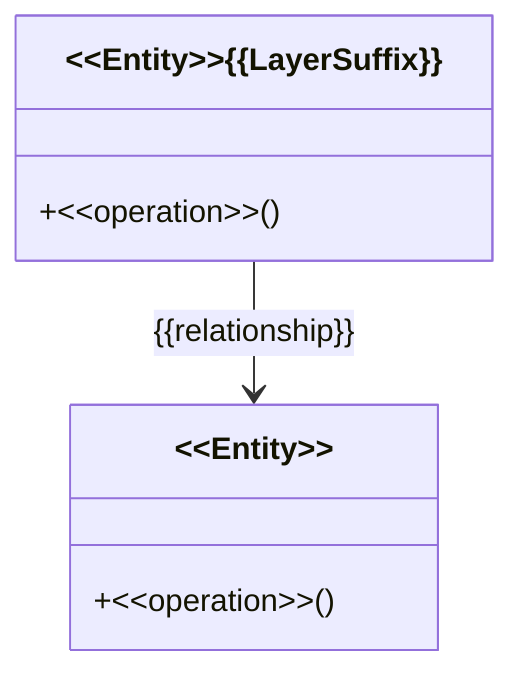
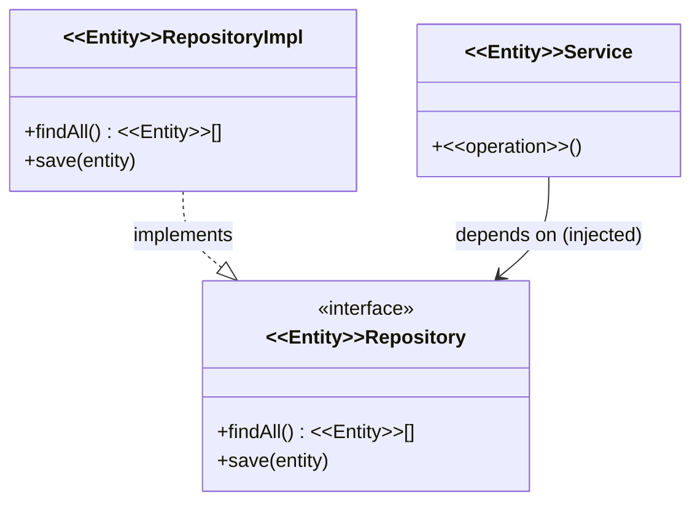

<!--
  Template: the architecture-specification document.
  This template is STACK-AGNOSTIC — works for MERN, Django, Spring Boot, or any other stack.

  PARAMETERIZED NAMES — KEY RULE:
  Architecture Flow, Mechanisms (Participants, Flow, Walkthrough) use <<Parameterized>> placeholders.
  The architect picks the placeholder vocabulary that fits their stack:

    <<Entity>>        — a domain concept (e.g. fills as "Order", "Recipient", "Invoice")
    <<operation>>     — a domain operation or method verb (e.g. fills as "placeOrder", "loadActive")
    <<Feature>>       — a user-facing capability (e.g. fills as "Checkout", "WirePayment")

  Replace <<Parameterized>> names with the domain vocabulary from your domain spec.
  Concrete domain names belong ONLY in ## Example.

  Mechanism organization:
    - 2-3 tightly-related mechanisms → use one ## Mechanisms section
    - 4+ mechanisms → one ## Mechanism: <Name> per concern
  Delete the illustrative example block at the bottom before shipping.
-->

# {{ArchitectureName}} Architecture Specification

## Table of Contents

- [Overview](#overview)
- [Instantiating the Domain](#instantiating-the-domain)
  - [Principles](#principles)
  - [Architecture Flow](#architecture-flow)
  - [Module Layout](#module-layout)
  - [Participants](#participants)
- [Mechanisms](#mechanisms)
  - [Mechanism: {{Mechanism1Name}}](#mechanism-{{mechanism1-slug}})
  - [Mechanism: {{Mechanism2Name}}](#mechanism-{{mechanism2-slug}})
  - [Mechanism: {{Mechanism3Name}}](#mechanism-{{mechanism3-slug}})
- [Testing Architecture](#testing-architecture)
  - [Principles](#principles-1)
  - [Testing Scope](#testing-scope)
  - [Module Layout](#module-layout-1)
  - [Participants](#participants-1)
- [Example](#example)
- [Rules and Validation](#rules-and-validation)
- [References](#references)

---

## Overview

{{ArchitectureName}} is a {{one-sentence positioning}} that prioritizes:

1. **{{Principle1}}** — {{one-line gloss}}
2. **{{Principle2}}** — {{one-line gloss}}
3. **{{Principle3}}** — {{one-line gloss}}

Mechanisms: **{{Mechanism1Name}}**, **{{Mechanism2Name}}**, **{{Mechanism3Name}}**.

> Sources: [cite the architecture's source of truth — ADR, wiki, decision doc, or sibling-skill output].

---

## Instantiating the Domain

<!-- COMMON TO ALL ARCHITECTURE SPECS — explains how domain classes and operations become code.
     Use <<Parameterized>> names throughout. Concrete domain names → ## Example only. -->

How domain classes and operations from the domain model become code in this architecture.

### Principles

<!-- State the mapping rules the architect has decided for this architecture.
     The goal: a reader can look at any file and know which domain concept it came from.
     How strictly names are derived, how layers are organized, how tiers extend each other
     is the architect's decision — record it here as checkable rules. -->

- **{{HowDomainConceptsMapToCode}}** — {{e.g. "file names, class names, and method names derive directly from domain classes and operations" or "each domain module maps to a package; internal naming is the team's choice"}}
- **{{HowCodeIsOrganized}}** — {{e.g. "domain modules over technical layers" or "one top-level folder per bounded context" or "hexagonal ports and adapters"}}
- **{{HowLayersRelate}}** — {{e.g. "outer layers depend on inner; domain depends on nothing" or "all tiers extend a shared domain core" or "adapters implement domain interfaces"}}
- **{{AnyOtherArchitectDecisions}}** — {{add or remove bullets; this list is the architect's}}

### Architecture Flow

<!-- Produce TWO deliverables for this section:
     1. ASCII block below — inline text summary of the flow, parameterized.
     2. architecture-flow.drawio — Draw.io file alongside this document.
        Start from templates/architecture-flow.drawio; replace placeholder labels
        with the actual layer/file names for this architecture.
        Simple boxes and lines only — no gradients, no swimlane fills.
     Use <<Parameterized>> names for all participants and files.
     Concrete names (e.g. "Recipient", "placeOrder") → ## Example. -->

One {{interaction description}} from {{entry point}} through {{layers}} to {{persistence}} and back.

> See [`architecture-flow.drawio`](./architecture-flow.drawio) for the visual diagram.

```
{{FLOW DIAGRAM — ASCII, participants named <<Feature>>, <<Entity>>, <<operation>>, or layer names}}
```

| Tech / Layer | File / Module | Domain concept it carries |
|---|---|---|
| **{{Layer1}}** | `{{file or module pattern}}` | `<<Entity>>` — {{e.g. "entity class; business rules live here"}} |
| **{{Layer2}}** | `{{file or module pattern}}` | `<<operation>>` — {{e.g. "named operation on the entity"}} |
| **{{Layer3}}** | `{{file or module pattern}}` | {{domain concept + one-line role}} |

### Module Layout

<!-- Show the folder / package tree with <<Parameterized>> file names.
     Annotate every file with what domain artifact it instantiates.
     Structure is the architect's choice — not prescribed here. -->

```
{{FOLDER OR PACKAGE TREE}}
{{example annotation: <<Entity>>.ts  ← entity class; <<operation>> lives here}}
```

| Artefact | Location | Used by |
|----------|----------|---------|
| **`<<Entity>>`** | `{{path pattern}}` | {{which layers / components}} |
| **`<<operation>>`** | `{{path pattern}}` | {{which layers / components}} |

### Participants

<!-- Class diagram using <<Parameterized>> names.
     Show inheritance (--|>), interface implementation (..|>), delegation (-->).
     Shape depends on the architecture — fill in what applies.
     Concrete class names → ## Example. -->



---

## Mechanisms

<!-- Tech-specific runtime concerns — NOT domain orientation (that belongs in Instantiating the Domain).
     Use <<Parameterized>> names throughout.
     Concrete domain names → ## Example only.
     Testing content → ## Testing Architecture. Do NOT add a testing subsection here. -->

### Mechanism: {{Mechanism1Name}}

#### Principles & Patterns

- **Principle:** {{one-liner stance — technology-agnostic, fits in a sentence}}.
- **Pattern:** {{named shape that satisfies the principle}}
  - **Options:** {{variants considered}}.
  - **Benefits:** {{why this pattern}}.
  - **Trade-offs:** {{what the team gives up}}.

#### File Structure

<!-- <<Parameterized>> names only. -->

```
{{folder / package tree for this mechanism — annotate with <<Entity>>, <<operation>>}}
```

#### Participants

<!-- <<Parameterized>> names. Show relationships appropriate to this mechanism. -->



| Class / Module | Layer | Responsibility | Collaborators |
|---|---|---|---|
| **`<<Entity>>`** | {{Layer}} | {{role}} | {{collaborators}} |
| **`<<Entity>>{{LayerSuffix}}`** | {{Layer}} | {{role}} | {{collaborators}} |

#### Flow

<!-- <<Parameterized>> participants. One representative scenario through this mechanism. -->

```mermaid
sequenceDiagram
    participant A as "&lt;&lt;caller&gt;&gt;"
    participant B as "&lt;&lt;Entity&gt;&gt;"
    participant C as "&lt;&lt;Entity&gt;&gt;Port"
    A->>B: &lt;&lt;operation&gt;&gt;()
    B->>C: {{call}}
    C-->>B: {{result}}
    B-->>A: {{outcome}}
```

#### Walkthrough Example

<!-- Describe the PATTERN using <<Parameterized>> names.
     Concrete code (e.g. using "Recipient") → ## Example. -->

Scenario: {{one representative scenario using <<Parameterized>> names}}.

1. **`<<Entity>>{{LayerSuffix}}`** (`{{file}}`) receives {{trigger}}; calls `<<operation>>()`.
2. **`<<Entity>>`** applies domain logic; returns {{result}}.
3. {{observable outcome}}.

```{{language}}
// Pattern — <<Parameterized>> names show the shape; see template/ for concrete implementation
{{code using <<Entity>>, <<operation>>, <<Feature>> as names}}
```

---

### Mechanism: {{Mechanism2Name}}

<!-- Same five-part shape. <<Parameterized>> names throughout. -->

---

### Mechanism: {{Mechanism3Name}}

<!-- Same five-part shape. <<Parameterized>> names throughout. -->

---

## Testing Architecture

<!-- When generating tests from this specification, use the **abd-story-acceptance-test** skill.
     That skill owns the test file shape, helper naming, orchestrator pattern, and RED-GREEN-REFACTOR cycle.
     This section defines the architecture-specific layer structure; abd-story-acceptance-test
     defines how to write the code within each layer. -->

Tests are generated using **`abd-story-acceptance-test`** — story-driven names, Given/When/Then helpers, one class per story, one method per scenario. The sections below define the layer structure for this architecture; the skill defines the code shape within each layer.

### Principles

- **Stories instantiate tests.** Every story produces one test file per tier at the same folder path as the story in the hierarchy.
- **Same scenario vocabulary across tiers.** The base helper defines Given/When/Then method names from the story's acceptance criteria; every tier helper implements the same names.
- **Stub at the tier boundary only.** {{state what each tier stubs — depends on the stack}}.
- **Helpers own mechanics; test files own scenarios.** Test files contain only `it`/`test` declarations.

### Testing Scope

<!-- Name the testing layers for this architecture. Domain unit tests are always present.
     The adapter tiers depend on the stack — fill in what applies. -->

```
  Domain unit tests  ({{path to domain test files}})
  Entry: class / function call | Real: domain classes only | Stub: nothing | Asserts: return values / errors

  {{AdapterTier1}} tests  ({{path pattern}})
  Entry: {{e.g. HTTP request, CLI call, message queue}} | Real: {{...}} | Stub: {{...}} | Asserts: {{...}}

  {{AdapterTier2}} tests  ({{path pattern}})
  Entry: {{e.g. render view, call presenter}} | Real: {{...}} | Stub: {{...}} | Asserts: {{...}}

  {{BrowserOrIntegrationTier}} tests  ({{path pattern}})
  Entry: {{e.g. full browser, full process}} | Real: full stack | Stub: nothing | Asserts: {{...}}

  Base helper  ({{path}})
  └─ scenario vocabulary + test data constants shared by the adapter tiers
```

| Layer | Entry point | Real | Stubbed | Asserts |
|-------|-------------|------|---------|---------|
| **Domain unit** | class / function call | domain classes only | nothing | return values, errors |
| **{{AdapterTier1}}** | {{entry}} | {{real}} | {{stubbed}} | {{assertion}} |
| **{{AdapterTier2}}** | {{entry}} | {{real}} | {{stubbed}} | {{assertion}} |
| **{{IntegrationTier}}** | {{entry}} | full stack | nothing | {{assertion}} |

### Module Layout

| Story artifact | Test artifact |
|----------------|---------------|
| Epic | folder |
| Mid-level sub-epic | intermediate folder (only when it has children) |
| **Lowest-level sub-epic** | **file** (`<sub-epic>_<tier>.<ext>`) |
| **Story** | **`describe` / test class** inside the file |
| **Scenario** | **`it` / `test` method** inside the describe |

```
{{path to domain test files}}
    {{domain test file}}      ← domain unit tests — live alongside domain classes

tests/ (or {{project test folder}})
└── <epic>/
    ├── <sub-epic>_{{tier1}}.<ext>
    ├── <sub-epic>_{{tier2}}.<ext>
    ├── <sub-epic>_{{tier3}}.<ext>
    └── helpers/
        ├── <sub-epic>.base.{{ext}}   # scenario vocabulary; abstract setup/teardown
        ├── <sub-epic>.{{tier1}}.{{ext}}
        ├── <sub-epic>.{{tier2}}.{{ext}}
        └── <sub-epic>.{{tier3}}.{{ext}}
```

### Participants

| | Domain test (base) | {{Tier1}} | {{Tier2}} | {{Tier3}} |
|-|--------------------|-----------|-----------|-----------|
| **Given** | scenario language | {{e.g. seeds DB}} | {{e.g. configures stub}} | {{e.g. seeds via API}} |
| **When** | (abstract) | {{e.g. HTTP call}} | {{e.g. call presenter}} | {{e.g. full process}} |
| **Then** | (abstract) | {{e.g. response body}} | {{e.g. view output}} | {{e.g. page state}} |

---

## Example

The worked example lives in `reference/example.ts`. It implements the **{{EpicName}} → {{SubEpicName}}** story using all mechanisms and the `{{domain}}` domain module.

| Artifact | Path | What it is |
|----------|------|------------|
| Runnable code | `reference/example.ts` | Domain module + composition root(s) — all template files merged into one |
| Specification by example | `template/specification-by-example.md` | Given/When/Then scenarios |
| Domain spec | `template/domain-spec.md` | Typed domain spec |
| Tests | `template/tests/` | Domain unit tests + acceptance test tiers |

---

## Rules and Validation

Rules live in `rules/`. Scanners live in `scanners/`. Read every rule before generating code; run scanners before declaring done.

| Rule file | What it checks |
|-----------|----------------|
| `rules/{{rule1}}.md` | {{what it validates}} |
| `rules/{{rule2}}.md` | {{what it validates}} |

```bash
python foundational/skill-helpers/skills/common/scripts/run_scanners.py \
  --skill-root practices/architecture-centric-engineering/specs/{{arch}} \
  --workspace <path-to-generated-code> \
  --language {{language}}
```

---

## References

- **Architecture source of truth:** [cite ADR, wiki, or sibling-skill output].
- **Coding standard:** {{e.g. abd-clean-code or project guide}}.
- **Testing standard:** {{e.g. abd-story-acceptance-test or project guide}}.
- **Worked example:** `template/` — runnable `{{domain}}` domain module.

---

## Illustrative example (delete before shipping)

> **For authors only** — shows tone, depth, and <<Parameterized>> name usage. Delete before shipping.

### Mechanism: Persistence (illustrative — generic)

#### Principles & Patterns

- **Principle:** Persistence is an infrastructure detail. Domain classes never import storage libraries; only a dedicated adapter touches the data store.
- **Pattern:** Repository interface in the domain; adapter in the infrastructure layer.
  - **Options:** active record (discarded — couples domain to DB); data mapper (acceptable variant).
  - **Benefits:** domain testable without a database; storage technology swappable.
  - **Trade-offs:** extra interface + adapter per domain module; acceptable for testability.

#### File Structure

```
{{domain}}/
├── <<Entity>>Repository.{{ext}}          # domain interface — depends on nothing
└── {{infra layer}}/
    └── <<Entity>>RepositoryImpl.{{ext}}  # adapter — depends on storage library
```

#### Participants



#### Flow

```mermaid
sequenceDiagram
    participant Service as "&lt;&lt;Entity&gt;&gt;Service"
    participant Repo as "&lt;&lt;Entity&gt;&gt;Repository"
    participant Impl as "&lt;&lt;Entity&gt;&gt;RepositoryImpl"
    Service->>Repo: findAll()
    Repo->>Impl: (runtime dispatch)
    Impl-->>Repo: &lt;&lt;Entity&gt;&gt;[]
    Repo-->>Service: &lt;&lt;Entity&gt;&gt;[]
```

#### Walkthrough Example

Scenario: `<<Entity>>Service` loads all `<<Entity>>`s; repository adapter queries the store.

1. **`<<Entity>>Service`** calls `<<Entity>>Repository.findAll()` (domain interface — no storage import).
2. **`<<Entity>>RepositoryImpl`** queries the data store; maps rows to `<<Entity>>` instances.
3. **`<<Entity>>Service`** receives `<<Entity>>[]`; applies domain logic.

```python
# Pattern — <<Parameterized>> names; see template/ for the concrete domain implementation
class <<Entity>>Service:
    def __init__(self, repo: <<Entity>>Repository) -> None:
        self._repo = repo

    def <<operation>>(self) -> list[<<Entity>>]:
        return [e for e in self._repo.find_all() if e.is_eligible()]
```
