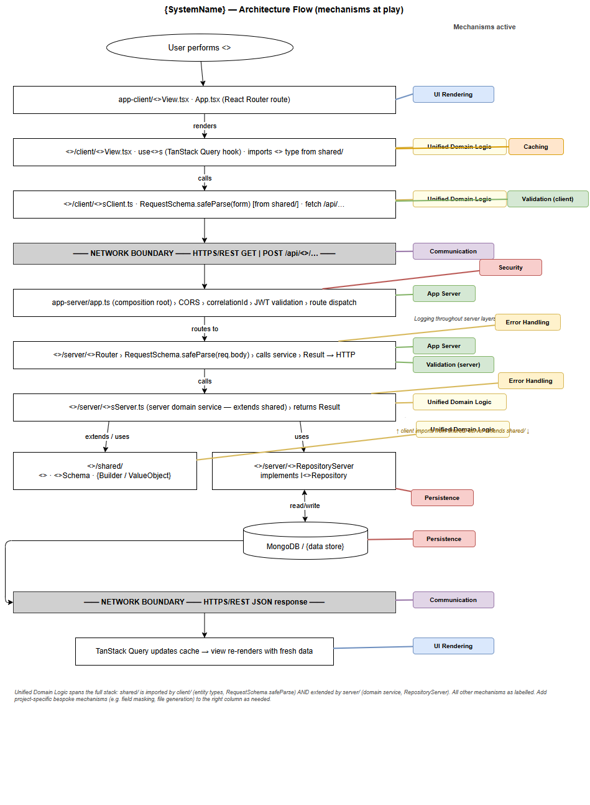

# MERN Domain-First — Architecture Blueprint

> **Purpose.** Second-level architecture document. Describes each mechanism as the code shape every module must adopt. Identifies the two kinds of module. Captures the testing architecture. Deep code walkthroughs and per-mechanism file layouts are in [`architecture-specification.md`](./architecture-specification.md).

---

## 1. Scope

This blueprint deepens [`architecture-outline.md`](./architecture-outline.md). It does not re-state the layered diagram, mechanism technology choices, guiding principles, or tech stack table. When a new mechanism is discovered during blueprint work, record its technology choice in the outline first, then deepen it here.

**Vocabulary:**

- **Mechanism** — a cross-cutting concern that defines a code shape or injection pattern modules must follow. May or may not have a concrete module surface of its own.
- **Module** — a bounded unit of business or infrastructural functionality. Domain modules implement a set of mechanisms. Some mechanisms also produce a dedicated module (Security → Identity; App Server → App Server Bootstrap).

---

## 2. Architecture Mechanisms

Mechanisms define the code shapes the platform commits to. Each entry names the technology, then describes in prose how every module participates in or extends the mechanism. Mechanisms marked **[+ module]** also have a dedicated module in section 4.

---

### 2.1 Security *(+ module: Identity)*

**Technology:** External IdP (OAuth 2.0 + OIDC); JWT validation middleware in Express; role-based route guards; HttpOnly session cookies.

Authentication is injected at the App Server layer, not inside individual domain modules. The Identity module's middleware sits in the global middleware chain and intercepts every protected request before any domain router receives it. It validates the JWT signature against the IdP JWKS endpoint, extracts role claims, and attaches a typed `Principal` to the request context. Domain modules participate in this mechanism by reading `req.principal` for role-based guards — they never touch the JWT directly.

On the client, the Security mechanism shapes every module's entry point: the React Router root wraps all domain routes in a session guard that redirects to the IdP login page when `useSession()` reports no active session. No module stores, generates, or validates credentials; security is entirely injected.

---

### 2.2 Error Handling & Resilience

**Technology:** Discriminated-union Result type (`{ ok: true; value: T } | { ok: false; error: E }`); no thrown exceptions in domain or server layers.

Every domain operation in every module returns a Result rather than throwing. This shapes the call stack: a module's service method receives typed inputs, performs work, and returns `Result<T, DomainError>`. The route handler (App Server mechanism) is the only translation point — it reads the discriminant and maps error variants to HTTP status codes with a structured JSON body. External call adapters are also Result-returning; network errors are caught and wrapped as `{ ok: false, error: { kind: 'ExternalSystemError' } }` before surfacing to callers.

The mechanism shapes modules by prohibiting `throw` outside the composition root and requiring every inter-layer call to handle both variants of the Result explicitly.

---

### 2.3 Logging & Observability

**Technology:** Pino structured JSON logging; `X-Correlation-Id` header propagated per request.

Logging is injected into every module through constructor-level dependency injection; no module calls `console.log` or creates its own logger. App Server Bootstrap injects a child Pino logger (with `correlationId` bound) into each domain module's constructor. Modules participate by logging business events at `INFO` with typed fields (e.g. entity reference, operation name), and Result failures at `ERROR` with the full error context.

The mechanism shapes modules by requiring them to accept `ILogger` as a constructor argument and emit structured, correlation-ID-tagged entries at defined severity levels.

---

### 2.4 Validation

**Technology:** Zod 3 schema validation at the Express route boundary and in entity constructors inside `shared/`; client-side mirrors server schemas.

Validation is applied at two points in every domain module. At the server route boundary (App Server mechanism), the route handler calls `{Domain}RequestSchema.safeParse(req.body)` before the domain service is invoked — an invalid payload returns a 422 with a structured field-error list without entering domain logic. Entity constructors in `shared/` enforce business-rule invariants (field formats, value ranges, status transitions) using Zod refinements; violations surface as `{ ok: false, error: ValidationError }` Results.

On the client, the same `{Domain}RequestSchema` is imported from `shared/` and called on form field change, giving immediate feedback. The mechanism shapes modules by requiring all input schemas to live in `shared/` (never duplicated in `client/` or `server/`) and by requiring constructors to validate their inputs — never accepting an unvalidated raw object.

---

### 2.5 Configuration & Secrets

**Technology:** Environment variables read once at `app-server/app.ts` (composition root); typed `Config` record injected via constructor arguments.

The mechanism forbids `process.env` reads outside the composition root. App Server Bootstrap reads and assembles the full `Config` record at startup, constructing sub-configs (`SecurityConfig`, `DbConfig`, `{ExternalService}Config`, etc.) and passing each to the relevant module constructor. Modules declare typed config interfaces in their `server/` package and accept them as constructor arguments — they never read environment variables directly.

The mechanism shapes modules by making their configuration dependencies explicit and testable: test code substitutes config objects directly without environment setup.

---

### 2.6 Caching

**Technology:** TanStack Query 5 client-side server-state cache (stale-while-revalidate); no server-side cache by default.

Caching is client-side only. The mechanism shapes every domain module's client layer: data fetching must go through `useQuery` / `useMutation` hooks rather than direct `fetch` calls. Each module declares query keys and `staleTime` values for its data. Mutations call `queryClient.invalidateQueries([key])` immediately on success to evict affected entries. The mechanism is entirely within the client-side layers — the server has no awareness of client-side cache state.

---

### 2.7 Persistence

**Technology:** MongoDB 7 document store via the official Node.js driver; repository pattern with `I<Entity>Repository` interface in `shared/`, implemented by `<Entity>RepositoryServer` in `server/`.

Every domain module that persists state owns exactly one MongoDB collection and exposes a repository interface in its `shared/` package. The `<Entity>RepositoryServer` class is the sole writer and reader of that collection. The mechanism shapes modules in three ways: the repository interface lives in `shared/` (so it can be implemented by fakes in tests without MongoDB); the implementation lives in `server/`; and no module may hold a MongoDB `Collection` reference belonging to another module.

---

### 2.8 Communication

**Technology:** HTTPS/REST with JSON (SPA ↔ API and API ↔ external services); other protocols (SFTP, message queues) added per integration need.

Outbound communication is always wrapped in a named adapter interface in the calling module's `server/` package (e.g. `I{ExternalServiceName}`). The mechanism shapes modules by requiring every external protocol call to: (a) go through a project-owned interface (so it can be stubbed in tests), (b) return a Result rather than throwing on network error, and (c) enforce timeout NFRs via `AbortSignal`.

On the client, all communication goes through TanStack Query hooks (Caching mechanism), which use the browser's `fetch` API. Direct `fetch` calls outside a TanStack Query hook are prohibited in domain module client code.

---

### 2.9 UI Rendering

**Technology:** React 18 SPA; React Router 6 (one named route per domain module); TanStack Query 5 hooks for all server-state; Vite 5 bundle with content-hashed chunks delivered from CDN.

The mechanism defines the code shape of every module's client layer. Each domain module contributes: a React Router route registered in the root `App.tsx`; one or more presentation components in `client/` that are pure rendering nodes; TanStack Query hooks that are the only path to server data. Components never call `fetch` directly. The bundle is code-split by route (React.lazy), so each domain module's client code is loaded on first navigation to its route.

---

### 2.10 App Server *(+ module: App Server Bootstrap)*

**Technology:** Node.js 20 / Express 4; modular Express Routers, one per domain module; global middleware chain applied before any router.

The mechanism defines the server-side code shape for every domain module. Each module contributes an Express `Router` (not raw middleware) that validates inbound request bodies, calls the domain service, and translates the returned Result to an HTTP response. The global middleware chain — `CORS → correlationId → JWT validation` — is applied by App Server Bootstrap before any domain router. No business logic lives in routers; they are thin HTTP/domain translators.

Modules participate by exposing a `create{Domain}Router(service, logger)` factory that App Server Bootstrap calls at startup and mounts at the module's path prefix.

---

### 2.11 Unified Domain Logic *(bespoke)*

**Technology:** TypeScript 5 `packages/<domain>/shared/` packages with zero framework imports; Zod 3 for entity invariants.

This is the central architectural mechanism: business rules live in `shared/` and shape every layer of the stack around the domain model to the maximum extent possible. Entities, value objects, Zod schemas, and any builders carry no framework imports. Server-side domain services extend or compose domain types directly. Express route handlers are organised by domain entity — one router per domain concept, named and structured to mirror the domain operation it exposes. MongoDB repositories are shaped around the same entity and schema types, using the domain interface as the contract.

React views and TanStack Query hooks are named and structured around the same domain concepts; a view imports domain entity types for its props and the domain schema for client-side `safeParse` — not because it inherits from the entity class, but because the domain vocabulary flows from `shared/` into every layer. Even where the connection is not direct inheritance, naming, structure, and vocabulary are aligned to the domain.

A change to a business rule in `shared/` propagates consistently across routes, views, and repositories in the same commit.

---

## 3. Architecture Flow

The diagram shows how mechanisms combine on a typical domain request — from user interaction through to persistence and back.

> Source: [`architecture-flow.drawio`](./architecture-flow.drawio).

| Step | Layer / File | Mechanisms active |
|---|---|---|
| 1 | **User** performs `<<operation>>` | — |
| 2 | `app-client/<<Feature>>View.tsx` · `App.tsx` (React Router route) | UI Rendering |
| 3 | `<<domain>>/client/<<Entity>>View.tsx` · `use<<Entity>>s` (TanStack Query hook) · imports `<<Entity>>` type from `shared/` | UI Rendering · Unified Domain Logic · Caching |
| 4 | `<<domain>>/client/<<Entity>>sClient.ts` · `RequestSchema.safeParse(form)` [from `shared/`] · `fetch /api/…` | Unified Domain Logic · Validation (client) · Communication |
| — | **NETWORK BOUNDARY** — HTTPS/REST `GET \| POST /api/<<domain>>/…` | Communication |
| 5 | `app-server/app.ts` (composition root) › CORS › correlationId › JWT validation › route dispatch | App Server · Security · Logging |
| 6 | `<<domain>>/server/<<Entity>>Router` › `RequestSchema.safeParse(req.body)` › calls service › `Result → HTTP` | App Server · Validation (server) · Error Handling |
| 7 | `<<domain>>/server/<<Entity>>sServer.ts` (domain service — extends `shared/`) › returns `Result<T, E>` | Unified Domain Logic · Error Handling · Logging |
| 8 | `<<domain>>/shared/` — `<<Entity>>` · `<<Entity>>Schema` · `{Builder / ValueObject}` | Unified Domain Logic |
| 9 | `<<domain>>/server/<<Entity>>RepositoryServer` implements `I<<Entity>>Repository` | Persistence · Unified Domain Logic |
| 10 | `MongoDB / {data store}` | Persistence |
| — | **NETWORK BOUNDARY** — HTTPS/REST JSON response | Communication |
| 11 | TanStack Query updates cache → view re-renders with fresh data | UI Rendering · Caching |

*Note: Unified Domain Logic spans the full stack — `shared/` is imported by `client/` (entity types, `RequestSchema.safeParse`) and extended by `server/` (domain service, `RepositoryServer`). Add project-specific bespoke mechanisms to the table as needed.*

---

## 4. Modules

Two kinds of module exist: **mechanism-modules** (mechanisms that also have a concrete implementation surface) and **domain modules** (owned business capabilities). Front end and back end are not separate modules — a module spans the full stack for its domain area.

> Source: [`module-overview.drawio`](./module-overview.drawio).

**Mechanisms used by all domain modules** (legend on diagram; not repeated per module):
UI Rendering · Unified Domain Logic · Validation · Error Handling & Resilience · Logging & Observability · App Server

---

### 4.0 App Server Bootstrap *(mechanism-module)*

Composition root for the `{SystemName}` API. Reads all configuration and secrets from the environment, constructs the typed `Config` record, instantiates all domain module dependencies, mounts the global middleware chain (`CORS → correlationId → JWT`), registers all domain routers, and starts the Express listener. Exposes the Express `app` instance as the surface other modules wire against at startup.

Uses: App Server · Configuration & Secrets · Security (mounts Identity) · Logging · Error Handling

---

### 4.1 Identity *(mechanism-module)*

Validates JWT tokens on every protected request, extracts role claims, and attaches a typed `Principal` to the request context for downstream domain routers to consume. Exposes `IdentityMiddleware` as its concrete surface — mounted globally by App Server Bootstrap before any domain router.

Uses: Security

---

### 4.2 `{Domain Module A}` *(domain module)*

*{1–2 sentences describing business scope.}*

Uses: *common set* + `{module-specific mechanisms — e.g. Persistence · Communication · Caching}`

Dependencies: App Server Bootstrap · Identity · `{other domain modules if any}`

---

### 4.N `{Domain Module N}` *(domain module)*

*Add one entry per domain module. Keep to 1–2 sentences of business scope + mechanisms used + dependencies. Deep module walkthrough goes in the architecture specification.*

---

## 5. Testing Architecture

| Tier | Scope | Test doubles | Where it runs |
|---|---|---|---|
| **Domain** | One `shared/` entity or builder; pure TypeScript | None | In-process, Vitest, no DB |
| **Application** | One module's server service; full use case | `Fake{Entity}Repository`, `Fake{ExternalAdapter}` | In-process, Vitest, no DB |
| **Integration** | One module's Express router + real MongoDB | Real MongoDB (test container); external adapters still faked | CI, Vitest, requires MongoDB |
| **E2E** | Key user journey; full deployed stack | Real everything, against `{target env}` | Pre-release, Playwright |

Common doubles pattern: `Fake{Entity}Repository` · `Fake{ExternalService}` · `FakeClock`

> See [`testing-flow.drawio`](./testing-flow.drawio) for a side-by-side view of which stack layers are real, faked, or not reached in each tier.

---

## 6. Decision Records

Blueprint-level decisions (module boundaries, test-tier vocabulary, data ownership). Mechanism technology choices are in the outline.

| ID | Decision | One-line consequence |
|---|---|---|
| ADR-B01 | One `packages/<domain>/` with `shared/`, `client/`, `server/` sub-packages | Component boundaries align with the mechanism model; cross-layer imports are structurally prevented |
| ADR-B02 | Four-tier test vocabulary: domain / application / integration / e2e | Every test file belongs to a named tier with a defined scope and double set |
| ADR-B03 | Each domain module owns its MongoDB collection exclusively | No cross-module queries; cross-module reads go via repository interfaces |

---

## See also

- [`architecture-outline.md`](./architecture-outline.md) — mechanism technology choices, guiding principles, tech stack, ADRs.
- [`architecture-specification.md`](./architecture-specification.md) — code-level: module layout, layer qualifiers, file naming, worked examples.
