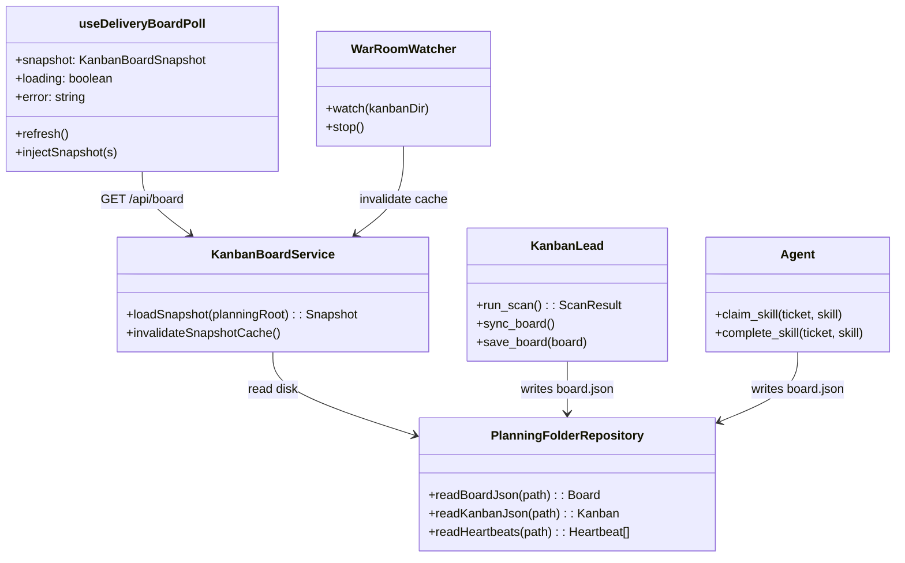
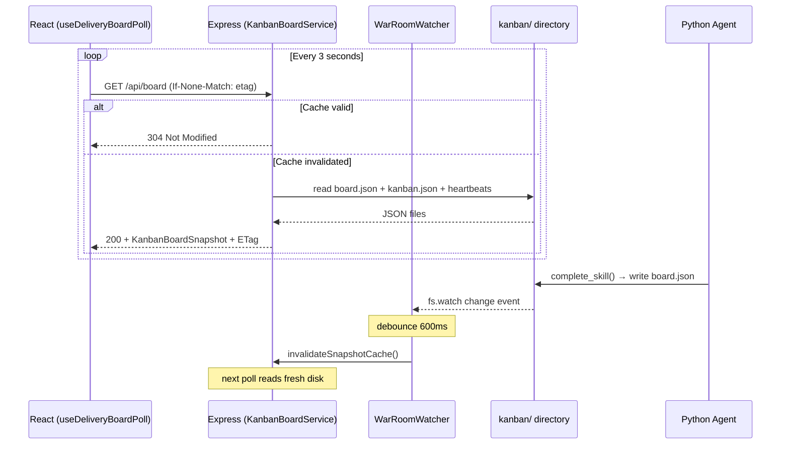
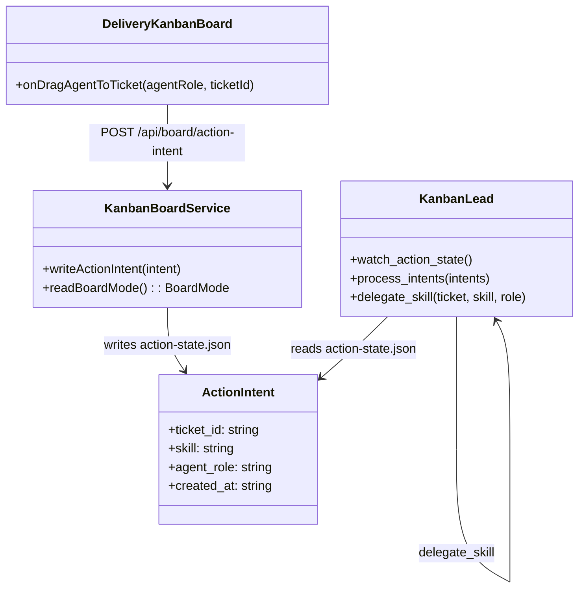
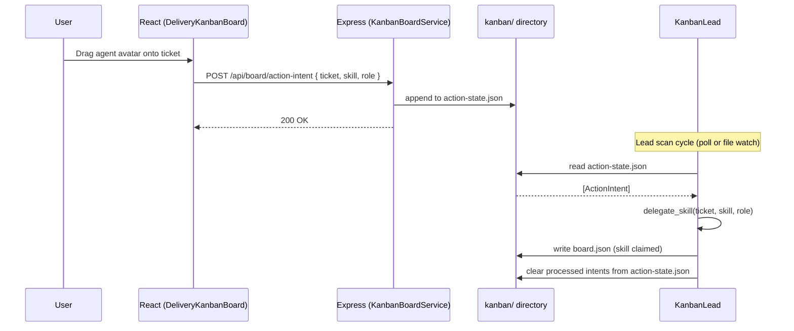
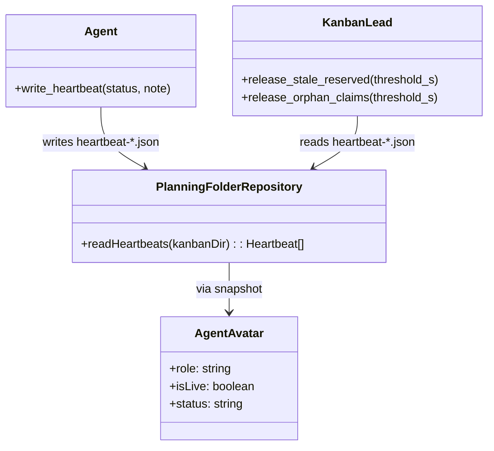
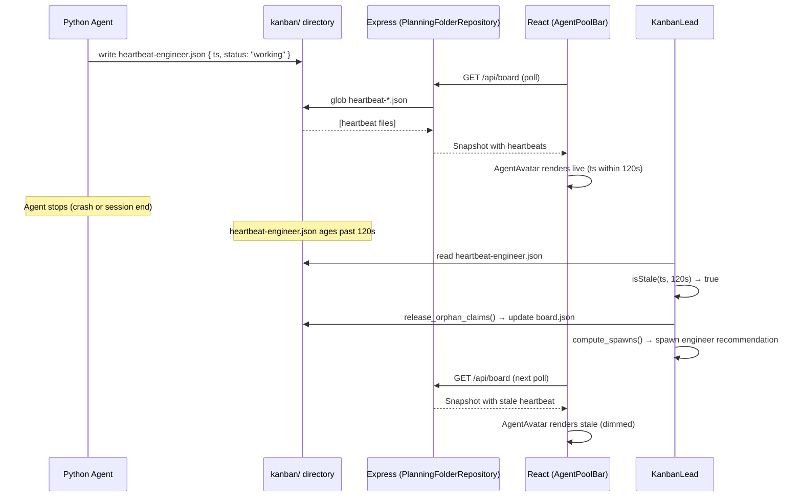

# Delivery Agent Kanban — Architecture Reference

## Table of Contents

- [Overview](#overview)
- [Architecture Layers](#architecture-layers)
- [Mechanism: Board State Synchronization](#mechanism-board-state-synchronization)
- [Mechanism: Action Intent Bridge](#mechanism-action-intent-bridge)
- [Mechanism: Heartbeat Liveness](#mechanism-heartbeat-liveness)
- [Testing Architecture](#testing-architecture)
- [References](#references)

---

## Overview

Delivery Agent Kanban is a **file-mediated observer architecture** where a React board UI and Python agent processes share state through JSON files on disk — no direct inter-process communication, no message broker, no database. The architecture prioritizes:

1. **File-based contract** — agents and the UI never call each other; both read and write a shared war-room directory
2. **Polling with cache invalidation** — the client polls an Express API that mirrors disk state, with server-side file watching to invalidate stale caches
3. **Unidirectional data authority** — agents own board mutations (skill progress, ticket advancement); the UI is a read-mostly observer that can size the team and trigger a lead scan
4. **Manual mode extension** — a planned action-intent file allows the UI to direct agent work without changing the automatic-mode architecture

This reference covers three mechanisms: **Board State Synchronization**, **Action Intent Bridge**, and **Heartbeat Liveness**.

> Sources: ubiquitous-language.md (domain model); kanban_lead.py, delivery_model.py, board_skill.py (agent protocol); DeliveryKanbanBoard.tsx, useDeliveryBoardPoll.ts, KanbanBoardService.ts, warRoomWatcher.ts (front-end stack).

---

## Architecture Layers

```
┌──────────────────────────────────────────────────────────────┐
│  Presentation          React (Vite :3000)                    │
│                        DeliveryKanbanBoard, AgentPoolBar     │
├──────────────────────────────────────────────────────────────┤
│  API Gateway           Express (Node :3001)                  │
│                        kanbanBoard.routes, KanbanBoardService│
├──────────────────────────────────────────────────────────────┤
│  File Bridge           War-room directory on disk            │
│                        board.json, heartbeats, action-state  │
├──────────────────────────────────────────────────────────────┤
│  Agent Orchestration   Python (Cursor subagents)             │
│                        kanban_lead.py, board_skill.py        │
├──────────────────────────────────────────────────────────────┤
│  Agent Execution       Python + practice skills              │
│                        agent.py, executor-workflow.md         │
└──────────────────────────────────────────────────────────────┘
```

**Presentation** — React with Vite (`packages/delivery-board/client`, `packages/app-client`). Renders the kanban board, polls the API for snapshot changes, accepts user interactions (team sizing, manual-mode drag-assign, lead-scan trigger). No direct file access — everything goes through the API gateway.

**API Gateway** — Express on Node (`packages/delivery-board/server`, `packages/app-server`). Reads board and heartbeat files from disk, caches the assembled snapshot with an ETag, and invalidates the cache when the server-side file watcher detects a change. Exposes REST endpoints for board reads, team updates, action intents, and lead-scan invocation.

**File Bridge** — JSON files on disk under `<planningRoot>/kanban/`. This is the only coupling point between the UI and agents. Neither side knows the other exists — both read and write to the same directory. The contract is the file schema: `board.json` (tickets, skill progress, team), `kanban.json` (stage definitions), `heartbeat-*.json` (agent liveness), `action-state.json` (manual-mode intents), and `metrics-log.jsonl` (append-only events).

**Agent Orchestration** — Python, run as Cursor subagents (`skills/abd-kanban/scripts/kanban_lead.py`). The kanban lead scans the board on each cycle: syncs ticket states, scatters parent tickets, pulls backlog into active, releases stale claims, dispatches reserved work to live agents, and recommends spawns for dead slots. It reads and writes the same war-room files the API gateway reads.

**Agent Execution** — Python + Cursor practice skills (`skills/abd-kanban/scripts/agent.py`, `board_skill.py`). Team member agents claim skills via `board_skill.py pull`, execute the practice skill (producing delivery artifacts), then write completion via `board_skill.py complete`. Each agent writes its own heartbeat file on every work cycle.

---

## Mechanism: Board State Synchronization

### Principles & Patterns

- **Principle:** Ticket state — skill progress, board position, advancement — is owned exclusively by agents. The front end writes directives (action intents in manual mode) and configuration (team counts), but never mutates ticket state. Agents never call the HTTP API — they write files. The war-room directory is the single shared contract.
- **Pattern:** **Poll-with-ETag + Server File Watch** — the React client polls an Express endpoint on a fixed interval; the server reads disk, caches the result, and uses ETag-based conditional responses (304 Not Modified) to minimize payload. A server-side `fs.watch` on the war-room directory invalidates the cache when agents write, so the next poll returns fresh data.
  - **Options:** WebSocket push (rejected — adds connection management complexity for a local-first tool); direct file watching from the browser (rejected — no browser API for local filesystem); shared database (rejected — adds infrastructure dependency).
  - **Benefits:** Agents remain decoupled from the UI process; no server state beyond a snapshot cache; ETag eliminates redundant JSON serialization on unchanged boards; file watcher ensures sub-second cache freshness after agent writes.
  - **Trade-offs:** Worst-case UI latency is one poll interval (3s default) plus file-watcher debounce (600ms); acceptable for a local delivery tool where real-time millisecond updates are not required.

### File Structure

```
packages/delivery-board/
├── client/
│   ├── useDeliveryBoardPoll.ts         # Poll hook: interval, ETag, refresh, injectSnapshot
│   ├── DeliveryKanbanBoard.tsx         # Board renderer consuming snapshot
│   └── deliveryBoardApi.ts             # fetchBoardSnapshot(), postTeamUpdate()
├── server/
│   ├── kanbanBoard.routes.ts           # GET /api/board, POST /api/board/team, POST /api/board/lead-scan
│   ├── KanbanBoardService.ts           # loadSnapshot(), invalidateSnapshotCache()
│   ├── PlanningFolderRepository.ts     # readBoardJson(), readKanbanJson(), readHeartbeats()
│   └── warRoomWatcher.ts               # WarRoomWatcher — fs.watch on kanban dir, debounced invalidation
├── shared/
│   ├── kanbanBoard.ts                  # KanbanBoardSnapshot type, parseBoard(), buildStageBuckets()
│   └── KanbanBoardLoader.ts            # Merge board + kanban + heartbeats into snapshot
<planningRoot>/kanban/
├── board.json                          # Tickets, skill_progress, team, synced_at
├── kanban.json                         # Stage definitions, stage_work_required, strategy
├── heartbeat-*.json                    # Agent liveness (see Heartbeat Liveness mechanism)
└── metrics-log.jsonl                   # Append-only event log
```

### Participants



| Class / Module | Layer | Responsibility | Collaborators |
|---|---|---|---|
| **useDeliveryBoardPoll** | Presentation | Poll API on interval; cache ETag; expose snapshot to React tree | KanbanBoardService (via HTTP) |
| **KanbanBoardService** | API Gateway | Load snapshot from disk; cache with ETag; invalidate on watcher signal | PlanningFolderRepository, WarRoomWatcher |
| **WarRoomWatcher** | API Gateway | Watch kanban directory for file changes; debounce; call invalidate | KanbanBoardService |
| **PlanningFolderRepository** | API Gateway | Read board.json, kanban.json, heartbeats from disk | Filesystem |
| **KanbanLead** | Agent Orchestration | Scan board, advance tickets, dispatch claims, save board.json | board.json, Agent |
| **Agent** | Agent Execution | Claim/complete skills on tickets; write skill_progress to board.json | board.json, heartbeat files |

### Flow



### Walkthrough Example

Scenario: An engineer agent completes a skill on a ticket; the UI reflects the completion within one poll cycle.

1. **Agent** (`board_skill.py complete`) writes `board.json` with the ticket's `skill_progress` entry updated: `execution_status: done`, `review_status: done`. `synced_at` is set to current ISO timestamp.
2. **WarRoomWatcher** detects the `board.json` change via `fs.watch`. After the 600ms debounce window, it calls `KanbanBoardService.invalidateSnapshotCache()`.
3. **KanbanBoardService** clears its cached snapshot and ETag.
4. **useDeliveryBoardPoll** fires its next 3-second poll: `GET /api/board` with the old ETag.
5. **KanbanBoardService** sees no cached snapshot, calls `PlanningFolderRepository.readBoardJson()` + `readKanbanJson()` + `readHeartbeats()`, builds a new `KanbanBoardSnapshot`, computes a new ETag, and returns **200** with the full snapshot.
6. **DeliveryKanbanBoard** re-renders: the ticket's skill row transitions from the magnifying glass (review pass) to the done checkmark. `useFlipTicketAnimations` animates the card if its board position changed.

```typescript
// useDeliveryBoardPoll.ts — poll loop (simplified)
export function useDeliveryBoardPoll(planningRoot: string, intervalMs = 3000) {
  const [snapshot, setSnapshot] = useState<KanbanBoardSnapshot | null>(null);
  const etagRef = useRef<string | null>(null);

  useEffect(() => {
    const timer = setInterval(async () => {
      const res = await fetch(`/api/board?planningRoot=${planningRoot}`, {
        headers: etagRef.current ? { 'If-None-Match': etagRef.current } : {},
      });
      if (res.status === 304) return;
      const data = await res.json();
      etagRef.current = res.headers.get('etag');
      setSnapshot(data);
    }, intervalMs);
    return () => clearInterval(timer);
  }, [planningRoot, intervalMs]);

  return { snapshot };
}
```

```python
# board_skill.py complete — agent writes completion (simplified)
def complete_skill(workspace, ticket_id, skill_name):
    board = load_board(war_room_dir(workspace))
    ticket = find_ticket(board, ticket_id)
    progress = ticket.skill_progress[skill_name]
    progress.execution_status = "done"
    progress.review_status = "done"
    progress.ended_at = datetime.utcnow().isoformat()
    save_board(board, war_room_dir(workspace))
    append_metrics_log(war_room_dir(workspace), {
        "event": "skill_done", "ticket": ticket_id, "skill": skill_name
    })
```

### Testing the mechanism

- **Tier:** Server integration (Express) + client unit (React hook).
- **Server test:** Given a `board.json` on disk, when the file changes and the watcher fires, then the next `GET /api/board` returns the updated snapshot (not the cached one).
- **Client test:** Given `useDeliveryBoardPoll` is active, when the API returns a new ETag, then `snapshot` updates and triggers a re-render.
- **End-to-end:** Given an agent writes `board.json`, within `pollInterval + debounce` milliseconds the board UI shows the updated ticket state.

---

## Mechanism: Action Intent Bridge

> **Status: specified in domain model and acceptance criteria; not yet implemented in code.**

### Principles & Patterns

- **Principle:** In manual mode the user directs agent work; the kanban lead does not act autonomously. The user's intent reaches the agent through a file — the same file-based contract as automatic mode, extended with a new file type.
- **Pattern:** **Action State File** — the UI writes a structured JSON file (`action-state.json`) containing action intents (which skill, which ticket, which agent role). The kanban lead, already polling the war-room directory, detects the file change and delegates accordingly. No new transport — the existing file-watch + poll architecture handles it.
  - **Options:** WebSocket command channel (rejected — introduces bidirectional coupling and connection management); REST endpoint that kanban lead exposes (rejected — agents are Cursor subprocesses, not long-lived servers); shared database (rejected — same reason as board sync).
  - **Benefits:** Zero new infrastructure; leverages the file watcher the lead already uses; the intent file is auditable on disk; multiple intents can queue before the lead processes them.
  - **Trade-offs:** Latency depends on lead poll/scan interval (not just UI poll); file writes from the UI must be atomic to avoid partial reads; the intent file format is a new contract to maintain.

### File Structure

```
<planningRoot>/kanban/
├── board.json                          # Existing — includes board_mode field (automatic | manual)
├── action-state.json                   # NEW — action intents written by UI, consumed by kanban lead
└── ... (existing files)

packages/delivery-board/
├── client/
│   └── deliveryBoardApi.ts             # EXTEND — postActionIntent(ticket, skill, agentRole)
├── server/
│   ├── kanbanBoard.routes.ts           # EXTEND — POST /api/board/action-intent
│   ├── KanbanBoardService.ts           # EXTEND — writeActionIntent(), readBoardMode()
│   └── warRoomWatcher.ts               # EXTEND — watch action-state.json
├── shared/
│   └── kanbanBoard.ts                  # EXTEND — ActionIntent type, BoardMode enum

skills/abd-kanban/scripts/
├── kanban_lead.py                      # EXTEND — watch_action_state(), process_intents()
└── delivery_model.py                   # EXTEND — ActionIntent dataclass, BoardMode enum
```

### Participants



| Class / Module | Layer | Responsibility | Collaborators |
|---|---|---|---|
| **DeliveryKanbanBoard** | Presentation | Accept drag-drop; call API to record intent | KanbanBoardService (via HTTP) |
| **KanbanBoardService** | API Gateway | Write action intent to disk; read board mode | action-state.json, board.json |
| **ActionIntent** | File Bridge | Structured record: ticket, skill, agent role, timestamp | action-state.json |
| **KanbanLead** | Agent Orchestration | Detect intent file change; process each intent in order; delegate | Agent, board.json |

### Flow



### Walkthrough Example

Scenario: The user drags an engineer agent onto a ticket in manual mode; the kanban lead delegates the next skill.

1. **User** drags an engineer avatar onto a ticket card in the board UI.
2. **DeliveryKanbanBoard** determines the next incomplete skill in *stage work required* order and calls `POST /api/board/action-intent` with `{ ticket_id, skill, agent_role: "engineer" }`.
3. **KanbanBoardService** appends the `ActionIntent` to `action-state.json` on disk. If the file does not exist, it creates it.
4. **KanbanLead** (on its next scan cycle or file-watch trigger) reads `action-state.json`, finds the unprocessed intent.
5. **KanbanLead** calls `delegate_skill()`: reserves the skill on the ticket in `board.json` for the engineer role, and either dispatches to a live agent (via `board_skill.py pull --reserve`) or adds a spawn recommendation.
6. **KanbanLead** removes the processed intent from `action-state.json`.
7. The board poll cycle picks up the updated `board.json` — the ticket card shows the skill as claimed.

```json
// action-state.json — action intent file format
{
  "intents": [
    {
      "ticket_id": "shaping-1",
      "skill": "abd-story-mapping",
      "agent_role": "product-owner",
      "created_at": "2026-05-31T21:05:00Z"
    }
  ]
}
```

```python
# kanban_lead.py — process intents (planned, simplified)
def process_intents(self, war_room: Path):
    state_file = war_room / "action-state.json"
    if not state_file.exists():
        return
    state = json.loads(state_file.read_text())
    for intent in state.get("intents", []):
        self.delegate_skill(
            ticket_id=intent["ticket_id"],
            skill=intent["skill"],
            role=intent["agent_role"],
        )
    state_file.write_text(json.dumps({"intents": []}, indent=2))
```

### Testing the mechanism

- **Tier:** Server integration + Python unit.
- **Server test:** Given board mode is manual and a POST arrives, then `action-state.json` contains the intent.
- **Python test:** Given `action-state.json` has two intents, when `process_intents` runs, then both skills are reserved on `board.json` and the intent file is cleared.
- **End-to-end:** Given a user drags an agent in manual mode, within one lead scan cycle + one UI poll cycle the ticket shows the skill as claimed.

---

## Mechanism: Heartbeat Liveness

### Principles & Patterns

- **Principle:** Agent liveness is determined by file age, not by connection state. Each agent writes a timestamped heartbeat file; any process can determine liveness by comparing the timestamp to a staleness threshold.
- **Pattern:** **Heartbeat File per Agent Instance** — each running agent writes `heartbeat-<role>[-<instance>].json` to the war-room directory on every work cycle. The file contains a timestamp, status (`working`, `ready`, `reserved`), and an optional note. Readers compare `ts` to `now` against a role-specific threshold (agents: 120s, kanban lead: 180s) to determine liveness.
  - **Options:** Process heartbeat via OS signals (rejected — agents are Cursor subprocesses with no guaranteed PID stability); centralized health-check endpoint (rejected — agents are not servers).
  - **Benefits:** Simple, decentralized, observable (files on disk); works across process boundaries; the same mechanism serves both the UI (pool bar avatars) and the kanban lead (spawn decisions, stale release).
  - **Trade-offs:** Clock skew between writer and reader could cause false positives; mitigated by local-only operation. File system latency on slow disks could delay detection; acceptable for a development tool.

### File Structure

```
<planningRoot>/kanban/
├── heartbeat-kanban-lead.json          # Kanban lead liveness
├── heartbeat-product-owner.json        # Single-instance PO agent
├── heartbeat-engineer.json             # Engineer instance 1
├── heartbeat-engineer-2.json           # Engineer instance 2
└── ...

packages/delivery-board/
├── server/
│   └── PlanningFolderRepository.ts     # readHeartbeats() — glob heartbeat-*.json
├── shared/
│   └── kanbanBoard.ts                  # AgentHeartbeat type, isStale() threshold logic
├── client/
│   └── DeliveryKanbanBoard.tsx         # AgentPoolBar, AgentAvatar — live/stale styling

skills/abd-kanban/scripts/
├── heartbeat.py                        # write_heartbeat(role, instance, status, note)
└── kanban_lead.py                      # release_stale_reserved(), release_orphan_claims()
```

### Participants



| Class / Module | Layer | Responsibility | Collaborators |
|---|---|---|---|
| **Agent** | Agent Execution | Write heartbeat file each work cycle | heartbeat-*.json |
| **KanbanLead** | Agent Orchestration | Read heartbeats; release stale claims (30s); release orphan claims (120s); compute spawn needs | heartbeat-*.json, board.json |
| **PlanningFolderRepository** | API Gateway | Glob and parse all heartbeat files into snapshot | heartbeat-*.json |
| **AgentAvatar** | Presentation | Render live/stale indicator per agent role and instance | Snapshot heartbeat data |

### Flow



### Walkthrough Example

Scenario: An engineer agent becomes unresponsive; the kanban lead releases its claims and recommends a spawn; the UI shows the agent as stale.

1. **Agent** writes `heartbeat-engineer.json` with `{ "ts": "2026-05-31T21:00:00Z", "status": "working", "note": "abd-clean-code on shaping-1" }` during its last active cycle.
2. The agent's Cursor session ends (crash or user close). No more heartbeat writes.
3. **KanbanLead** runs its next scan. `release_stale_reserved()` checks all heartbeats against a 30-second threshold for reserved claims; `release_orphan_claims()` checks against 120 seconds for active claims. The engineer's heartbeat is 130 seconds old — orphan threshold exceeded.
4. **KanbanLead** updates `board.json`: the engineer's claimed skill on the ticket has its `agent` field cleared, returning it to claimable state.
5. **KanbanLead** `compute_spawns()` detects the engineer slot has no live heartbeat → adds `{ "role": "engineer", "instance": 1, "reason": "heartbeat stale" }` to spawn recommendations.
6. **useDeliveryBoardPoll** picks up the updated snapshot. **AgentAvatar** for engineer renders dimmed/stale. The spawn badge appears on the AgentPoolGroup.

```json
// heartbeat-engineer.json
{
  "ts": "2026-05-31T21:00:00Z",
  "status": "working",
  "note": "abd-clean-code on shaping-1"
}
```

```python
# kanban_lead.py — release orphan claims (simplified)
def release_orphan_claims(self, board, heartbeats, threshold_s=120):
    now = datetime.utcnow()
    for hb in heartbeats:
        age = (now - parse_iso(hb["ts"])).total_seconds()
        if age > threshold_s:
            for ticket in board.active:
                for skill, progress in ticket.skill_progress.items():
                    if progress.agent == hb["role"] and progress.execution_status == "in_progress":
                        progress.agent = None
                        progress.execution_status = "not_started"
```

### Testing the mechanism

- **Tier:** Python unit (lead logic) + server integration (heartbeat reading) + client unit (avatar rendering).
- **Python test:** Given a heartbeat older than 120s and a claimed skill, when `release_orphan_claims` runs, then the skill's agent is cleared and execution_status resets to not_started.
- **Server test:** Given heartbeat files on disk, when `readHeartbeats()` is called, then all files are parsed and included in the snapshot.
- **Client test:** Given a heartbeat with `ts` older than 120s, when `AgentAvatar` renders, then it shows the stale indicator.

---

## Testing Architecture

| Tier | Tool | Emphasis | Location |
|------|------|----------|----------|
| **Python unit** | pytest | Board model, lead scan logic, agent claim/complete, heartbeat thresholds | `skills/abd-kanban/scripts/test_board_flow_logic.py` |
| **Server integration** | Vitest / Jest | API routes, snapshot loading, file watcher cache invalidation | `packages/delivery-board/server/__tests__/` |
| **Client unit** | Vitest + React Testing Library | Poll hook behavior, component rendering, animation triggers | `packages/delivery-board/client/__tests__/` |
| **End-to-end** | Manual (board + agents running locally) | Agent writes → UI reflects within poll + debounce window | Local dev environment |

Tests follow the project's testing standard — story-driven names, Given/When/Then structure where applicable. Python tests use the orchestrator pattern from `abd-acceptance-test-driven-development`.

---

## References

- **Domain model:** `docs/domain/ubiquitous-language.md` — board mode, action intent, action state file, skill progress, execution status, review status, heartbeat, team member agent.
- **Acceptance criteria:** `docs/acceptance-criteria.md` — stories for manual mode, board sync, skill execution two-pass model.
- **Agent protocol:** `practices/kanban/reference/agent-protocol.md` — read-gates, war-room paths, verdict format.
- **Code conventions:** `abd-clean-code` (production), `abd-acceptance-test-driven-development` (tests).
- **Existing implementation:** `packages/delivery-board/` (TypeScript), `skills/abd-kanban/scripts/` (Python).

---

## Mechanism Assignments

| Mechanism | Decision | Path | Section |
|-----------|----------|------|---------|
| Board State Synchronization | **create** | this file | [§ Board State Synchronization](#mechanism-board-state-synchronization) |
| Action Intent Bridge | **create** | this file | [§ Action Intent Bridge](#mechanism-action-intent-bridge) |
| Heartbeat Liveness | **create** | this file | [§ Heartbeat Liveness](#mechanism-heartbeat-liveness) |
