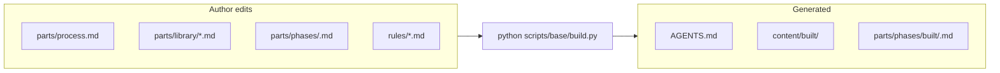
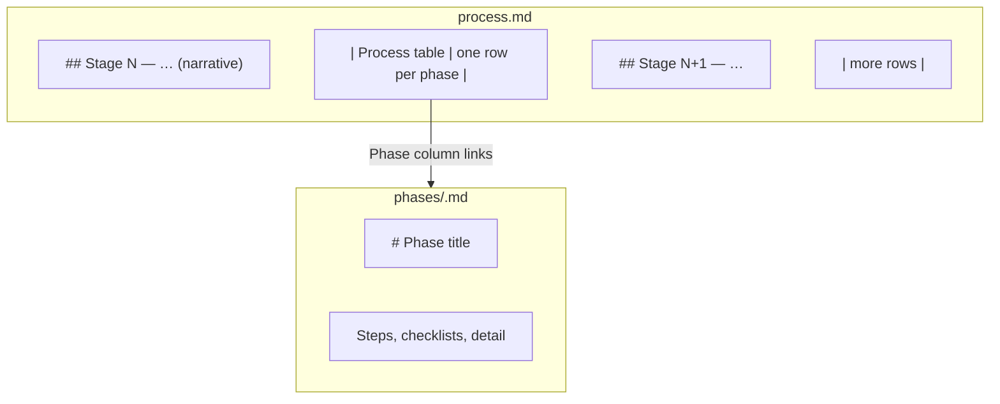

# Process phases — how `process.md`, `build.py`, and phase files fit together

---

## Approach (two views)

### 1) Where things live vs what `build.py` emits

- **Sources** are under **`content/parts/`** (this doc says **`parts/`** for short).
- **`build.py`** reads **`skill-config.json`** for merge lists (`phase_files`, `library_files`, `phase_rules`, `phase_bundle`, …), assembles each phase prompt, writes **`AGENTS.md`**, copies the same merge to **`content/built/`** when using static delivery, and writes **per-phase** snapshots under **`parts/phases/built/`**. After merge it runs **`build.build_pipeline`** (compile, scanners, etc.).

### 2) Stages vs phases vs steps

| Term | Where | What it is |
| --- | --- | --- |
| **Stage** | **`## Stage …`** sections in **`process.md`** | Grouping story: purpose, “what you produce,” success criteria. **Not** one row per stage. |
| **Phase** | **One row** in the process **table** + **one file** **`phases/<slug>.md`** | A unit of work with a stable **slug** (e.g. `workspace-and-config`). Order = table order + **`phase_files`** in **`skill-config.json`**. |
| **Step** | **Inside** a phase markdown file | Bullets, `## Action Checklist`, BDD-style steps — **not** extra table rows. |

Full layout rules: **[Skill structure and concepts — §3](skill-structure-and-concepts.md#skill-structure-sec3)**.

---

## `process.md` — pipeline line and table

**Top of file:** one **Pipeline** line — linked phase names in order (e.g. Workspace → Plan → Scaffold → …).

### Process table columns (abd-skill-builder shape)

**Process table (default — seven columns):**

| Column | Use |
| --- | --- |
| **`#`** | Order id: **`0`** = workspace first; **`1a`/`1b`**, **`2a`/`2b`**, … as needed. |
| **Phase** | Link text → **`phases/<slug>.md`**. Stable title, not `phase-02-foo` in the link. |
| **Description** | What this phase **does** — enough to pick the right doc. |
| **Actor** | Human / AI / Code / mixed. |
| **Input** | What you need **before** starting (paths, prior artifacts). |
| **Output** | Concrete **artifacts** when done (paths, tree, exit criteria). |
| **Scripts** | Commands: `python scripts/base/generate.py --phase <slug>`, `python scripts/base/build.py`, `scaffold_skill.py`, etc. Separate **`·`** between commands. |

**Alternate shape (e.g. abd-maps-models-specs):** same seven columns but **`Summary`** + **`Script`** + **`Outputs`** + **`Ref`** — keep header labels consistent within a skill.

**Do not** write vague **Output** cells that only name a template — give the **real path** under the skill (e.g. **`content/parts/library/base/checklist.md`**).

---

## File structure (typical skill)

| Path | Role |
| --- | --- |
| **`content/parts/process.md`** | Stages + process table; links to all phase files. |
| **`content/parts/phases/<slug>.md`** | Source for that phase (author-edited). |
| **`content/parts/phases/built/<slug>.md`** | **Generated** by **`build.py`** — assembled prompt for that slug (for static mode / diff). |
| **`content/parts/library/*.md`** | Shared norms; optional **`abd:begin <slug>`** / **`abd:end`** slices per phase. |
| **`rules/*.md`** | Inlined per **`phase_rules`** / **`every_phase_rules`** when assembling prompts. |
| **`skill-config.json`** | **`phase_files`** order, **`library_files`**, **`phase_library`**, **`phase_bundle`**, **`delivery.mode`**, **`build.*`**. |
| **`AGENTS.md`** | **Generated** — IDE default context. |
| **`content/built/`** | Copy of merged static outputs when **`static_built`**. |

---

## Language

- **Operator-facing prose:** second person (**you** / **your**) where **`documentation-standards.md`** applies.
- **Cross-phase routing:** one line — *Routing: [Workspace and config](…)* — do not paste full **`skill-config.json`** workspace keys in every phase.

---

## What `build.py` puts in `AGENTS.md`

Typical sections (see **`scripts/base/build.py`**):

1. Optional **preamble** from **`agents_preamble`** (e.g. purpose, outline, role from **`skill-config.json`**).
2. **`## Process`** — full **`process.md`** (with link rewrites for repo root).
3. Optional **`agents_front`** block.
4. For **each** slug in **`phase_files`**, **`## <section title>`** + one **assembled** prompt (phase markdown + library slices + rules per **`phase_bundle`**).

**`generate.py`** (or **`generate_prompt.py`** in some skills) is the **runtime** “give me **one** phase’s instruction block” — **`--phase <slug>`**, optional **`--mode static`** to read **`phases/built/<slug>.md`** when present else assemble dynamically. **`build.py`** is the **batch** “merge everything for **`AGENTS.md`** and write **`phases/built/*.md`**.”

**AI-chat vs code-driven phases:** code phases = you run scripts and check exit codes; AI phases = the model follows the assembled text from **`generate`** / **`built`**. **`phase_bundle`** (tokens like `principles`, `phase`, `library`, `rules`) controls section order inside each assembly — defaults and full contract: **`skill-structure-and-concepts.md`** (injector body) and **`skill-config.json`** in this repo.

---

## Phase 0 — workspace (required for routing skills)

| Item | Rule |
| --- | --- |
| **Slug** | **`workspace-and-config`** |
| **File** | **`parts/phases/workspace-and-config.md`** |
| **Table** | First pipeline row after any preamble; **`#`** = **`0`**. |
| **Merge** | Listed **first** in **`phase_files`** |

Details: **`workspace-and-config.md`**, not duplicated in Plan/Scaffold bodies.

---

## Adding or renaming a phase

1. Add **`content/parts/phases/<slug>.md`**.
2. Add a **row** in **`process.md`** (and a **Stage** section if it is a new stage).
3. Append **`slug`** to **`skill-config.json` → `phase_files`** in the right order.
4. If the skill uses **`library_files`** / **`phase_library`**, include new shards as needed.
5. Wire **`phase_rules`** if new rules apply to that slug.
6. Run **`python scripts/base/build.py`** and fix links until **`AGENTS.md`** and **`phases/built/`** look right.

---

## Reference

- **Worked example:** **`content/parts/process.md`** in **abd-skill-builder**.
- **Rich process template:** **`templates/process-team.md.template`**.
- **Delivery modes:** **[delivery-modes.md](delivery-modes.md)**.
- **Rules + scanners + `build.build_pipeline`:** **[rules-and-scanners.md](rules-and-scanners.md)**.
