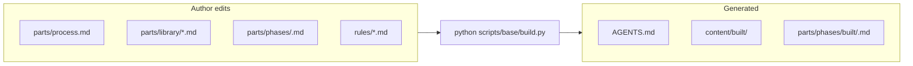
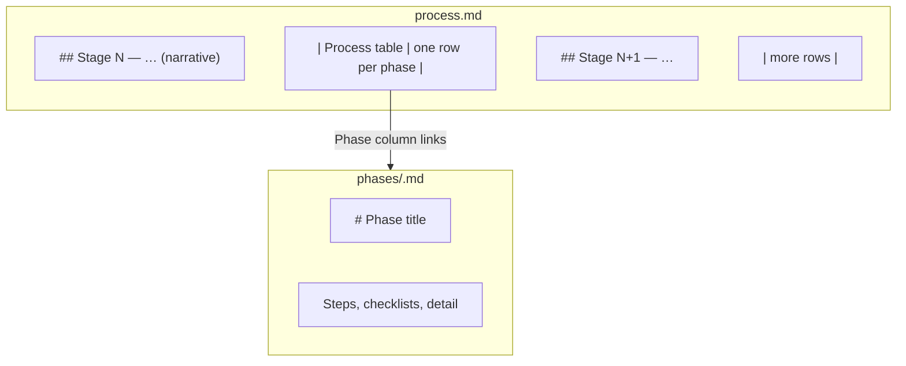

## Role

You are the **skill author** for this repository: you interpret the skill’s intent, edit **sources** under `content/parts/` and `rules/` (never hand-patch **AGENTS.md** or `content/built/` when the merge owns them), run **`python scripts/base/build.py`** after substantive changes, and prefer clear structure, reproducible merges, and honest alignment between claims in instructions and enforced rules.


---

## Principles

These **principles** state how the abd-skill-builder pattern is meant to be operated.

1. **Phase-scoped context** — Do not rely on one giant instruction dump. Assemble prompts for the **named phase** only from `content/parts/phases/` and `content/parts/library/` (and inlined rules). Flat skills that grow without phases invite command drift.
2. **Rules plus scanners** — Serious rules live under **`rules/*.md`**: **normative prose** the model follows, and—when you need enforcement beyond review—a **scanner** (`scripts/...py`) declared in **`rules/scanners.json`** (**`rule_scanner_bindings`**: which script applies to which rule). **`python scripts/base/build.py`** runs **`build.build_pipeline`** after merge so scanners **read the tree on disk** (paths, layout, config, declared bindings) and **exit non-zero** when something violates what the prose promises; **`build.scanners`** should list the same scripts so local runs and **CI** apply the same gate. Prose without checks drifts; checks without prose confuse intent.
3. **Process and checklists** — `content/parts/process.md` orders phases; each phase file owns procedure, inputs/outputs, and a **markdown checklist** so the first unchecked item is the resume point.
4. **Composable parts** — **Library** = cross-cutting norms; **phases** = procedure per step; **built/** = pre-merged slices in static mode. Fix **sources** under `content/parts/` and `rules/`; never patch `AGENTS.md` or `content/built/` by hand to “fix” quality.
5. **Templates as contracts** — Use `templates/` (or scaffold equivalents) so generated artifacts have a **stable shape** for humans and scripts.
6. **Scripts and tests** — Repeatable work lives in `scripts/`; scripts should have tests in `test/`. If an operation is manual twice, it belongs in a script.


---

## Phase

# Phase — Fill scaffold (library and rules)

In [`../process.md`](../process.md), **[Fill scaffold parts](fill-scaffold-parts.md)** appears as **phase #4, #5, and #6** — all inside **Stage 2** (one stage: phase **#2** scaffold through **#6** scripts). Focus **#4** rules & scanners, **#5** library, **#6** scripts. It runs **after** **phase #2** ([**scaffold**](scaffold.md)) and **phase #3** (process & phase files), or **after** **[migrate](migrate.md)** (execute a **plan-migrate** / **1b** plan) when you did not use greenfield scaffold. The scaffold **creates directories and templates**; this phase **fills them** with the **instructional content** the skill actually runs on: **`content/parts/library/**`**, **`rules/**`**, and—where needed—**richer `content/parts/process.md`** and **`phases/*.md`**.

**Not in scope:** running **`scaffold_skill.py`** again, or replacing **`scripts/base/build.py`**. **In scope:** collaborative **authoring** (human + AI) so **library** chunks and **rules** match **SKILL.md** purpose, **`content/parts/process.md`**, and the **process** you sketched.

Emit this file for an AI session with:

```bash
python scripts/base/generate.py --phase fill-scaffold-parts
```

(Or `python scripts/generate_prompt.py --phase fill-scaffold-parts`.)

---

## Purpose

Turn a **hollow** or **minimal** skill package into one whose **merged** agent bundle (**`AGENTS.md`**) and **built** slices honestly describe **how** the skill works. The AI **interprets** the skill’s **intent** (purpose, suggested phases, suggested rules, delivery hints) and **proposes concrete files**: definitions in **`library/`**, must-holds in **`rules/`**, and edits to **`process.md` / `phases/*.md`** where the scaffold left placeholders. The **user** confirms domain facts, rejects bad shortcuts, and owns final wording.

This is **not** “have the model freestyle in chat.” It is **structured authoring** against **[skill-structure-and-concepts.md](../library/skill-structure-and-concepts.md)** and **[how checklists are created](../library/base/checklist.md)** (stable **`library/base/`** reference vs workspace **`progress/`**). Each skill has **`content/parts/library/base/checklist.md`** after scaffold (copied with **`library/base/`** from **abd-skill-builder**).

---

## What to read first (in the skill under construction)

| Source | Why |
| --- | --- |
| **`SKILL.md`** | Declared purpose, frontmatter, what the skill *is for*. |
| **`content/parts/library/base/checklist.md`** | How checklists work in this layout (refresh from **abd-skill-builder** `library/base/` when needed). |
| **`content/parts/process.md`** | Staged flow—even if minimal—defines **order** and **phase slugs**. |
| **`skill-config.json`** | **`delivery.mode`**, **`build.*`** (compile paths, pipeline, scanners), workspace keys — see **[Workspace and config](workspace-and-config.md)** (**`active_skill_workspace`**). |
| **Existing `content/parts/phases/*.md`** | Skeleton or empty—**extend**, don’t duplicate the **process** table blindly. |

If **`library/`** or **`rules/`** already has files (e.g. after **migrate**), **revise** before adding parallel ad-hoc docs elsewhere.

---

## What to produce

| Area | Target |
| --- | --- |
| **`content/parts/library/*.md`** | Cross-cutting definitions, tables, glossaries, **delivery** notes—**one home** for concepts reused across phases (see **[skill-structure-and-concepts.md](../library/skill-structure-and-concepts.md)**). |
| **`rules/*.md`** (and **`rules/scanners.json`** if used) | Must-holds the agent and tooling should enforce; align with **`skill-config.json`** scanners when you add them. |
| **`content/parts/process.md` / `phases/*.md`** | Replace placeholders with **steps** that match the **#** column and **`build.py`** merge order (when the skill’s **`build.py`** lists phases explicitly). |

Everything you add must **merge** cleanly: no instruction bodies that belong in **`parts/`** stranded under **`docs/`** ( **`docs/`** is for onboarding / manuals — not mergeable phase bodies).

---

## Prompt contract — how the AI should work (follow in order)

1. **Restate the skill’s purpose** in one short paragraph (from **`SKILL.md`** and **`content/parts/process.md`**). If unclear, **ask** the user before inventing domain rules.

2. **Map process to files:** From **`process.md`**, list **phase slugs** and ensure each has a **`phases/<slug>.md`** (or a documented exception). Flag **gaps** between the **table** and **`phases/`** on disk.

3. **Design `library/`:** Propose **which** library files you need (names mirror **concepts**, not random `misc.md`). Each file should have a **single** role (definitions vs delivery vs checklist pointers). Pull **cross-cutting** text out of phase files into **`library/`** when two or more phases would repeat it. **`library/`** must stay **non-procedural**: definitions and structure only—**not** step-by-step phase execution, **not** CLI runbooks, **not** pipeline order (**[`Skill structure and concepts.md`](../library/skill-structure-and-concepts.md#skill-structure-sec3)** → *Library vs phase*).

4. **Design `rules/`:** Turn “suggested rules” from the plan into **actionable** rule files—**testable** where possible. Connect rules to **scanners** only when the skill **defines** those scanners; otherwise keep rules as **agent** constraints.

5. **Collaborate:** After each batch of proposed paths, **stop** for user confirmation on: domain terms, **must** vs **should**, and **out-of-scope** behavior.

6. **Run the merge check:** After edits, run **`python scripts/base/build.py`** in the **skill under construction** and fix **source** files until **build** succeeds—**never** hand-edit **`AGENTS.md`** if **build** owns it.

---

## Success criteria

- **`library/`** holds **shared meaning** (definitions, shapes, vocabulary) the phases **link** to; **`phases/`** holds **procedures** (steps, scripts, checks)—not duplicated long essays, and **not** the reverse (procedures hiding in **`library/`**).
- **`rules/`** reflects **must-holds** the user agreed to, consistent with **`skill-config.json`** where wired.
- **`process.md`** phase table and **`phases/*.md`** **agree** on slugs and order (and with **`build.py`** if the skill uses an explicit phase list).
- **`python scripts/base/build.py`** exits **0**; **`AGENTS.md`** reflects the new content.

---

## See also

- **[skill-structure-and-concepts.md](../library/skill-structure-and-concepts.md#skill-structure-sec3)** — placement, voice, **library/** vs **phases/** (§3).
- **[Workspace and config](workspace-and-config.md)** — **`skill_path`**, **`skill-config.json`**, **`active_skill_workspace`**.
- **[Scaffold](scaffold.md)** — greenfield tree (**phase #2** in **Stage 2** in **`process.md`**).
- **[Migrate](migrate.md)** — apply **1b** delta (brownfield).
- **[Plan skill migration](plan-migrate.md)** — **1b** (inventory + **standards delta**).
- **[Plan Script Build](plan-script-build.md)** — **Stage 1** (plan before scaffold).


---

## Library


---

### `Skill structure and concepts.md`

# Skill structure and concepts

This is the **one** place for **what goes where** in a skill repo and **how it connects** to the capability story in **[outline.md](required/outline.md)**. Everything else in `content/parts/library/` is detail: link out from here.

**Greenfield template:** `scripts/scaffold_skill.py` copies **[templates/skill-scaffold/](../../../templates/skill-scaffold/)** (paths below are relative to **`content/parts/library/`** unless noted).

---

## Repository shape (skill package root)

Typical tree after scaffold. **Purpose** = why it exists; **Template** = starting file under `templates/skill-scaffold/` when applicable.

| Path | Purpose | Template / note |
| --- | --- | --- |
| `SKILL.md` | Agent discovery: name, description | [`templates/skill-scaffold/SKILL.md`](../../../templates/skill-scaffold/SKILL.md) |
| `AGENTS.md` | Merged instructions for IDEs (from `build.py`) | Generated — do not hand-edit as source of truth |
| `skill-config.json` | **One manifest:** workspace routing, `phase_files`, library + rules shards, `delivery`, `build` | [`templates/skill-scaffold/skill-config.json`](../../../templates/skill-scaffold/skill-config.json) |
| `content/parts/process.md` | **Pipeline:** one table row per **phase** (not per step) | [`templates/skill-scaffold/content/parts/process.md`](../../../templates/skill-scaffold/content/parts/process.md) |
| `content/parts/phases/<slug>.md` | Procedure, steps, checklists **for that phase** | [`phase-template.md`](../../../templates/skill-scaffold/content/parts/phases/phase-template.md), [`workspace-and-config.md`](../../../templates/skill-scaffold/content/parts/phases/workspace-and-config.md) |
| `content/parts/phases/built/` | Generated phase bodies for static prompts | [`built/README.md`](../../../templates/skill-scaffold/content/parts/phases/built/README.md) |
| `content/parts/library/base/*.md` | **Frozen** shared norms copied from **abd-skill-builder** (checklist, critical-quality-steps, …) — refresh from upstream, do not fork casually | Copied by **`scaffold_skill.py`** |
| `content/parts/library/required/*.md` | **Per-skill** narrative every scaffold creates (`purpose.md`, `outline.md`, `role.md`, `principles.md`) — authors extend these | [`templates/skill-scaffold/content/parts/library/required/`](../../../templates/skill-scaffold/content/parts/library/required/) |
| `content/parts/library/*.md` | Optional **extra** shards (listed in `library_files`) — not in base/required | Skill-specific |
| `content/built/` | Optional built slices when `delivery.mode` is `static_built` | [`content/built/README.md`](../../../templates/skill-scaffold/content/built/README.md) |
| `rules/*.md` | Normative constraints; stems wired in `skill-config.json` | [`rules/rule-template.md`](../../../templates/skill-scaffold/rules/rule-template.md) |
| `rules/scanners.json` | Rule → scanner bindings | [`rules/scanners.json`](../../../templates/skill-scaffold/rules/scanners.json) |
| `scripts/base/` | **`build.py`**, **`generate.py`**, **`set_workspace.py`**, shared modules (`instructions`, `skill`, …). Run from skill root, e.g. **`python scripts/base/build.py`**. | Copied from **abd-skill-builder** `scripts/base/` |
| `scripts/scanners/` | Scanner scripts | Template stub under `templates/skill-scaffold/scripts/scanners/` |
| `docs/` | **Non-runtime:** onboarding, manuals, architecture notes — **not** mergeable instruction bodies | [`docs/README.md`](../../../templates/skill-scaffold/docs/README.md) |
| `test/` | Pytest + fixtures (optional) | [`test/README.md`](../../../templates/skill-scaffold/test/README.md) |

**Stages → phases → steps:** **Stages** group work; **phases** are **rows** in `process.md`; **steps** live **inside** each `phases/<slug>.md` only — never as extra process rows.

**`library/` vs `phases/`:** Library = **what** (shared definitions). Resolution order for a filename is **`library/<file>`** → **`library/required/<file>`** → **`library/base/<file>`** (see `scripts/base/instructions.py` → `_resolve_library_md`). Phases = **how** for that step (commands, ordered steps). **`docs/`** = human planning; runnable markdown stays under **`content/parts/`**.

**`docs/` vs mergeable markdown:** If **`docs/`** holds instruction bodies that should merge into **`build.py`** output, **move** them into **`content/parts/`** (`library/`, `phases/`) and keep **`docs/`** as index or narrative only.

---

## `skill-config.json` (two roles)

### Workspace (`workspace` in JSON)

| Key | Use |
| --- | --- |
| `active_skill_workspace` | Project tree the skill reads/writes (or `"."`). Set with `python scripts/base/set_workspace.py`. |
| `known_skill_workspaces` | Optional list of other roots. |
| `context_paths` | Extra context dirs for tooling. |

### Pipeline manifest (same file)

| Key | Use |
| --- | --- |
| `name`, `version` | Skill id and semver. |
| `library_files` | Filenames under `library/` injected into **every** phase bundle. |
| `phase_files` | Ordered phase slugs; each → `content/parts/phases/<slug>.md` (first is usually `workspace-and-config`). |
| `phase_library` | Optional: extra library shards per phase. |
| `every_phase_rules` / `phase_rules` | Rule stems from `rules/` per phase. |
| `phase_bundle` | Order of sections in assembled AI-chat prompts (`role`, `principles`, `phase`, `library`, `rules`). |
| `delivery.mode` | `static_built` vs `runtime_injection` — see [base/delivery-modes.md](base/delivery-modes.md). |
| `build` | `compileall_paths`, `build_script`, `build_pipeline`, `scanners`. |

Optional keys `agents_front`, `operation_sections`: see comments in scaffold `skill-config.json` and `scripts/base/build.py`.

---

## content/parts/process.md — minimal format

`process.md` defines the **phase pipeline** for the skill — what phases exist, what order they run, what each phase does, who runs it, and what scripts drive it.

The filled scaffold copy lives at [`templates/skill-scaffold/content/parts/process.md`](../../../templates/skill-scaffold/content/parts/process.md).

### Minimal vs rich format

| Format | When to use |
| --- | --- |
| **Minimal** (single table) | Simple skills with 2–3 phases. One table covers all phases. |
| **Rich** (multi-stage) | Skills with distinct planning, build, and validation stages. See [Rich process table (team process plate)](#rich-process-table-team-plate) below. |

### Required sections (both formats)

#### H1 title

One clear title for the skill’s process doc.

#### Pipeline table(s)

One **row per phase** — not one row per step. Columns follow **[process-phases.md](process-phases.md)** (e.g. **#**, **Phase**, **Description**, **Actor**, **Input**, **Output**, **Scripts**). Include a **workspace / Phase 0** row when applicable.

---

## Rich process table (team process plate)

Use this when **`content/parts/process.md`** spans **multiple stages** (plan → build → validate) with separate tables or sections per stage. Norms:

- **Seven-column** tables where required by **[process-phases.md](process-phases.md)**.
- **Stages** are narrative grouping; **phases** remain **rows** linked to **`content/parts/phases/<slug>.md`**.
- **`process-phases.md`** describes how **`generate.py`**, **`build.py`**, and IDE bundles align with these tables.

---

## Authoring checklist — injector body

The canonical file **[checklist.md](base/checklist.md)** in **abd-skill-builder** explains **how checklist files are created**: the stable **`library/base/`** reference, workspace **`progress/`** files, what **`generate.py`** creates, and **`workspace_checklists.py`**. It does **not** duplicate the full process story — that stays in **[process-phases.md](base/process-phases.md)** and **[outline.md](required/outline.md)** (*Activity checklists*).

**Convention:** **`scaffold_skill.py`** copies **`content/parts/library/base/`** from the builder, including **`checklist.md`**. Refresh **`library/base/checklist.md`** from **abd-skill-builder** when checklist mechanics change.

---

## Skill identity

Phases, rules, and **`SKILL.md`** describe **this skill’s** behavior on its own terms — not chronic “vs another skill” or migration-only narrative. **Dependencies** (other repos, tools, versions) belong in **`README`**, **`skill-config.json`** → **`build_strategy`**, or an explicit **Dependencies** list — not mixed into the main story.

---

## Validation and tests

- **`build.compileall_paths`** and **`build.build_script`** (typically `python scripts/base/build.py`) are the default structural gate.
- **`build.scanners`** / **`rules/scanners.json`** align local checks with CI when wired.
- **`test/`** holds pytest suites and fixtures; layout norms match the **Repository shape** table above. See **`test/README.md`** in the scaffold and **[rules-and-scanners.md](rules-and-scanners.md)**.

---

<a id="skill-structure-sec3"></a>

## Skill package layout and content standards (§3)

**What this is:** Normative rules for how a **skill repository** is shaped — where **runtime** content lives (`content/parts/`, `rules/`, `build.py`), how **stages / phases / steps** relate, how **process tables** and **Refs** work, optional patterns (e.g. domain + story map), **rule file naming**, and **static vs dynamic** assembly of instructions. **How skills are used in the IDE** (AGENTS.md, `process.md`, code vs AI-chat phases, `generate_prompt`) is defined in [`process-phases.md`](process-phases.md) — read that first.

**How to use it:** Implement **§3.1–§3.4** when authoring or reviewing a skill. Tools and humans use the same rules; nothing here depends on any external “origin” document.

**Scope boundary — skills stay simple:** A **skill package** should express a **linear** pipeline: **stage → phase → (steps inside phase docs)**. The **process table** rows are **phases**, not steps. Keep skills deliberately sequential.

### 3.1 Directory and content conventions

**Hierarchy in the repo:** **Stages** group **phases**. Each **phase** has normative markdown (one file or section per phase, per skill); **steps** live **inside** that phase’s markdown — they are **not** separate rows in the master process table. See **Stages, phases, and steps** below.


| Area                            | Convention                                                                                                        | Notes                                                                                                                                                                                                                                                                                                                                                                                                                                                                                                                  |
| ------------------------------- | ----------------------------------------------------------------------------------------------------------------- | ---------------------------------------------------------------------------------------------------------------------------------------------------------------------------------------------------------------------------------------------------------------------------------------------------------------------------------------------------------------------------------------------------------------------------------------------------------------------------------------------------------------------- |
| **Normative content**           | Under /`content/parts/`                                                                                           | Plans, operations, domain narrative — **not** dumped only in chat.                                                                                                                                                                                                                                                                                                                                                                                                                                                     |
| `**docs/` (non-runtime)**       | /`docs/` at skill root                                                                                            | **User manuals**, **migration/planning notes**, **architecture**, **authoring checklists**, and **narrative** descriptions of delivery. **Do not** put markdown here that `build.py` **merges**, **injects**, or **ships** as the runnable phase/operation body — that belongs under `**content/parts/`** (including `**library/`**, `**phases/`**, `**process.md**`, `**rules/**`).                                                                                                                                   |
| **Phase markdown (source)**     | e.g. /`content/parts/phases/<descriptive-slug>.md`, or one doc per phase with step sections — paths vary by skill | **One row in the process table = one phase.** **Steps** (numbered sub-procedures, “Step 1…”, checklists) are written **inside** this markdown as **normative content of the phase**, not as their own table rows. **Do not** encode execution order in filenames or H1 titles (`phase-02-foo.md`, `# Phase 2 — …`): order belongs in `**process.md`** (the `#` column) and in `**scripts/base/build.py`**’s explicit file list. Use **stable descriptive** kebab-case slugs so renumbering the plan does not force renames. |
| **Built phase markdown**        | `content/parts/phases/built/<descriptive-slug>.md` and/or `content/built/…` per skill layout | **Generated** from source phase bodies + rules via `scripts/base/build.py`. **Authors do not hand-edit `built/`.** These files are **materialized instruction blobs** for **static** AI-chat phases and for **`static_built`** delivery — consumed by **`generate_prompt`** (or pasted into chat), **not** by “agents browsing the repo” as the primary UX. IDEs load **`AGENTS.md`**; see [`process-phases.md`](process-phases.md). Folder layout (`phases/built` vs `content/built`) is per skill; document it in **`README.md`**.                                                                                                                                                                                                            |
| **Atomic rules**                | `content/parts/rules/*.md` (or top-level `rules/` in simpler skills)                                              | One concern per file where possible; **names** should encode **phase** and/or **domain concept** + rule name (see §3.2). **Which phase inlines which rule** is declared in **`skill-config.json`** (`phase_rules`, `every_phase_rules`), not scattered in per-rule frontmatter lists.                                                                                                                                                                                                                                                                                                                                                                                               |
| **Roles**                       | `roles/*-role.md`                                                                                                 | One file per **user/agent role** the skill assumes.                                                                                                                                                                                                                                                                                                                                                                                                                                                                    |
| **Process**                     | `content/parts/process.md` or staged process docs                                                                 | **Summary table: each row is a phase** (linked by **Ref** to phase markdown). Stages group those rows. **Steps** appear only **inside** the linked phase files.                                                                                                                                                                                                                                                                                                                                                        |
| **Library markdown**            | `content/parts/library/*.md` (or `parts/library/`)                                                                | **Cross-phase structure and meaning**: definitions, glossaries, artifact shapes, naming, invariants. **Not** phase-local procedures, pipeline ordering, or CLI runbooks—those live in **`process.md`** / **`phases/`** (see **Library vs phase documents** below).                                                                                                                                                                                                                                                     |
| **Repo-facing built artifacts** | `AGENTS.md`, `SKILL.md`, sometimes `README.md`                                                                    | Frequently produced by `scripts/base/build.py` (merge order per skill). **`AGENTS.md`** is what **IDEs and assistants typically load automatically** for the skill repo.                                                                                                                                                                                                                                                                                                                                                                |
| **Config**                      | `skill-config.json`                                                                                               | Name, version, **`phase_files`**, **`PHASE_LIBRARY_SLICES`**, **`phase_rules`** / **`every_phase_rules`** (ordered rule **stems** inlined per phase bundle — see [`process-phases.md`](process-phases.md)), **`phase_bundle`**, **`operator.compileall_paths`**, **`operator.build_script`**, **`operator.build_pipeline`** (post-merge steps for **`build.py`**), **`operator.scanners`** (Operator gate; align with rule-bound scanners) — skill-specific knobs. See **[`rules-and-scanners.md`](rules-and-scanners.md)** (base framework).                                                                                                                                                                                                                                               |
| **Scripts**                     | `scripts/`                                                                                                        | Operational entry points; may share `_config.py` patterns.                                                                                                                                                                                                                                                                                                                                                                                                                                                             |


#### Stages, phases, and steps (how they relate)

**Order is always:** **Stage → Phase → Step** (coarse → mid → finest) — but **only the first two appear as rows** in the master process table. **Steps** are **inside** the phase markdown.


| Term      | Typical meaning                                                                                                                                                                                                                                                                                                                      | Example                                                                                  |
| --------- | ------------------------------------------------------------------------------------------------------------------------------------------------------------------------------------------------------------------------------------------------------------------------------------------------------------------------------------ | ---------------------------------------------------------------------------------------- |
| **Stage** | **Coarse pipeline slice** — groups many **phases**; may span days or sessions. Often a heading or section in `process.md` or a staged doc.                                                                                                                                                                                           | **Stage 1 — Extract Context**; **Stage 2 — Map and Model**; **Stage 3 — Specification**. |
| **Phase** | **One row** in the process summary table — the unit of “what we do next” with a **driver**: **human** or **AI actor**. The **Ref** column links to **phase** markdown. Phases answer “are we allowed to proceed?” and **contain** the detailed steps as normative body copy.                                                         | “Corpus audit — Phase N”; **Initiator / Actor** column = human vs AI.                    |
| **Step**  | **Sub-structure inside the phase’s markdown** — numbered instructions, checklists, “Step 1 / Step 2”, optional **suffix letters** (`5a`, `7a`) for companion script runs **within the same phase**. **Not** a row in the process table. Machine state (if any) may still reference `workflow_step` as a **sub-id** inside the phase. | Inside `modules-epics-scaffold-breadth.md`: “1. … 2. … 3a. rebuild index …”              |


**AI-driven phases — how the operation is delivered:** See **[`process-phases.md`](process-phases.md)**. In short: **code-driven** phases = run scripts as documented in the phase file; **AI-chat** phases = produce the instruction block via **`generate_prompt`**-style tooling in **dynamic** (assemble sections) or **static** (use pre-built phase markdown under `phases/built/` or equivalent). The **chat** follows that text; **`built/`** is not “the agent’s filesystem API.”

**Ordering (linear, inside the skill):** Stages order **major outcomes**. **Phases** run in **process table order** (each row = one phase). **Steps** follow the order **written inside** each phase document. **Parallel batches, fan-out, or merge** are **not** modeled as extra table rows; if needed, handle that **outside** the skill package (host app, orchestration, or scripts). **Phases** may **block** a later stage until accepted (e.g. “the indexer phase says rebuild chunks — do not start Stage 2 until accepted”).

**“Process” one-liner:** `content/parts/process.md` (or `parts/process.md`) often opens with a **single pipeline string** (e.g. Context → Foundational spine → …). That line is the **navigation spine**; the **table lists phases** (by stage); **authoritative step detail** lives inside each **Ref**’d phase file.

#### Process tables, hyperlinks, and naming in the Ref column

**How the table is built**

- **Rows are phases**, not steps. Columns typically include: `#`, **Phase** (title — sometimes labeled “Step” in legacy tables; **semantically it is the phase**), **Initiator / Actor** (Human→Code, AI, Code), **Script** (if any), **What it does**, **Coverage**, **Ref**, **Inputs**, **Outputs**.
- **Ref** is the **hyperlink hub**: each row points to the **normative markdown for that phase**. **Steps** (numbered sub-procedures) live **inside** that file — not in separate table rows. Python entry points stay in **Script**, not **Ref**.
- **Two-tier phase files:**
  - **Source:** phase markdown authors edit (e.g. `content/parts/phases/<name>.md`, or `parts/steps/<name>.md` when the filename is the **phase** slug — naming varies by skill).
  - **Built:** `content/parts/phases/built/<name>.md` or `content/built/<name>.md` — **rules baked in** from `parts/rules/*.md` via `scripts/base/build.py`. **Steps remain inside** the built document. Used for **static** prompt generation and **`static_built`** slices — not hand-edited. See [`process-phases.md`](process-phases.md).
- **Cross-links inside the table:** The **Ref** column uses relative markdown links to the **phase** doc, e.g. `[context](parts/context.md)`, `[modules-epics-scaffold-breadth (built)](content/parts/steps/built/modules-epics-scaffold-breadth.md)` (paths vary by skill; **from the skill root** per `AGENTS.md`).

**Naming conventions visible in the table**

- **Phase titles** in the table read like **milestones or operations** (“Parse, curate, chunk, index”, “Integrate and Harmonize”) — stable labels for **phase** / workflow fields. **Finer labels** for **steps inside the phase file** may appear in JSON as `workflow_step` or similar.
- **Phase file names and H1 headings** must **not** duplicate pipeline indices (`phase-00-`, `Phase 3 —` in the title). Those numbers **change** when the plan evolves; **brittle** names churn git history and links. The **Ref** column and `build.py` define order; phase files stay **semantically** named (`story-map.md`, `canonical-context.md`).
- **Letter suffixes** (`5a`, `7a`) describe **sub-steps inside a phase** (e.g. companion script after a numbered step) — **inside the phase markdown**, not extra table rows.

#### Concepts and cross-cutting artifacts (generic — all skills)

**This section is the generic rule.** A **skill** packages **concepts** (ideas, definitions, invariants, roles) and **artifacts** (outputs, schemas, manifests) that the workflow references across **multiple stages or phases**. Anything that would be **repeated** if pasted into every phase file should instead live in **its own file** (usually markdown under `content/parts/`, sometimes JSON alongside) so there is a **single source of truth**.


| Guideline           | Meaning                                                                                                                                                                                                         |
| ------------------- | --------------------------------------------------------------------------------------------------------------------------------------------------------------------------------------------------------------- |
| **When to extract** | If a concept or artifact **spans** more than one phase (or stage), give it a **dedicated** doc (or structured file) and **link** from phase bodies — do not duplicate long definitions in each phase.           |
| **Naming**          | Conventional filenames (`glossary.md`, `concepts.md`, `artifacts.md`, `roles/`*, etc.) vary by skill; **discover** and **validate** presence from templates and this skill’s `build.py`, not one global layout. |
| **Not every skill** | A minimal skill might only have `SKILL.md`, `content/parts/process.md`, and phase files — **no** separate “domain” or “story map” layer. That is valid.                                                         |


#### Library vs phase documents (authoring split)

**`library/`** answers **what** (stable meaning for ideas and artifacts that **more than one** phase touches). **`phases/<slug>.md`** answers **how for this step** (operator procedure: inputs, outputs, ordered steps, **commands**, done checks).

| In **`library/`** | In **`phases/`** (not a second copy of the whole library) |
| --- | --- |
| Definitions, tables, schemas, vocabulary used across phases | Purpose of **this** phase, **steps**, checklists, **script/CLI** lines |
| Single source of truth for a construct that spans the pipeline | **Links** into the right **`library/`** shard for depth |
| Optional injection slices (`abd:begin` / `abd:end`) | **No** long normative essays that other phases would repeat verbatim |

**Do not** put **numbered phase procedures**, **order-of-operations** for the skill, or **phase-to-phase sequencing narrative** in **`library/`**—that belongs in **`process.md`** and the relevant **`phases/`** files. **Do not** park **large** reusable specs only inside one phase file if another phase needs the same text—extract to **`library/`** and link.

Normative detail for writers: [`documentation-standards.md`](documentation-standards.md) and [`Skill structure and concepts.md`](skill-structure-and-concepts.md#skill-structure-sec3) (§3).

#### Optional pattern — domain narrative + interaction tree (maps-models–class skills only)

Some skills (notably **abd-maps-models-specs** and similar) **choose** to separate **two parallel artifacts** that must stay in sync. **Do not** treat this table as the default for **all** skills — only for skills that explicitly adopt this shape.


| Piece                            | Role                                                                                                                                                                                                    | Typical location (example skill)                                                                              |
| -------------------------------- | ------------------------------------------------------------------------------------------------------------------------------------------------------------------------------------------------------- | ------------------------------------------------------------------------------------------------------------- |
| **Domain narrative**             | **State and structure** — modules, **domain concepts** (CRC-style: owns, properties, operations, `extends`, invariants), evidence hooks. Answers **what things are** and **what owns which rules**.     | e.g. `parts/domain.md` + evolving `map-model-spec.json` (`modules_and_epics`, `concepts[]`, chunk citations). |
| **Story map / interaction tree** | **Behavior** — epics, sub-epics, stories, scenarios; **Trigger / Response**; **Pre-Condition**; **Given/When/Then** where required. Answers **who does what** and how behavior references domain state. | e.g. `parts/story-map.md` + nested JSON under epics (`stories`, `sub_epics`, etc.).                           |


**When this pattern applies**

- **Same vocabulary:** Domain concept names (`concepts[].name`) and story references can be held to **one namespace** — scanners may enforce **exact string match** where the skill defines that rule.
- **Evidence ladder / paired edits:** Concepts may carry `evidence_stage`; **domain** vs **journey** edits are **paired** in skills that implement both files.
- Skills **without** this split still use the **generic** rule above: cross-cutting concepts → **their own** markdown (whatever the skill calls them), not repeated per phase.

#### Rules and automated checks (default wiring)

For **machine-enforceable** rules, use the **base framework** in **[`rules-and-scanners.md`](rules-and-scanners.md)**:

- Declare **rule → scanner** bindings in **`rules/scanners.json`** (`rule_scanner_bindings`).
- List **ordered post-merge steps** under **`skill-config.json` → `operator.build_pipeline`**; **`scripts/base/build.py`** runs them after merges (same pattern as **`abd-maps-models-specs`**).
- Keep **`operator.scanners`** consistent with those scripts for **`operator.run_operator()`** / CI.

**Process tables** should **not** enumerate every scanner as if it belonged to a single phase; document automation at the skill level and link **`rules/scanners.json`** + **`build.py`** / **`build_pipeline`**.

### 3.2 Rule file naming (heuristic standard)

Target pattern (flexible regex for validation):

```text
{phase-or-stage}__{domain-concept-or-scope}__{short-rule-name}.md
```

Examples mirror **story synchronizer / maps-models** style: scanners and rules tied to **phase** and **concept** (e.g. `chunks_must_be_referenced`, `concept-layering-scaffold`). **Propose** names from the **phase** + concept + verb (and step text inside the phase doc if needed), then **check uniqueness** under `parts/rules/`.

<a id="assembly-model"></a>

### 3.3 Assembly model (static vs dynamic)

**Two different “static vs dynamic” pairs** — do not conflate:

1. **`build.py` assembly** (repo artifacts): Each skill ships `scripts/base/build.py`. It merges **process + library + phases (+ rules)** into **`AGENTS.md`** and optional **`content/built/`**. Flags like `--assembly static|snapshot` are **per skill** when present.

2. **AI-chat prompt generation** (`generate_prompt`): For **AI-driven** phases only — **dynamic** = assemble instruction string from sections; **static** = emit text from **pre-built** phase file under `phases/built/` (or documented path). See [`process-phases.md`](process-phases.md).

**Per skill:** `build.py` is the **authoritative** merge driver for **this** repo; scaffolding **emit or check** trees — they do **not** replace `build.py`.

**Flag on `build.py`:** The skill’s `build.py` may expose **CLI flags** for snapshot vs interactive merge; exact names are per skill. For **prompt** modes, document **`generate_prompt`** (or equivalent) next to **`build.py`** in **`README`** / **`AGENTS.md`**.


| Mode (merge / delivery) | Mechanism                                                                               | When                                                               |
| ----------------------- | --------------------------------------------------------------------------------------- | ------------------------------------------------------------------ |
| **Static (merge)**      | `build.py` merges **built-phase** fragments into `AGENTS.md` / `SKILL.md` (and related) | Release, reproducible snapshot; CI; “what ships”.                  |
| **Dynamic (merge)**     | Runtime concatenation by **phase** / **operation** from `skill-config.json` + manifest  | Interactive sessions, partial rebuild, IDE-driven iteration. |


A **host** (CI, IDE, or orchestrator) may emit an **internal** manifest (JSON or YAML) for a **given generation run**, listing which fragments form which artifact for both modes; the skill’s `build.py` **may read** that manifest (or embedded config) when implementing **static** merges and documents how **dynamic** mode resolves fragments at runtime. That manifest is **optional** and **not** a standard every skill must carry — only **documented** `build.py` behavior is.

### 3.4 Reference skills (illustrative)

Other skills in the monorepo **illustrate** patterns (long `AGENTS.md`, phased pipelines, rules + scanners). They are **examples**, not extra requirements. **Operator** checks and layout rules are grounded in **abd-skill-builder** library files and each skill’s **`skill-config.json`** — not in a separate “corpus” file unless your team adds one.


---

### `critical-quality-steps.md`

Rules improve skill quality in two ways: they guide the model while authoring artifacts, and they set expectations that can be checked mechanically or by review.

**Every rule in `rules/` is two things at once:** (1) **Normative advice** — prose the model follows while authoring `**content/parts/`**, `**rules/`**, `**skill-config.json**`, and other skill artifacts. (2) **Checkable expectations** — where this repo ships a scanner under `**scripts/**`, it catches common layout or config misses; where it does not, **you** still review against the rule text.

**Example (wrong):** Treating a green `**python scripts/base/build.py`** as enough while `**AGENTS.md`** still disagrees with `**content/parts/**` or `**phase_rules**` omits a rule you claimed to enforce.

**Example (correct):** Read the **Rules** section in this bundle, align files with `**library/`** norms, run `**python scripts/base/build.py`** (and `**operator.scanners**` when configured), then **re-read** outputs against each applicable rule.

---

## Layer 1 — Generate Output guided by rules

While generating or editing skill artifacts:

- Apply `**rules/*.md`** inlined into this bundle (and related `**library/`** docs).
- Prefer **DO / DON'T** and **good vs bad** fragments inside each rule — they are the contract for *shape*, not only for CI.

---

## Layer 2 — Mechanical checks (this skill)

After you have files on disk, the pipeline can run:


| Mechanism                     | What it does                                                                                                                                                                                        |
| ----------------------------- | --------------------------------------------------------------------------------------------------------------------------------------------------------------------------------------------------- |
| `**python scripts/base/build.py`** | Merges **process** + per-phase bundles into `**AGENTS.md`** and `**content/built/`**, then runs **`build.build_pipeline`** / merged scanners from **`skill-config.json`** and **`rules/scanners.json`** when configured. |
| `**rules/scanners.json**`     | Declares **rule → scanner** bindings when your skill uses them; align with `**operator.scanners`**.                                                                                                 |


**Example (wrong):** Hand-editing `**AGENTS.md`** while `**build.py`** is supposed to own the merge.

**Example (wrong):** Adding a scanner only in prose — no `**rule_scanner_bindings`** or `**build_pipeline`** step.

**Example (correct):** Fix issues reported by scanners, re-run **build**, keep `**skill-config.json`** paths honest.

Scanners are **necessary** for what they implement; they are **not sufficient** for semantic quality (e.g. a valid tree that still mis-describes what the skill does).

---

## Layer 3 — Adversarial pass (AI then Human)

With clean tool output, still ask:

- Does each **rule** that applies to this phase pass **by intent**, not only by letter?
- Would a reviewer see **drift** between `**SKILL.md`**, `**process.md`**, and `**phases/**` even when the tree validates?

## Layer 4 — Corrections log

When a problem is found during review, **do not touch skill sources yet**. Log the problem and iterate on the output until the right answer is confirmed. Only then is the log entry complete.

A **corrections log** file (e.g. `docs/corrections-log.md`) holds all entries. Add one entry per problem:

| Field | Content |
| ---- | ------- |
| **Rule** | Rule id or `rules/<file>.md` name |
| **DO / DO NOT** | The rule as it should be stated |
| **Example (wrong)** | What the output actually did |
| **Example (correct)** | What it should have done — fill in only once the correct output is confirmed |
| **Scanner or validator** | If applicable — see `**rules/scanners.json`** and `**operator.build_pipeline`** |
| **Likely source** | One of: prompt gap · rule not read · edge case · automation gap |

If the **same guidance has been violated before**, add a second example to the existing entry rather than creating a new one.

**Example (wrong):** Recording a correction and immediately editing `**content/parts/**` to fix it before the correct output has been confirmed.

**Example (correct):** Log the problem, re-generate and iterate until the output is right, then fill in "Example (correct)" and mark the entry done.

---

## Loop 1 — Correct the output

Iterate on the generated output until it is right. **Do not change skill sources during this loop.**

1. **Identify** — Note the problem; open the corrections log.
2. **Log** — Add a DO / DO NOT entry with "Example (wrong)" filled in. Leave "Example (correct)" blank.
3. **Re-generate** — Produce the output again, applying the DO / DO NOT rule explicitly.
4. **Review** — Does the new output satisfy the rule? If not, refine the statement and repeat from step 3.
5. **Confirm** — When the output is right, fill in "Example (correct)" and mark the entry done. The phase is now approved.

---

## Loop 2 — Fix the skill

Run this loop only after Loop 1 is complete for all phases — or when explicitly told "let's fix the skill."

1. **Review the log** — Read all completed corrections log entries together. Look across all issues as a set before proposing any fix.
2. **Determine root cause** — Identify the underlying cause(s) shared across one or more issues. A pattern of related issues likely has a single root cause (e.g. a missing rule, a gap in the prompt, an ambiguous instruction). Group issues by root cause before proposing changes.
3. **Propose improvements** — Suggest a set of changes to `**content/parts/**`, `**rules/**`, or config that address the root causes. Consider all issues together — a single rule change may resolve several. Do not make changes yet; get agreement on the proposal first.
4. **Fix sources** — Once the proposal is agreed, apply the changes. Do not fix the assembled pieces directly — fix the parts.
5. **Re-run build** — Run `**python scripts/base/build.py`** and any applicable scanners; confirm clean output. The fixes are now live — the corrections are promoted by virtue of being built.
6. **Clear the log** — Remove all resolved entries from the corrections log.

**Example (wrong):** Jumping to fixing `**content/parts/**` mid-review before the correct output is confirmed.

**Example (correct):** Finish Loop 1 (output confirmed right, log entry complete), then run Loop 2 (agree on root cause and improvements, fix sources, build, clear the log).

---

## Do not fix the assembled pieces directly — fix the parts

`**AGENTS.md**` and `**content/built/**` are generated. Fixing them directly is futile — the next build overwrites the change. Fix `**content/parts/**` and `**rules/**`; then build.

**Example (wrong):** Patching `**AGENTS.md**` directly to "pass" review while `**process.md**` is unchanged.

**Example (correct):** Edit `**content/parts/**` (or `**rules/**`), run `**python scripts/base/build.py**`, commit the regenerated output.


---

### `delivery-modes.md`

# Agent delivery modes (static build vs runtime injection)

Skills hand **process slices** to an agent or executor in one of two ways, declared in **`skill-config.json`** as `"delivery": { "mode": "static_built" | "runtime_injection" }`. **`static_built`** (default) means each operation uses content already merged into **`content/built/`** (and similar layouts); skill authors run **`python scripts/base/build.py`** after source changes and commit regenerated files. **`runtime_injection`** means the executor loads the process part plus **library** and **rules** from source paths at run time in a documented order, without requiring that slice to exist under **`content/built/`**. In both modes, **`AGENTS.md`** is still the assembled skill-wide orientation (typically from **`build.py`**); the flag only changes how a **single operation** gets its slice—pre-built vs injected—not whether **`AGENTS.md`** exists.

**Do not mix modes in one session without an explicit choice** (same idea as merge discipline in **[skill-structure-and-concepts.md](../skill-structure-and-concepts.md)**). Regardless of mode, maintain a single **injection map**: which source paths apply per operation (phase/step), merge order, and how that matches **`build.py`** output or any deliberate differences. Put it in one lookup place (e.g. **`README.md`**, a **`build.py`** manifest, or a checked-in manifest next to **`built/`**) so you can change **`delivery.mode`** later without rediscovering paths. **`static_built`** favors CI, reviewable diffs, and “what the agent saw” in git; **`runtime_injection`** favors rapid iteration or avoiding large checked-in built trees—tradeoffs should be explicit.

**`build.py`** flags such as **`--assembly static|dynamic`** (if the skill exposes them) describe how static snapshots are *produced*; they are **orthogonal** to **`delivery.mode`**, which answers whether execution relies on checked-in built files vs runtime resolution. Keep meaning in unbuilt sources (**`content/parts/`**, **`rules/`**); under **`static_built`**, treat **`content/built/`** as regenerable derivatives. If both modes are ever supported, state whether runtime matches the static merge or differs (and how).


---

### `process-phases.md`

# Process phases — how `process.md`, `build.py`, and phase files fit together

---

## Approach (two views)

### 1) Where things live vs what `build.py` emits



- **Sources** are under **`content/parts/`** (this doc says **`parts/`** for short).
- **`build.py`** reads **`skill-config.json`** for merge lists (`phase_files`, `library_files`, `phase_rules`, `phase_bundle`, …), assembles each phase prompt, writes **`AGENTS.md`**, copies the same merge to **`content/built/`** when using static delivery, and writes **per-phase** snapshots under **`parts/phases/built/`**. After merge it runs **`build.build_pipeline`** (compile, scanners, etc.).

### 2) Stages vs phases vs steps



| Term | Where | What it is |
| --- | --- | --- |
| **Stage** | **`## Stage …`** sections in **`process.md`** | Grouping story: purpose, “what you produce,” success criteria. **Not** one row per stage. |
| **Phase** | **One row** in the process **table** + **one file** **`phases/<slug>.md`** | A unit of work with a stable **slug** (e.g. `workspace-and-config`). Order = table order + **`phase_files`** in **`skill-config.json`**. |
| **Step** | **Inside** a phase markdown file | Bullets, `## Action Checklist`, BDD-style steps — **not** extra table rows. |

Full layout rules: **[Skill structure and concepts — §3](skill-structure-and-concepts.md#skill-structure-sec3)**.

---

## `process.md` — pipeline line and table

**Top of file:** one **Pipeline** line — linked phase names in order (e.g. Workspace → Plan → Scaffold → …).

### Process table columns (abd-skill-builder shape)

**Process table (default — seven columns):**

| Column | Use |
| --- | --- |
| **`#`** | Order id: **`0`** = workspace first; **`1a`/`1b`**, **`2a`/`2b`**, … as needed. |
| **Phase** | Link text → **`phases/<slug>.md`**. Stable title, not `phase-02-foo` in the link. |
| **Description** | What this phase **does** — enough to pick the right doc. |
| **Actor** | Human / AI / Code / mixed. |
| **Input** | What you need **before** starting (paths, prior artifacts). |
| **Output** | Concrete **artifacts** when done (paths, tree, exit criteria). |
| **Scripts** | Commands: `python scripts/base/generate.py --phase <slug>`, `python scripts/base/build.py`, `scaffold_skill.py`, etc. Separate **`·`** between commands. |

**Alternate shape (e.g. abd-maps-models-specs):** same seven columns but **`Summary`** + **`Script`** + **`Outputs`** + **`Ref`** — keep header labels consistent within a skill.

**Do not** write vague **Output** cells that only name a template — give the **real path** under the skill (e.g. **`content/parts/library/base/checklist.md`**).

---

## File structure (typical skill)

| Path | Role |
| --- | --- |
| **`content/parts/process.md`** | Stages + process table; links to all phase files. |
| **`content/parts/phases/<slug>.md`** | Source for that phase (author-edited). |
| **`content/parts/phases/built/<slug>.md`** | **Generated** by **`build.py`** — assembled prompt for that slug (for static mode / diff). |
| **`content/parts/library/*.md`** | Shared norms; optional **`abd:begin <slug>`** / **`abd:end`** slices per phase. |
| **`rules/*.md`** | Inlined per **`phase_rules`** / **`every_phase_rules`** when assembling prompts. |
| **`skill-config.json`** | **`phase_files`** order, **`library_files`**, **`phase_library`**, **`phase_bundle`**, **`delivery.mode`**, **`build.*`**. |
| **`AGENTS.md`** | **Generated** — IDE default context. |
| **`content/built/`** | Copy of merged static outputs when **`static_built`**. |

---

## Language

- **Operator-facing prose:** second person (**you** / **your**) where **`documentation-standards.md`** applies.
- **Cross-phase routing:** one line — *Routing: [Workspace and config](…)* — do not paste full **`skill-config.json`** workspace keys in every phase.

---

## What `build.py` puts in `AGENTS.md`

Typical sections (see **`scripts/base/build.py`**):

1. Optional **preamble** from **`agents_preamble`** (e.g. purpose, outline, role from **`skill-config.json`**).
2. **`## Process`** — full **`process.md`** (with link rewrites for repo root).
3. Optional **`agents_front`** block.
4. For **each** slug in **`phase_files`**, **`## <section title>`** + one **assembled** prompt (phase markdown + library slices + rules per **`phase_bundle`**).

**`generate.py`** (or **`generate_prompt.py`** in some skills) is the **runtime** “give me **one** phase’s instruction block” — **`--phase <slug>`**, optional **`--mode static`** to read **`phases/built/<slug>.md`** when present else assemble dynamically. **`build.py`** is the **batch** “merge everything for **`AGENTS.md`** and write **`phases/built/*.md`**.”

**AI-chat vs code-driven phases:** code phases = you run scripts and check exit codes; AI phases = the model follows the assembled text from **`generate`** / **`built`**. **`phase_bundle`** (tokens like `principles`, `phase`, `library`, `rules`) controls section order inside each assembly — defaults and full contract: **`skill-structure-and-concepts.md`** (injector body) and **`skill-config.json`** in this repo.

---

## Phase 0 — workspace (required for routing skills)

| Item | Rule |
| --- | --- |
| **Slug** | **`workspace-and-config`** |
| **File** | **`parts/phases/workspace-and-config.md`** |
| **Table** | First pipeline row after any preamble; **`#`** = **`0`**. |
| **Merge** | Listed **first** in **`phase_files`** |

Details: **`workspace-and-config.md`**, not duplicated in Plan/Scaffold bodies.

---

## Adding or renaming a phase

1. Add **`content/parts/phases/<slug>.md`**.
2. Add a **row** in **`process.md`** (and a **Stage** section if it is a new stage).
3. Append **`slug`** to **`skill-config.json` → `phase_files`** in the right order.
4. If the skill uses **`library_files`** / **`phase_library`**, include new shards as needed.
5. Wire **`phase_rules`** if new rules apply to that slug.
6. Run **`python scripts/base/build.py`** and fix links until **`AGENTS.md`** and **`phases/built/`** look right.

---

## Reference

- **Worked example:** **`content/parts/process.md`** in **abd-skill-builder**.
- **Rich process template:** **`templates/process-team.md.template`**.
- **Delivery modes:** **[delivery-modes.md](delivery-modes.md)**.
- **Rules + scanners + `build.build_pipeline`:** **[rules-and-scanners.md](rules-and-scanners.md)**.


---

### `rules-and-scanners.md`

# Rules and scanners (base framework for every skill)

**Status:** **Normative default** for Open Agent Skills in this repo. When a skill defines **governance rules** (`rules/*.md`) and wants **machine enforcement**, wire checks this way—not as one-off phase script call-outs.

## What owns what

| Layer | Owns |
| --- | --- |
| **`rules/<stem>.md`** | The **human-readable rule**: scope, must/should, examples, done criteria. |
| **`rules/scanners.json`** | **Which script enforces which rule** — `rule_scanner_bindings[]` maps `rule_id` + `rule_file` → `scanner` path (relative to skill root). Optional top-level **`scanners`** lists scanner scripts for tooling that expects a flat array. |
| **`skill-config.json` → `operator.build_pipeline`** | **Ordered post-merge steps** that **`scripts/base/build.py`** runs after it writes **`AGENTS.md`** / **`content/built/`** (or your skill’s equivalent). Entries are typically **`scripts/...py`** paths: rule-bound scanners, emitters, manifest generators, rule-example linters, etc. **Empty or omitted** means “merge only” (skills with no automated checks yet). |
| **`skill-config.json` → `operator.scanners`** | **Operator / CI gate** — paths **`agentic-skill-builder`** **`operator.run_operator()`** runs **after** **`operator.build_script`**. **Keep these paths aligned** with the scanner steps you care about (usually the same modules listed in **`build_pipeline`** and/or **`rules/scanners.json`**), so “green build” and “green operator” mean the same checks. |

## What you do not do

- **Do not** treat **scanners** as **phase-owned scripts** in **`process.md`** process tables. Phase rows are for **human/AI procedure** and **merge / emit** entry points (e.g. `python scripts/base/build.py`), not for listing every validator. If readers need detail, add a short **“Rules and scanners”** subsection in **`process.md`** that points here and to **`rules/scanners.json`**.
- **Do not** bind scanners only in prose. If a rule is machine-checked, add a **`rule_scanner_bindings`** row and a **`build_pipeline`** step (and **`operator.scanners`** / Operator docs as required by your host).

## Execution flow (mental model)

1. Author edits **`content/parts/`**, **`rules/`**, **`skill-config.json`**.
2. **`python scripts/base/build.py`** merges instruction bundles, then runs **`operator.build_pipeline`** in order (if present).
3. **Operator** (or CI) runs compile check → **`build.py`** again → **`operator.scanners`** (when configured).

**Reference implementation:** **`abd-maps-models-specs`** — `rules/scanners.json`, **`operator.build_pipeline`** in **`skill-config.json`**, and **`scripts/base/build.py`** driving the pipeline after merge.

## Scaffolded skills

Greenfield trees from **`scaffold_skill.py`** should ship **`rules/scanners.json`** (even if bindings start empty) and a **`skill-config.json`** fragment that includes **`operator.build_pipeline`** alongside **`operator.scanners`**, so authors extend **one** pattern instead of inventing ad hoc wrappers.

See also: **[`Skill structure and concepts.md`](skill-structure-and-concepts.md#skill-structure-sec3)** (§3.1 config row), **[`builder-vs-operator.md`](builder-vs-operator.md)**, **`rules/README.md`** at the skill root.


---

## Rules

*No rules for this phase. List rule stems (filename without `.md`) under `skill-config.json` → `phase_rules` for this phase slug, and optionally `every_phase_rules` for rules that apply to every phase. See `parts/library/process-phases.md` § Phase bundle — rules.*


---
